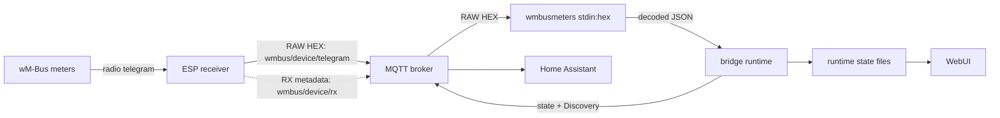

# Architecture

Technical description of **wMBus MQTT Bridge** for maintainers, contributors,
and upstream `wmbusmeters` developers who want to understand what this project
adds around `wmbusmeters`.

This is not an installation guide. User documentation lives in
[`README.en.md`](README.en.md) and the other language guides. Build, test, and
release mechanics live in [`DEVELOPMENT.md`](DEVELOPMENT.md).

## 1. System at a glance

The project moves wM-Bus decoding away from the radio receiver and onto the
Home Assistant host. An ESP receiver captures radio frames and publishes their
RAW hexadecimal representation to MQTT. The bridge passes those frames to an
unmodified, pinned `wmbusmeters` binary through `stdin:hex`, then turns the JSON
output into MQTT state, Home Assistant Discovery, and diagnostic state for the
WebUI.



### Responsibility boundary

| Component | Owns | Does not own |
|---|---|---|
| ESP receiver | RF reception, RAW HEX publication, optional reception diagnostics | meter drivers, AES keys, decoded values |
| MQTT broker | transport between receivers, bridge, and Home Assistant | interpretation of telegrams |
| `wmbusmeters` | frame parsing, decryption, driver selection, built-in and XMQ drivers, decoded field names and values | MQTT orchestration, Home Assistant entities, WebUI state |
| Bridge runtime | broker selection, `wmbusmeters` processes and config files, candidate workflow, state publication, Discovery, lifecycle | vendor-specific decode logic already owned by `wmbusmeters` |
| WebUI | configuration, comparison tools, and visibility into bridge state | automatic decisions about which driver or value is correct |
| Home Assistant | storing add-on options and creating entities from MQTT Discovery | wM-Bus decoding |

The most important rule is that **`wmbusmeters` remains the decoder**. This
project does not replace its built-in drivers, reinterpret manufacturer data,
or maintain a parallel decoder. A field shown by the bridge came from
`wmbusmeters`; if upstream emits no field, the bridge does not invent one.

## 2. What this project adds around wmbusmeters

The upstream program can already receive and decode wM-Bus telegrams. This
project supplies the surrounding application needed for a receiver fleet and
Home Assistant:

- MQTT RAW HEX input instead of a radio dongle attached to the decoder host;
- generation of `wmbusmeters.conf` and per-meter files from add-on options;
- server-side AES-key storage and delivery to `wmbusmeters`;
- continuous decoding for configured meters and continuous discovery of
  unconfigured meters;
- MQTT state and Home Assistant Discovery publication;
- a WebUI for LISTEN, ADD, client-side value filtering, driver comparison,
  diagnostics, and settings; the legacy SEARCH backend remains available but
  hidden from normal navigation;
- persistent operational state, reception statistics, error classification,
  soft reload, and restart handling;
- optional diagnostics from one or more ESP receivers.

This split keeps the ESP firmware independent of meter models. Adding a driver
or changing a key does not require reflashing a receiver. Decoder upgrades are
container upgrades and can be tested centrally against recorded telegrams.

### Why decode centrally

The alternative is to compile the decoder and meter drivers into every ESP.
That can be appropriate for a standalone receiver, but it couples radio
firmware to a large and changing decoder. This project makes a different
trade-off:

| Concern | Decoder on every ESP | This architecture |
|---|---|---|
| New or changed driver | rebuild and reflash receiver firmware | rebuild the central image; receivers stay unchanged |
| ESPHome/toolchain change | can break the embedded decoder build | cannot change server-side decode behavior |
| Keys and meter configuration | distributed across receiver nodes | stored once on the server |
| Flash/RAM usage | grows with decoder and driver set | receiver footprint stays independent of supported meters |
| Troubleshooting | RF reception and decoding fail inside one device | RAW reception, decoding, MQTT state, and HA Discovery are separately observable |

The cost is an always-on host and MQTT broker, plus one transport hop before
decoding. For a Home Assistant installation those services normally already
exist, so central ownership is the more maintainable boundary.

## 3. Contract with upstream wmbusmeters

### 3.1 Binary and driver catalog

The image builds `wmbusmeters` from the fixed `WMBUSMETERS_COMMIT` in the
[`Dockerfile`](../Dockerfile). A fixed commit makes the runtime reproducible and
lets CI compare known telegrams before the add-on version advances.

The WebUI driver catalog is generated at image build time from the decoder
itself:

1. run `wmbusmeters --listdrivers`;
2. fall back to the legacy `--listmeters` option for older pins;
3. merge that output with the XMQ drivers found under `drivers/src/*.xmq`;
4. write `/usr/share/wmbus-webui/assets/drivers.json`.

This deliberately preserves both built-in C++ drivers and XMQ drivers. The
Docker build fails if the built-in `izar` driver is absent from the generated
catalog, guarding against a silent option-name regression that would otherwise
hide upstream drivers from the WebUI.

### 3.2 Runtime invocation

Both long-running decoder paths receive the same MQTT payload. With
`filter_hex_only=true`, the bridge removes whitespace and an optional `0x`
prefix, then accepts only non-empty, even-length hexadecimal data. With the
filter disabled, the payload is passed through unchanged:

```text
MQTT payload -> optional cleanup/HEX validation -> wmbusmeters stdin:hex
```

The bridge creates native `wmbusmeters.d/meter-*` files. A configured file
contains the friendly name, lowercase meter ID, optional 32-character AES key,
optional driver, and any `calculate_` fields the user configured. Omitting the
driver means upstream auto-detection.

Those files are regenerated — deleted and written again — on start and on every
soft reload, which has a consequence worth stating plainly: **anything upstream
supports in a meter file but this project does not carry through is not merely
undocumented here, it is actively erased.** A hand-written line survives until
the next reload and no longer.

### 3.2.1 The wrapper must not narrow what upstream can do

This project's contribution is the output — entities, Discovery, the WebUI,
diagnostics — not a smaller decoder. Where upstream offers a capability, the
add-on's job is to make it reachable and to render its result well, never to
decide on the user's behalf that it does not exist.

The rule was learned rather than designed. `calculate_` fields, upstream's own
mechanism for computing a value from the telegram, were unreachable for exactly
this reason: the regenerated meter file dropped them. The fix added no
arithmetic here — the formula engine is upstream's — it only stopped discarding
the user's line. The instinct it corrects is the dangerous one: to route users
to a workaround elsewhere (a template sensor in Home Assistant) for something
the decoder already does, and to describe the wrapper's silence as a design
decision.

One deliberate exception, and it is a security boundary rather than a
preference: upstream's `shell`, `metershell` and `alarmshell` keys run an
arbitrary command per telegram. Exposing them through an add-on option field
would turn a configuration value into code execution, so they stay unexposed
unless a future gate makes the risk explicit at the point of use. Keys that
describe polling a physical bus (`pollinterval`, `bus`) are not withheld but
inapplicable: this path receives frames through `stdin:hex` and has nothing to
poll.

Decoded output is consumed as line-oriented JSON. Non-JSON diagnostic lines are
also inspected for known operational failures, such as a missing or invalid AES
key causing upstream to permanently ignore a meter until the decoder process is
reloaded.

### 3.3 Driver selection is advisory to the user

Auto-detection belongs to `wmbusmeters`, but auto-detection is not proof that a
driver is semantically correct for every meter variant. Likewise, a driver that
decodes more fields is not automatically the correct driver.

The WebUI therefore offers **Compare drivers**, not automatic switching. It:

1. looks for a keyed frame in `status_candidate_raw.tsv`, then falls back to a
   matching recent frame in `status_recent_raw.tsv`;
2. obtains the upstream `Auto driver` name when available;
3. decodes the same frame with the saved/auto baseline and the user-selected
   driver;
4. displays field names and real values side by side.

The calls are short-lived `wmbusmeters --format=json stdin:hex` processes and do
not alter the live pipeline. The result remains a human verification aid:
plausible values must be checked against the physical meter or vendor
documentation.

### 3.4 Where decoder problems belong

When the same RAW telegram, driver, meter ID, and key produce a wrong or missing
field in the pinned `wmbusmeters` binary, the decoder is the relevant boundary.
The WebUI can generate an issue-report block containing the RAW frame and
`--analyze` output. When a configured meter with the same ID has a 32-character
key, that key is supplied to the analyzer. AES keys are never included in the
generated report, although decrypted analysis can naturally expose meter
readings.

Bridge-side issues are different: dropped MQTT frames, stale process state,
incorrect config generation, missing Discovery messages, or UI presentation
belong in this repository.

### 3.5 One deliberate exception: the Qundis walk-by block

Section 3.2.1 says the wrapper must not narrow what upstream can do, and
section 3.4 says decoder problems belong to the decoder. The optional Qundis
walk-by stage (`qds_walkby_enabled`, off by default) is the one place where the
bridge modifies a telegram before the decoder sees it. The reasoning is worth
stating plainly, because it is a real exception rather than an oversight.

Qundis meters put their entire walk-by payload into a single manufacturer
record on CI=0x78 frames: DIF `0D` (LVAR), VIF `FF`, VIFE `5F`, length 0x35 (53
bytes), with the values read from fixed offsets inside it. Since the 2026
generation that record's 48-byte body is encrypted. The encryption is inside
the manufacturer record, not at the wM-Bus layer -- CI=0x78 carries no TPL
header, so the frame genuinely is unencrypted as far as wM-Bus is concerned,
and nothing in the normal encryption handling flags it.

Two consequences follow, and the stage addresses each:

**The decoder can publish ciphertext as a reading.** `qwaterv2` decides whether
a block is a walk-by record by testing one byte (`blob[9] == 0x13`). Random
ciphertext satisfies that 1 time in 256, roughly every eight hours per meter at
typical transmission rates. `extractDVdouble()` then reads the bytes as BCD
while mapping hex A-F to "digits" 17-22, so the record decodes to a large
plausible-looking number with `status: OK`. This is upstream issue #2025,
unpatched on master as of 2026-08-17. Verified here against the pinned 3.0.0
build: the frame from that issue yields `total_m3 15430.611` on a meter reading
1.387 m3.

Suppressing the whole telegram would be the crude fix, but it would also discard
the `046D` meter datetime, which is the one field that is valid on these frames.
So when the stage cannot validate a walk-by record, it rewrites only that
record's key from `0DFF5F` to `0DFF5E`. The record keeps its length and
structure, every following record still parses, and the key is one no driver
matches -- EN 13757 reserves VIFE 0x5E. The decoder then reports exactly what it
reports for any unrecognised manufacturer block: nothing.

**The block can be decrypted, but not by the decoder.** The body is AES-128-CBC
under the meter's ordinary AES key -- the same key its CI=0x7A frames already
use, not a separate walk-by secret. The `ixml` engine upstream uses for these
drivers cannot do AES, so this cannot live in a driver without core changes.
When the key is configured, the stage decrypts the body, resets the generation
marker byte and hands the decoder a record identical to what a plaintext-
generation meter would have sent. Upstream's unmodified driver decodes it.

Nothing is published on trust. A decrypted body must still pass the full header
check and strict BCD validation on every field before any value is produced;
failure is reported as `QDS_DECRYPT_FAILED`, never as a fallback value. The
format itself is documented in `rootfs/usr/bin/qds.py`, which separates what
this project verified independently from what rests on a single (well
evidenced, but unmerged) upstream report.

With the option off, the stage is a plain `cat` and the decode path is
byte-for-byte what it was.

## 4. Life of a telegram

Every payload accepted by the configured input filter is delivered to two
independent `wmbusmeters` paths.
They solve different problems and intentionally see the same physical frame.

### 4.1 Configured meter path: DECODE

1. `mosquitto_sub` subscribes to `raw_topic` (default
   `wmbus/+/telegram`) and emits payload only.
2. The bridge applies the configured input filter and feeds accepted payloads
   to the main `wmbusmeters` instance.
3. That instance loads the user's generated meter files and emits JSON only for
   matching, decodable meters.
4. The bridge records the last JSON and reception statistics.
5. Home Assistant Discovery is published before the matching state message.
6. The full decoder JSON is published to
   `<state_prefix>/<meter_id>/state`.

The bridge selects one cumulative numeric field for its compact meter table,
but does not remove fields from the MQTT state payload. The WebUI's published
fields view reads the last complete decoder JSON.

### 4.2 Unconfigured meter path: LISTEN and preview

A second, always-on `wmbusmeters` instance runs with an empty meter directory.
It exists only to observe traffic and report candidate IDs, media, manufacturer,
encryption hints, and the upstream suggested driver. It continues running even
when configured meters exist.

When a candidate needs a value preview, the bridge creates a preview meter file
and runs a bounded, one-shot decoder for a matching RAW frame. Preview decoders
are rate-limited and concurrency-limited; the always-on LISTEN instance remains
pure listen and is not polluted with preview meter files.

Candidate preview states are explicit:

- `pending`;
- `decoded_value`;
- `decoded_without_numeric_value`;
- `no_decode_result`.

A candidate becomes a configured meter only after the user saves it. No
candidate or SEARCH temporary meter is allowed to publish Home Assistant
Discovery.

### 4.3 Counting the duplicated observation once

DECODE and LISTEN each observe the same transmission, normally about one second
apart. `status_seen.tsv` records both kinds, while statistics apply an
approximately two-second cross-kind de-duplication. Counts therefore stay
continuous when an ID moves from candidate to configured meter without doubling
every physical telegram.

## 5. Runtime topology

### 5.1 Home Assistant add-on

The Home Assistant image uses s6 with two services:

| Service | Process |
|---|---|
| `wmbus_mqtt_bridge` | `/usr/bin/run.sh` -> `/usr/bin/bridge.sh` |
| `wmbus_webui` | `/usr/bin/webui.py` on port 8099 through Ingress |

`run.sh` resolves `mqtt_mode`:

- `ha`: require the Supervisor MQTT service;
- `external`: use the configured host and credentials;
- `auto`: prefer an explicitly configured external host, otherwise check the
  Supervisor service and known broker add-on hostnames.

Broker probes distinguish unreachable hosts from rejected credentials. Startup
failures are written to `status_run_error.txt`; failures after the bridge has
started are written to `status_broker_error.txt`. Subscriber reconnect loops
back off so invalid credentials do not hammer the broker.

### 5.2 Standalone Docker

`docker/entrypoint.sh` creates a default `/config/options.json` when needed,
exports external MQTT settings, starts the WebUI and bridge, and remains PID 1.
Its TERM/INT handler stops the container. The WebUI restart action therefore
depends on a Docker restart policy; without one it acts as a stop.

### 5.3 Core process layout

`bridge.sh` sources numbered modules in dependency order:

| Module | Responsibility |
|---|---|
| `00-logging.sh` | log and event helpers |
| `01-utils.sh` | time, JSON, and general helpers |
| `02-config.sh` | option parsing |
| `03-tsv.sh` | shared locked atomic keyed-TSV upsert helper |
| `04-status.sh` | status, counters, and reception history |
| `05-raw.sh` | RAW validation and meter-ID normalization |
| `06-candidates.sh` | candidates and one-shot previews |
| `07-meters.sh` | configured meter files and decoded meter state |
| `08-discovery-helpers.sh` | Discovery field classification helpers |
| `09-discovery.sh` | Home Assistant Discovery and verification |
| `10-search.sh` | SEARCH mode |
| `11-listen.sh` | parallel pure-LISTEN process |
| `12-pipeline.sh` | MQTT publication and pipeline helpers |
| `13-esp.sh` | ESP, broker, and Home Assistant background subscribers |
| `14-mbus.sh` | wired M-Bus: third wmbusmeters instance polling a serial bus |

The main script also owns a heartbeat ticker and the restart loop around the
DECODE pipeline. Background subscribers and LISTEN are long-lived workers, not
children that should be replaced on every meter change.

### 5.4 Wired M-Bus: a third instance, not a second transport

DECODE and LISTEN are both fed through `stdin:hex` — frames arrive over MQTT and
the bridge pipes them in. The wired M-Bus instance is structurally different: it
opens a serial port and *polls*, so it drives itself and owns its own lifecycle.

It reuses the entity layer unchanged. Decoded JSON goes to the same
`emit_discovery_from_json()` as a radio telegram, because that consumer never asks
where a line came from. The meter id in the JSON is built by the decoder from the
address inside the frame, not from the polling address, so it passes the same
`^[0-9A-Fa-f]{8}$` gate and produces entities the normal way.

An accepted wired telegram also goes through `status_meter_seen()`. This is the
shared runtime index used by the Dashboard and Meters views; without that call a
wired meter could publish working MQTT state and HA entities while remaining
invisible in the WebUI. `status_mbus.json` maps the configured bus entry to the
frame id, so `webui.py` can retain that row alongside radio-configured ids and mark
its source as `mbus`. Radio-only ESP, link-mode and reception diagnostics are
cleared for that row. The dashboard renders a second wired pipeline only after the
runtime state reaches `ok`, never merely because the option is enabled.

Three consequences of the transport that are not visible from the radio path:

- **`pollinterval` belongs in each meter file, never in `wmbusmeters.conf`.** The
  global parser does not know the key and answers `No such key: pollinterval`
  without failing, and `--pollinterval` cannot be combined with `--useconfig`. A
  meter file without it is never polled, and a meter that is never polled is
  indistinguishable from a dead one.
- **The supervisor must not restart on a missing port.** The decoder reports
  `SpecifiedDeviceNotFound`, waits, and reconnects by itself; restarting would only
  discard that wait. The loop here restarts on process exit only.
- **`rssi_dbm` is stripped on this path.** The decoder emits it as `0` on a wire,
  which would otherwise become a "0 dBm signal strength" entity for a meter that
  has no radio at all. `device` is kept — on a bus it carries the port alias and is
  meaningful.

The instance is behind two independent options, both off by default: one controls
whether the tab is shown, the other whether the engine runs. Disabled, it does not
start and the radio path is untouched.

#### Bus state travels through a file

On this path the failure modes share a single symptom — nothing arrives — and the
decoder names the cause only in its own log: `no 0x68 byte found` for a foreign
protocol, `expected checksum 0xNN but got 0xMM` for a damaged frame or two meters
answering on one address, `did not send a response!` for silence. None of them
reaches the JSON.

That state is also unreachable from anywhere else in the process tree. It is
established in the subshell that reads the decoder's output, so the parent shell
never observes it, and the WebUI is a different process again. The bridge therefore
writes `status_mbus.json` — current state, the meters configured and rejected, and
per meter the last id seen and when it last answered — and the WebUI renders it as
the bus-status card.

The two halves stay separate on purpose. Whether the port can be *opened* is
answered in `webui.py` by actually opening it, which is the only thing that proves
access; whether anything *answers* is answered by the bridge. A stale runtime state
must never be able to override a live `open()` result.

"Last answered" is counted from the arrival of a telegram, not from the poll that
asked for it. There is no timeout state here: a reply three seconds late for a
two-second `pollinterval` is still accepted (measured against a bus simulator), so
arrival is the only timestamp that means anything.

#### One master, and three ways to look at the wire

M-Bus has a single master. While the engine polls, it *is* that master, and a
second transmitter overlapping its frames produces exactly the checksum errors the
tab reports as a fault. Opening the tty a second time does not fail — POSIX allows
it — so the only thing separating the two is an explicit check, and every action
that puts bytes on the bus goes through it and is refused with HTTP 409 while
polling runs.

Three such actions exist, in increasing order of noise:

- the **bus probe** — one broadcast frame (`0xFE`), answering "is anything on this
  cable at all" without walking 250 addresses;
- the **diagnostic address scan** — `SND_NKE` checks presence and, for every
  address that acknowledges, `REQ_UD2` immediately classifies its data reply as
  valid long/short, ACK-only, foreign, incomplete, checksum-failed, or multiple.
  It is capped per request and stops after the reply becomes idle, but retains a
  long window for slow meters. The endpoint reports the range it actually covered,
  because a silently truncated scan reads as "there is nothing else here";
- **poll once** — a single `REQ_UD2` to one primary address, using the same
  adaptive 3.5-second/idle reply window as the scan, whose raw reply is shown as
  hex. Nothing here decodes it; that is the decoder's job, and a second
  implementation of it is what this project exists to avoid.

Alongside them the tab keeps a **read-only console** over the instance log. Writable
would mean sending arbitrary bytes into someone's metering hardware — the same class
of risk as the shell hooks, which are the one deliberate exception this project makes
to passing upstream through. Reading is enough, because the log is the only place
where the raw frame ever appears (`--logtelegrams` writes `telegram=|…|`; the shell
hooks receive the JSON, the id and the name, never the bytes).

Lines are classified by the shape of their first bytes — `68 LL LL 68` long,
`10` short, `E5` a bare acknowledgement — and anything matching none of them is
flagged as not M-Bus. That check is deliberately shallow. It exists so that a serial
port carrying DLMS/COSEM, which this project does not decode, produces one sentence
instead of one support thread; it says what the traffic is *not*, and offers what it
probably is as a reading rather than a verdict.

## 6. Configuration and lifecycle

### 6.1 Configuration ownership

`config.yaml` defines the add-on schema. In Home Assistant, Supervisor owns the
persistent options database and rewrites `/data/options.json` from it. WebUI
changes are therefore posted to `http://supervisor/addons/self/options`; a local
file write alone would disappear on restart. The meter driver field is a free
string because the valid driver set belongs to the pinned `wmbusmeters` build
and changes over time.

In standalone Docker there is no Supervisor, so the WebUI writes
`/config/options.json` directly. The Settings form is generated from the baked
`config.yaml` schema for scalar options instead of maintaining a second
hand-written option list; meters are managed by the separate add/edit/remove
flow. Secret fields are write-only in the browser; leaving one blank preserves
the current value.

### 6.2 Soft reload

Adding, editing, or removing a meter does not require a full add-on restart:

1. the WebUI persists options and touches `.reload_pipeline`;
2. the watcher stops only the DECODE pipeline;
3. the restart loop rereads options and regenerates meter files;
4. a new DECODE process starts after a short delay.

LISTEN, the heartbeat, and ESP/background subscribers survive this operation.
The watcher explicitly excludes their PIDs. Any new long-lived worker must be
added to the same exclusion model or it will silently disappear after a soft
reload.

A separate `.reload_listen` path remains debounced through request and pending
markers. Rapid requests collapse into one trailing LISTEN restart.

### 6.3 Full restart and factory reset

Core option changes require a full add-on/container restart. In Home Assistant,
the WebUI asks Supervisor to restart the add-on. In Docker it signals PID 1 and
relies on the container restart policy.

Factory reset first persists `meters=[]`, then asks the bridge ticker to clear
retained Discovery for removed IDs, wipe runtime/search state and preview files,
and soft-reload the empty meter configuration. The decoder binary and base
configuration directories remain intact.

## 7. MQTT and Home Assistant contract

| Purpose | Topic |
|---|---|
| Receiver input | `raw_topic`, default `wmbus/+/telegram` |
| Decoded state | `<state_prefix>/<meter_id>/state` |
| Field Discovery | `<discovery_prefix>/sensor/wmbus_<id>/<field>/config` |
| Status text | `<discovery_prefix>/sensor/wmbus_<id>/status/config` |
| Status problem | `<discovery_prefix>/binary_sensor/wmbus_<id>/status_problem/config` |
| Search results | `search_topic`, default `wmbus/search/candidates` |

The state payload is the decoded JSON from `wmbusmeters`. Metadata fields are
kept as attributes, while numeric fields receive Discovery sensors. The decoder
string field `status`, when present, receives a diagnostic text sensor and a
problem binary sensor.

Every remaining field the driver publishes receives a Discovery sensor as well,
split by what it measures rather than by its JSON type:

- numeric fields that Home Assistant can classify (`guess_device_class` returns
  a class) or that carry a consumption unit — the `is_consumption_unit` set:
  `m³`, `GJ`, `MJ`, `kWh`, `Wh`, `l`, `hca`, `kVARh`, `kVAh`. It exists because
  Home Assistant has no class for several billing quantities: heat-meter volume
  (where the bridge deliberately leaves `device_class` empty), heat energy in
  GJ/MJ, the allocation units of a heat cost allocator — `hca` is the entire
  reading of an `fhkvdataiii`-style device — and reactive/apparent energy;
- everything else is published with `entity_category: diagnostic` and
  `enabled_by_default: false`: unclassified numbers (record ages, error
  counters), string fields, and fields whose current value is `null`, which a
  driver uses for events that have not happened yet (`fraud_date`).

Only container values (`object`, `array`) and the metadata keys listed above are
skipped entirely. Drivers emit many secondary fields, most are useless as
long-term statistics, and Home Assistant already offers a per-entity enable
switch — so the bridge registers everything and leaves the choice to the user.

The two flags behave differently on upgrade, which is deliberate:
`enabled_by_default` is evaluated only when Home Assistant first adds an entity
to its registry, so republishing a config never disables an entity a user has
already enabled and never re-enables one they disabled; `entity_category` is
re-applied on every config update, so fields created by an older version move
into the device's Diagnostics section.

Each entity also carries the driver's own words for its field. `wmbusmeters
--listfields=<driver>` prints a description per field; the bridge loads that
catalog once per driver (the decoder binary is pinned, so it cannot change while
the container runs) and merges the text into the entity's attributes as
`Description`. The catalog names repeated fields with a placeholder —
`consumption_at_history_{storage_counter-7counter}_m3` — so the lookup matches
with a glob rather than by equality.

The merge matters: an entity has exactly one `json_attributes_topic`, and it is
already pointed at the state topic so every decoded field of the telegram
reaches the attributes. The description is therefore added through a
`json_attributes_template` that combines both — `dict(value_json,
Description="…") | tojson` — instead of replacing the pass-through. A field the
catalog does not describe keeps the plain pass-through with no template at all,
and if the decoder cannot be queried the descriptions are simply absent.

A meter entry may narrow what Discovery publishes at all. `exclude_fields` holds
glob patterns, comma- or space-separated; a decoded field whose name matches any
of them gets no entity. `refresh_meter_files()` rebuilds the patterns into
`METER_EXCLUDE_FIELDS` from `options.json`, and because that function is also
the soft-reload path, editing a meter takes effect without restarting the
container. Excluding `status` removes both entities of its dedicated pair — the
text sensor and the problem binary sensor — since a problem flag without the
status it reports on is worse than neither.

The option exists for drivers that report a whole ledger on every telegram:
`evo868` sends twelve monthly history readings plus twelve matching dates, so a
single pattern replaces twenty-four entities per meter. An excluded field is not
merely skipped — the bridge publishes an empty retained config for it once, the
MQTT Discovery removal protocol, so entities created before the pattern was
added disappear instead of lingering until they expire.

Removal is the part to think about before using it: the entity leaves Home
Assistant together with its recorder history, and re-adding the field later
brings the entity back with whatever enabled state it had, for the reason
described next.

Deleting the device in Home Assistant does not reset that state, which is worth
knowing before drawing conclusions from a "clean" test. Home Assistant keeps
removed entities in a graveyard and restores them when the same `unique_id`
appears again: `async_get_or_create` in `homeassistant/helpers/entity_registry.py`
pops the record from `deleted_entities` and brings back its `entity_id`,
`disabled_by`, `hidden_by`, `options` and `aliases`, with a retention of
`ORPHANED_ENTITY_KEEP_SECONDS` (30 days). `enabled_by_default` is not consulted
on that path at all, so an entity someone enabled by hand comes back enabled
after the device is deleted and rediscovered.

Two signs tell a restore apart from a fresh creation: the device keeps the same
`device_id` (a newly created one gets a fresh identifier), and the restored
entity carries the registry `options` it had before. Observing what the bridge
actually publishes therefore requires a `unique_id` Home Assistant has never
seen — a meter id that was never configured before — not a delete-and-wait
cycle.

Discovery behavior is designed around partial telegrams:

- configuration is published before state;
- each field's availability template checks whether that key exists in the
  latest state JSON;
- `expire_after` follows the observed transmit interval, with a one-hour floor;
- retained configs are removed when a meter is deleted or factory reset;
- the in-memory Discovery cache is reset by a pipeline restart, so the next
  telegram republishes configuration.

The bridge also checks whether it is merely publishing to MQTT or Home
Assistant is actually consuming the same broker and Discovery prefix. Signals
include HA's MQTT birth message, broker identity from `$SYS`, an optional canary
entity verified through the HA Core API, and the on-demand Discovery Doctor.
Absence of evidence is shown as unknown, not as a false success.

## 8. WebUI and state boundary

`webui.py` serves a small JSON API and static SPA. It does not attach to shell
process stdout. Instead, the bridge writes compact files under `/data` (or
`/config` in Docker) and the WebUI reads the current file-backed state. There is
no cross-file snapshot transaction.

The split has two effects:

- a quiet meter does not block the UI;
- the UI can distinguish an idle bridge from a dead bridge using
  `status_heartbeat.txt`.

The WebUI is read-only with respect to decoded pipeline state, but it has a
small control plane: persist options, create reload/reset request flags, request
Discovery Doctor, and invoke bounded diagnostic decodes such as driver
comparison. It never edits generated `wmbusmeters.d` files directly.

The dashboard follows an honest-witness rule: missing or stale inputs become
neutral/unknown, not green. Meter freshness adapts to each meter's observed
transmit interval. Long silence becomes "quiet" because a passive meter cannot
prove whether silence means failure. Reception windows, rather than RSSI, are
used for ESP coverage comparisons because RSSI is not comparable across radio
boards and antennas.

## 9. ESP integration

The only required receiver contract is a RAW topic whose payload is one
hexadecimal telegram. With the default topic, the `+` segment identifies the ESP
device. A background subscriber records last reception and count per device, so
basic receiver visibility works even when firmware diagnostics are disabled.

Newer companion firmware also publishes schema-1 JSON on
`wmbus/<dev>/rx` for every validated, whitelist-eligible RAW telegram. A separate,
continuous subscriber validates and records these events without feeding them to
the decoder. The payload identifies the ESP boot, carries a source-wide sequence
number, receiver-task wake time after IRQ, meter ID, link mode, measured RSSI
when available, and CRC32 plus length of the normalized frame. The wake time is
not presented as an exact on-air or `RX_DONE` timestamp.

The companion firmware can additionally publish:

| Topic | Frequency / condition | Purpose |
|---|---|---|
| `wmbus/<dev>/rx` | each validated, forwarded telegram | structured receive event and source-wide sequence continuity |
| `wmbus/<dev>/health` | every 60 s | uptime, radio receive count, time since last frame, chip/mode |
| `wmbus/<dev>/meters` | every 60 s | target/highlight meter flags |
| `wmbus/<dev>/diag/summary` | diagnostic mode | short receive/drop summary |
| `wmbus/<dev>/diag/summary_15min` and `_60min` | diagnostic mode | longer windows |
| `wmbus/<dev>/diag/meter_snapshot` | diagnostic mode with highlighted meters | batched per-meter reception |
| `wmbus/<dev>/diag/meter/<id>/<mode>/window/<trigger>` | diagnostic mode | frequent per-meter reception window |
| `wmbus/<dev>/rssi/<meter_id>` | opt-in in the firmware YAML | signal level of the last frame that board decoded from this meter |

The bridge stores diagnostics as maps keyed by device, allowing multiple ESPs
to be compared without one overwriting another. These topics enrich the RAW
path; they are never required for decoding.

When `/rx` data exists, the WebUI uses its per-meter/source session counts and
shows sequence continuity details in the receiver tooltip. Older firmware keeps
working through the existing `/telegram`-derived counter. Structured events are
also appended to a bounded history without RAW payload or AES material. Sequence
gaps demonstrate a missing event somewhere on the ESP-to-subscriber path; they
do not by themselves identify MQTT, networking, or the subscriber as the cause.

### Diagnostics tab

One row per ESP, because a multi-board setup raises two questions the other
pages answer badly: which board is behaving differently, and has any of them
been restarting unnoticed.

Sources, all already collected:

| file | contributes |
|---|---|
| `status_esp_rx_sequence.tsv` | `boot_id`, highest `seq`, missing and out-of-order counts |
| `status_esp_rx_boots.tsv` | one row per boot: first seen, last seen, events |
| `status_esp_rx_reception.tsv` | frames and meters per board |

Both the boot history and the clock view are scoped to the bridge session,
like every other counter here: restarting the add-on starts the 24 h reboot
window over. A zero there means "none since this session began", not "this
board has never rebooted".

`status_esp_rx_boots.tsv` exists because a restart resets the sequence counters
and therefore erases its own evidence. On 2026-08-20/21 four boards restarted
every 15 minutes for a day and the only visible symptom was slightly worse
reception; the cause was an empty `api:` block, where ESPHome applies its
default `reboot_timeout: 15min` and restarts whenever no Native API client is
connected. When restarts cluster between 840 s and 960 s apart the tab names
that cause directly instead of leaving the reader to rediscover it.

Thresholds, deliberately conservative:

| state | condition |
|---|---|
| not enough data | fewer than 500 events this boot, or less than 5 min since boot |
| OK | gaps at or below 0.1 % of expected events |
| needs attention | gaps above 0.1 %, or 1-2 restarts in 24 h |
| alarm | gaps above 1 %, a single gap of 100+, or 3+ restarts in 24 h |


Firmware that sets `received_at` in the `rx` payload lets the tab show an **ESP
clock** column. Three states, and the difference between them matters:

- **synced** - every frame carried a stamp; the number beside it is the skew
  between the board's reception time and the time the bridge saw the message,
- **partly stamped** - some frames arrived without one. Normal right after a
  restart, when the radio receives for as long as SNTP needs to answer,
- **no timestamp** - the board never stamped anything: either older firmware, or
  a clock that never came up.

A malformed stamp drops the field, never the frame. Rejecting a telegram over a
cosmetic timestamp would let one firmware bug silence a whole board.
`out_of_order` never raises a state on its own. It counts delivery reordering,
not reception, and a redelivering broker would otherwise light the whole page.

**Sequence gaps count against the highest sequence seen, not the last one.** An
arrival below the maximum is recorded as out-of-order and does not move the
baseline. Before that fix a late or duplicated delivery pulled the baseline
backwards and the next in-order frame looked like a jump, so one redelivery
invented a gap that never happened - seen on 2026-08-21, when three boards
reported a missing event in the same second while the broker was redelivering.

The add-on option `esp_rx_api_enabled` is an independent, default-off export
gate. When enabled, the authenticated Ingress WebUI exposes `GET /api/esp-rx`
with the structured reception summary, source sequence state, and bounded
history. Query parameters `limit` (1–10000), `since`, and `until` (UTC epoch;
`until` exclusive) bound the response. The endpoint uses an explicit field
allow-list and never returns RAW telegrams, AES keys, or MQTT credentials;
when disabled it returns HTTP 404. Collection and the normal GUI are unaffected
by this switch.

The Received / Search page shows a **Download RX history** button while that
gate is enabled. It downloads the same allow-listed payload with the complete
retained buffer (bounded at 100,000 events) and an UTC-stamped filename. The
interactive API remains capped at 10,000 events. Downloading is read-only: it
does not truncate the history, reset counters, or restart either bridge process.

The RSSI topic is the one case where a measurement has to travel out of band:
the RAW topic carries bare hexadecimal, so the decoder never sees a signal
level and cannot report one. The bridge caches the value per meter *and* per
board and joins it onto the decoded telegram as `rssi_<board>_dbm`, one field —
and therefore one Home Assistant entity — per receiving board. Only real
measurements between -125 and -1 dBm are stored; the firmware's "no data"
sentinels are dropped, and a cached value older than five minutes is ignored
rather than pinned to the meter forever.

Deliberately absent is a single merged RSSI per meter. Two boards hearing the
same meter would make it alternate between them, which reads as a fluctuating
signal rather than as two receivers. For the same reason this does not change
§8: per-board entities let the *user* compare their own boards, while the
dashboard's coverage verdict still comes from reception windows, because RSSI
is not comparable across different radio boards and antennas.

## 10. Design trade-offs and security

Server-side decoding intentionally chooses these costs:

- the host and MQTT broker must be available for readings to be decoded;
- RAW encrypted or plaintext telegrams transit the broker;
- an extra MQTT hop adds small latency;
- the central process must handle the aggregate frame rate of all receivers.

In exchange, the receiver firmware remains small and model-independent, meter
changes require no reflash, and AES keys stay on the server. A compromised ESP
does not reveal configured keys. MQTT credentials, AES keys, and Supervisor
tokens must still be protected as host secrets; generated issue reports never
include AES keys, but decrypted analysis can contain meter readings.

## 11. Development and release

Build topology, CI gates, versioning, and the boundary between the dev and stable
repositories are documented in [`DEVELOPMENT.md`](DEVELOPMENT.md). They are
intentionally separate from the runtime architecture so a reader can understand
the integration without first learning this repository's publication process.

## 12. wmbusmeters builds

The pinned decoder upgrade procedure, golden fixtures, driver-catalog contract,
and monthly upstream release check are documented in
[`DEVELOPMENT.md`](DEVELOPMENT.md#upgrading-wmbusmeters).

## Appendix A: runtime state reference

The table below is an implementation reference, not the recommended entry point
for understanding the system.

| File | Purpose |
|---|---|
| `status.json` | top-level pipeline status |
| `status_meters.tsv` | configured meters, selected display value, reception statistics |
| `status_candidates.tsv` | discovered but unconfigured meters and statistics |
| `status_seen.tsv` | append-ordered `id`, kind, and epoch reception history |
| `status_events.tsv` | rolling bridge/WebUI event log |
| `status_raw_count.txt`, `status_last_raw_seen.txt` | global RAW count and last frame time |
| `status_recent_raw.tsv` | rolling recent RAW frames used by previews/comparison |
| `status_candidate_analysis.tsv` | candidate encryption/type analysis |
| `status_candidate_raw.tsv` | last RAW frame keyed by candidate ID |
| `status_candidate_values.tsv` | selected preview value per candidate |
| `status_candidate_preview_state.tsv` | candidate preview state machine |
| `status_meter_last_json.tsv` | last full decoded JSON per configured meter |
| `status_meter_key_problem.tsv` | `key_missing` or `key_invalid` detected from decoder output |
| `status_heartbeat.txt` | bridge liveness independent of telegram traffic |
| `status_run_error.txt` | add-on wrapper startup failure classification |
| `status_broker_error.txt` | runtime broker failure classification |
| `status_ha_presence.txt` | latest observed HA MQTT birth state |
| `status_broker_info.txt` | broker brand/version from `$SYS` |
| `status_ha_verification.txt` | optional canary verification result |
| `status_discovery_doctor.json` | latest on-demand Discovery Doctor result |
| `status_discovery_published.flag` | session-wide Discovery publication flag |
| `status_wmbusmeters_version.txt` | runtime/build decoder version and commit |
| `status_official_meters_count.txt` | file-backed configured meter count |
| `status_rate_1m.json`, `status_rate_history.tsv` | receive rate and rolling history |
| `status_bridge_start.txt` | bridge start epoch |
| `status_esp_telegram_devices.tsv` | per-ESP RAW reception tracker |
| `status_esp_meter_device.tsv` | which ESP delivered a given meter's telegrams (band fallback) |
| `status_esp_meter_reception.tsv`, `esp_rx_history.jsonl` | session counts and bounded history derived from legacy `/telegram` traffic |
| `status_esp_rx_reception.tsv` | per-meter/source session counts from structured `/rx` events |
| `status_esp_rx_sequence.tsv` | per-source boot and sequence continuity, including missing and out-of-order events |
| `status_esp_rx_boots.tsv` | one row per ESP boot: first seen, last seen, events - so a restart leaves a trace after it resets the sequence counters |
| `status_esp_rx_clock.tsv` | the board's own reception time against bridge time: last stamp, skew, and how many frames arrived stamped or unstamped |
| `status_esp_config.json` | latest retained `<diag>/config` snapshot per ESP source: `{radio, lines, epoch}` - the effective YAML the board actually came up with, refreshed once per boot |
| `esp_rf_rx_history.jsonl` | bounded structured `/rx` history without RAW or AES payloads |
| `status_esp_health.json`, `status_esp_meters.json` | per-ESP health and meter flags |
| `status_esp_diag.json` | latest ESP diagnostic summary |
| `status_esp_meter_snapshot.json`, `status_esp_meter_window.json` | per-ESP, per-meter reception windows |
| `search_candidates.tsv`, `search_matches.tsv`, `search_status.json` | SEARCH workflow state |
| `.reload_pipeline`, `.reload_listen*` | pipeline/LISTEN lifecycle requests |
| `.discovery_doctor_request`, `.factory_reset_request` | asynchronous WebUI-to-bridge requests |

Keyed updates performed through `_tsv_upsert` use a lock, temporary file, and
atomic rename. Other state files use their own append, tail, direct-write, or
temporary-rename patterns; there is no global transaction across files. Several
writers run in subshells, so counters and cross-process flags that must remain
authoritative are file-backed rather than shell-variable-only.

## Appendix B: invariants worth preserving

- `wmbusmeters`, not the bridge, owns decode semantics and upstream drivers.
- The build-generated WebUI catalog must include built-in and XMQ drivers.
- LISTEN stays a zero-meter, always-on process; previews are one-shot decoders.
- Candidate and SEARCH data must never create Home Assistant entities.
- Soft reload replaces DECODE without killing LISTEN, heartbeat, or background
  subscribers.
- Reception continuity spans candidate and configured-meter phases while one
  physical frame is counted once.
- Discovery configuration is published before its non-retained state.
- A missing field in a partial telegram must not leave an apparently current HA
  value.
- In Home Assistant, persistent option changes go through Supervisor.
- Missing diagnostic evidence is unknown, not healthy.
