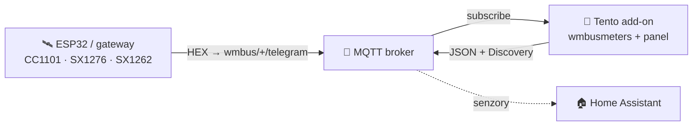
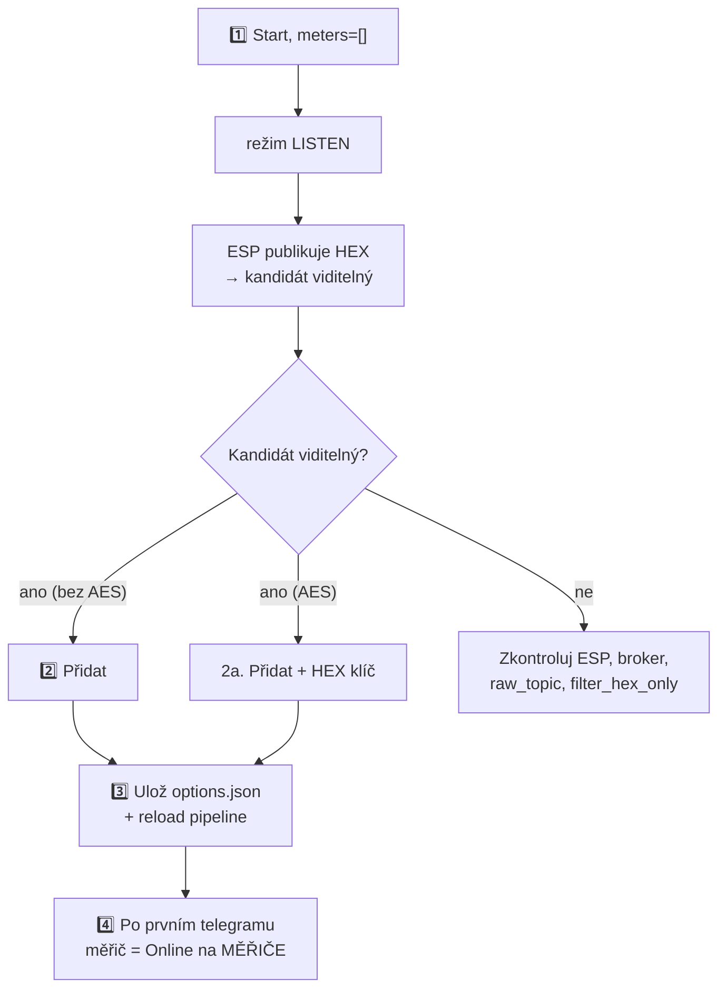

> 🌐 [EN](README.en.md) | [PL](README.pl.md) | [DE](README.de.md) | [**CS**](README.cs.md) | [SK](README.sk.md)

# wMBus MQTT Bridge — uživatelská příručka (CS)

> Příručka pro uživatele: instalace, přidání měřičů, čtení panelu, řešení potíží.
> **Jak to funguje uvnitř** (architektura, runtime soubory, soft-reload, kontrakt
> ESP diagnostiky) je v [`ARCHITECTURE.md`](ARCHITECTURE.md).

---

## Obsah

1. [Co to dělá](#1-co-to-dělá)
2. [Požadavky](#2-požadavky)
3. [Rychlý start — Home Assistant](#3-rychlý-start--home-assistant)
4. [Rychlý start — Docker standalone](#4-rychlý-start--docker-standalone)
5. [WebUI — co vidíš](#5-webui--co-vidíš)
6. [Typický postup: od prázdna k funkčnímu měřiči](#6-typický-postup-od-prázdna-k-funkčnímu-měřiči)
7. [Filtrování podle hodnoty — když je slyšet příliš mnoho cizích měřičů](#7-filtrování-podle-hodnoty--když-je-slyšet-příliš-mnoho-cizích-měřičů)
8. [Možnosti konfigurace](#8-možnosti-konfigurace)
9. [Jazyk rozhraní](#9-jazyk-rozhraní)
10. [Řešení potíží](#10-řešení-potíží)
11. [Jak to funguje pod kapotou](#11-jak-to-funguje-pod-kapotou)
12. [Licence a upstream](#12-licence-a-upstream)

---

## 1. Co to dělá

> **Jednou větou:** dekóduje telegramy Wireless M-Bus (vodoměry, měřiče tepla,
> elektroměry) **bez lokálního USB donglu** — surové HEX rámce dodává libovolný
> externí přijímač (ESP32, gateway) přes MQTT.

- **Ty** umístíš rádiový přijímač tam, kde je signál (např. ESP32 s anténou).
- **Přijímač** publikuje surové HEX rámce na MQTT (`wmbus/<device>/telegram`).
- **Tento add-on** se připojí k brokeru, krmí `wmbusmeters`, dekóduje telegramy a
  publikuje výsledek zpět na MQTT + **Home Assistant Discovery**.

Výsledek: **tvé měřiče se objeví jako senzory v HA, bez jakéhokoli rádiového hardwaru na straně HA.**



> 🤝 Typicky se používá s firmwarem **[esphome-wmbus-bridge-rawonly](https://github.com/Kustonium/esphome-wmbus-bridge-rawonly)**
> (ESP32 + CC1101/SX1276/SX1262, publikuje RAW HEX). Oba projekty jsou nezávislé —
> add-on přijímá hex z libovolného zdroje publikujícího na `raw_topic`.

> 🌉 **Jako celek tvoří ESP (RF přijímač) a tento add-on (dekodér)
> distribuovaný _wM-Bus → Home Assistant gateway_** — rádio je tam, kde je
> signál, a dekódování (dešifrování a sada ovladačů z připnutého sestavení
> `wmbusmeters`) běží na HA.
> Na rozdíl od monolitických wM-Bus gateway (rádio + dekodér v jedné krabičce)
> nepotřebuje lokální USB dongle a škáluje přidáváním levných ESP uzlů.
>
> **Každá polovina funguje i samostatně a jsou zaměnitelné:** ESP krmí libovolný MQTT backend (Node-RED, vlastní skript, vlastní dekodér) a add-on dekóduje hex z libovolného zdroje na `raw_topic` (tento ESP, rtl-wmbus, jiný gateway, replay nástroj) — spolupracují, ale ani jedna nezávisí na druhé.

---

## 2. Požadavky

- **MQTT broker** (Mosquitto, EMQX…) dosažitelný z HA / z hostitele.
- **Přijímač** publikující HEX rámce na `wmbus/<device>/telegram`.
- Home Assistant (režim add-onu) **nebo** Docker + compose (standalone).

> ⚠️ Neprovozuj paralelně oficiální add-on `wmbusmeters` — tento projekt má vlastní
> instanci a navzájem by se zdvojovaly.

> 🧱 **Hranice odpovědnosti.** Projekt poskytuje dva MQTT klienty — firmware ESP (rádio → MQTT) a tento add-on (MQTT → dekódování → HA); jeho rozsah končí u MQTT tématu. **Samotný broker — autentizace, ACL, TLS, síťová expozice a případný bridging broker-broker pro vzdálené/distribuované instalace (lokalita A → internet → lokalita B) — je odpovědností provozovatele.** Doporučeno: broker drž v LAN; pro vzdálený přístup použij tunel/VPN nebo bridging brokeru s TLS; nevystavuj port 1883 ani WebUI (8099) přímo do internetu. Pozn.: u měřičů s AES zůstává payload šifrován měřičem end-to-end, nezávisle na transportu brokeru.

> ⚠️ **Začátečník? Přečti si to, než něco vystavíš.** **Nepřesměrovávej** na domácím routeru port brokeru (1883) ani Home Assistant do internetu — vystavený broker může číst a zneužít kdokoli. Pro přístup zvenčí použij hotové bezpečné řešení: **Home Assistant Cloud (Nabu Casa)** nebo add-ony **Tailscale** / **Cloudflare Tunnel**. Nejsi si jistý? Nech vše v domácí síti — add-on ke svojí funkci internet nepotřebuje.

---

## 3. Rychlý start — Home Assistant

1. **Přidej repozitář:** Settings → Add-ons → Add-on Store → ⋮ → Repositories:
   ```
   https://github.com/Kustonium/homeassistant-wmbus-mqtt-bridge
   ```
2. **Nainstaluj** „wMBus MQTT Bridge", klikni **Start** (s výchozím `meters: []`
   add-on přejde do **režimu LISTEN** a jen naslouchá).
3. **Otevři WebUI** (Info → OPEN WEB UI).
4. Jdi na **PŘÍJEM / HLEDÁNÍ**, najdi svůj měřič mezi detekovanými kandidáty a klikni
   **Přidat** (modal: ID, ovladač, název, volitelný AES klíč a výběr publikovaných
   polí — viz níže). Po uložení se pipeline
   sama přenačte (bez restartu kontejneru).

Celý postup v [§6](#6-typický-postup-od-prázdna-k-funkčnímu-měřiči).

---

## 4. Rychlý start — Docker standalone

Pro vše mimo HA (DietPi, Ubuntu, Raspberry Pi OS, NAS…).

```bash
git clone https://github.com/Kustonium/homeassistant-wmbus-mqtt-bridge.git
mkdir -p /home/wmbus
cp -a homeassistant-wmbus-mqtt-bridge/docker/examples/* /home/wmbus/
cd /home/wmbus
docker compose pull
docker compose up -d
docker compose logs -f wmbus
```

Image `wmbus` je multi-arch (amd64 + aarch64) — `pull` sám stáhne variantu
odpovídající tvému hostu, bez lokální kompilace.

Konfigurace v `./config/options.json` (reference polí v [§8](#8-možnosti-konfigurace)):

```json
{
  "raw_topic": "wmbus/+/telegram",
  "discovery_enabled": true,
  "state_prefix": "wmbusmeters",
  "mqtt_mode": "external",
  "external_mqtt_host": "192.168.1.10",
  "external_mqtt_port": 1883,
  "external_mqtt_username": "user",
  "external_mqtt_password": "pass",
  "meters": []
}
```

Po úpravě: `docker compose restart wmbus`. WebUI: vystav port `8099` v
`docker-compose.yml` a otevři `http://<host-ip>:8099/`.

> 💡 V Dockeru globální tlačítko **Restart** funguje, pokud má kontejner
> nastavenou politiku restartu (ukázkový soubor Compose používá
> `restart: unless-stopped`). Bez ní tlačítko kontejner zastaví; znovu jej
> spusťte pomocí `docker start <container>`.

---

## 5. WebUI — co vidíš

Dostupné v **5 jazycích** (EN/PL/DE/CS/SK) — přepínač vpravo nahoře.

| Záložka | K čemu |
|---|---|
| **PANEL** | Dashboard: pipeline ESP→MQTT→wmbusmeters→HA (klikatelné dlaždice) + statistiky. |
| **MĚŘIČE** | Tvé nakonfigurované měřiče: hodnota, poslední telegram, **PŘÍJEM**. |
| **PŘÍJEM / HLEDÁNÍ** | Detekovaní kandidáti + nakonfigurované „v éteru"; zde přidáš/odebereš měřiče a filtruješ zobrazené hodnoty. |
| **LOGY / ESP LOGY** | Runtime události a diagnostika ESP přijímačů. |
| **NASTAVENÍ / O PROJEKTU** | Aktivní konfigurace, info. |

### Sloupec PŘÍJEM (co znamenají odznaky)

Najeď na **ⓘ** u záhlaví PŘÍJEM — máš legendu. Stručně:

- **stav + sloupce** — zda měřič dochází: *online* / *opožděný* / **ticho**. Práh je
  **adaptivní** podle rytmu daného měřiče (jeho průměrného intervalu). Delší ticho je
  **neutrální** (šedé), ne červený alarm — měřič může být v noci / při nepřítomnosti /
  při slabé baterii tichý, takže nehlásíme planý poplach.
- **📡 ESP** — měřič je označený (highlight) na některém z ESP.
- **📶 název N% · počet** — % příjmu a počet telegramů **na daném ESP** (z volitelné
  diagnostiky). Při více ESP vidíš, který přijímač měřič slyší a jak dobře. Barva:
  zelená ≥90 · jantarová ≥50 · červená <50.

> Surové % a počet **nejsou** mírou citlivosti desky (kumulativní počet od bootu,
> různé uptime). Skutečná citlivost je **pokrytí** — které měřiče deska vůbec slyší.

### Přidávání / odebírání měřičů (PŘÍJEM)

- Kandidáti bez AES se dekódují automaticky — sloupec **Hodnota** ukazuje živý náhled
  bez konfigurace.
- **Přidat** uloží měřič a přenačte pipeline.
- **Porovnat** v modalu **Přidat** nebo **Driver…** dekóduje poslední telegram dvěma
  drivery bez uložení změn. Vyber driver v poli **Driver**, u šifrovaného měřiče
  zadej AES klíč a klikni na **Porovnat**. Levý sloupec je uložený driver nebo
  auto-detekce `wmbusmeters`, pravý sloupec je tebou vybraný driver. Zelené řádky
  jsou další pole, žluté řádky jiné hodnoty; více polí **neznamená** automaticky
  správně — ověř hodnoty na displeji měřiče.
- **Hlášení…** použije uložený 32znakový AES klíč pro stejné ID, pokud existuje,
  takže `wmbusmeters --analyze` může ukázat dešifrované podrobnosti. Samotný klíč
  se do hlášení nikdy nevloží, ale odečty měřiče se v něm objevit mohou — před
  veřejným odesláním hlášení zkontroluj.
- **Odebrat vybrané** — zaškrtni checkboxy a odeber více najednou (tlačítko nad tabulkou).

---

## 6. Typický postup: od prázdna k funkčnímu měřiči



1. **Start** s `meters: []` → režim LISTEN, log ukáže `No meters configured -> LISTEN MODE`.
2. **Přidej** kandidáta (bez AES — hned; AES — zadej 32znakový HEX klíč).
   Ve stejném modálu je seznam všech polí, která ovladač umí vrátit — každé s
   popisem z wmbusmeters a zaškrtávátkem. Odškrtni, co nechceš jako entitu, nebo
   zadej vzory jako `consumption_at_history_*` do pole **Pole k vynechání**.
   Necháš-li prázdné, publikuje se vše jako dosud. Později to změníš přes
   **Driver…** u přidaného měřiče — pozor, odškrtnuté pole přijde o entitu i o
   zaznamenanou historii.
3. Uložení jde do `options.json` a DECODE pipeline se přenačte **bez plného restartu
   kontejneru**.
4. Po **dalším telegramu** tohoto měřiče se objeví jako **Online** na MĚŘIČE.
   HA Discovery vytvoří entity pro číselná pole vrácená `wmbusmeters`, například
   `total_m3`. Konečné HA `entity_id` přiděluje Home Assistant; bridge ho neurčuje.

Než přijde první telegram, dashboard ukazuje panel **„čeká na první telegram"**.
Plný restart add-onu je jen nouzová záloha.

**Přejmenování měřiče.** Otevři **Driver…** u nakonfigurovaného měřiče a uprav pole
**Název**. Název je to, co Home Assistant zobrazuje jako název zařízení.
Přejmenování je z hlediska historie bezpečné: `unique_id` každé entity vzniká z ID
měřiče, nikoli z názvu, takže entity i jejich zaznamenaná data zůstanou. Home
Assistant při přejmenování nepřepočítává existující `entity_id` — entita vytvořená
jako `sensor.kuchyne_total_m3` si toto ID ponechá i po přejmenování zařízení na
*Koupelna*, mění se jen zobrazovaný název. Dva měřiče nemohou mít stejný název:
dekodér zapisuje jeden soubor na název, proto je uložení odmítnuto, místo aby druhý
měřič tiše přepsal první.

**Kolik měřičů deska opravdu slyší?** Každá deska ESP dostane senzor
`wmbus <deska> meters_heard`: počet různých měřičů slyšených od startu doplňku,
v atributech součet přes všechny desky a procento pokrytí. Zaznamenává se jako
každá jiná veličina, takže se dostane do dlouhodobých statistik i do
InfluxDB/Grafany. Právě podle tohoto čísla má smysl desky porovnávat - podíl
zahozených rámců se *zlepší*, když deska ohluchne, protože rámec, který se
nepokusila přijmout, se nikdy nezapočítá jako zahozený.

**Nepodporovaný měřič?** Pokud se kandidát nikdy nedekóduje (neznámý driver /
„unknown format signature"), použijte tlačítko **Hlášení…** v jeho řádku:
add-on sestaví hotový blok hlášení pro upstream projekt wmbusmeters (surový
telegram + výstup `wmbusmeters --analyze`). Telegram obsahuje sériové číslo
měřiče. AES klíč není nikdy přiložen; pokud se pro analýzu použije uložený klíč,
dešifrovaný výstup může obsahovat odečty měřiče.

Totéž tlačítko **Hlášení…** je v každém řádku pohledu MĚŘIČE, takže už přidaný
měřič — takový, který se dekóduje, ale hlásí pole chybně nebo méně polí, než
ukazuje jeho displej — nahlásíte bez toho, abyste ho museli odebrat. Je to také
způsob, jak si prohlédnout surový rámec nakonfigurovaného měřiče: hlášení
začíná právě telegramem. Rámec pochází z kruhového bufferu naposledy přijatých
telegramů, takže po restartu je k dispozici, jakmile měřič znovu vyšle.

---

## 7. Filtrování podle hodnoty — když je slyšet příliš mnoho cizích měřičů

Aktuální postup ve WebUI používá lištu **Filtrovat podle hodnoty** v PŘÍJEM / HLEDÁNÍ:

1. Počkej, až nakonfigurované měřiče nebo kandidáti zobrazí číslo ve sloupci
   **Hodnota**.
2. Zadej odečet z fyzického displeje a toleranci (výchozí `0.05`).
3. Prohlížeč ponechá řádky v toleranci a skryje řádky s jinou nebo chybějící hodnotou.

Filtr porovnává pouze hodnoty, které už WebUI zobrazuje. Nespouští další dekodéry,
nezkouší jiné ovladače a nemění konfiguraci. Pro dva ovladače nad stejným rámcem
použij samostatně **Porovnat**.

Starší backend `search_mode` zůstává pro pokročilé použití na skryté trase
`#search`. LISTEN při něm ukládá pouze kandidáty hlášené jako nešifrované
vodoměry spolu s jejich jedním navrženým ovladačem. Teprve další restart je
načte jako dočasné měřiče a zkontroluje číselná pole, jejichž název obsahuje
`m3` nebo `total_volume`. Mechanismus **nezkouší** všechny ovladače. Dočasné
měřiče SEARCH jsou vynechány z HA Discovery.

---

## 8. Možnosti konfigurace

Z [`config.yaml`](../config.yaml).

### MQTT — vstup / výstup

| Pole | Typ | Výchozí | Popis |
|---|---|---|---|
| `raw_topic` | str | `wmbus/+/telegram` | Topic se surovými HEX rámci. `+` = wildcard (název ESP v diagnostice) |
| `filter_hex_only` | bool | `true` | Ignoruj zprávy, které nevypadají jako HEX |
| `mqtt_mode` | enum | `auto` | `auto` (pořadí: `external_mqtt_host`, je-li vyplněn → HA broker ze služby Supervisoru → sonda známých broker add-onů `core-mosquitto`/`a0d7b954-emqx`, s údaji `external_mqtt_username/password`, jsou-li zadány) / `ha` (vynutit HA) / `external` (vždy externí) |
| `external_mqtt_host/port/username/password` | str/int | `""` / `1883` / `""` / `""` | Externí broker (při `external`) |

### Discovery a výstup

| Pole | Typ | Výchozí | Popis |
|---|---|---|---|
| `discovery_enabled` | bool | `true` | Publikuj HA Discovery |
| `discovery_prefix` | str | `homeassistant` | Prefix Discovery |
| `discovery_retain` | bool | `true` | Discovery jako retained |
| `state_prefix` | str | `wmbusmeters` | Prefix topicu s hodnotami |
| `state_retain` | bool | `false` | Retained stav |
| `verify_ha_entities` | bool | `false` | V režimu HA add-onu použije deklarovaný read-only přístup add-onu k HA Core API k ověření testovací entity. Docker nemá token Supervisoru, takže tam ověření není dostupné. |

Každá entita z Discovery má **availability template**: pokud v posledním
telegramu měřiče chybí dané pole (některé měřiče střídají krátké a plné rámce),
entita zobrazí `unavailable` místo zastaralé nebo falešné hodnoty — a
automaticky se obnoví s dalším telegramem, který pole obsahuje. Nezávisle na
tom automaticky laděné `expire_after` (cca 2× pozorovaný interval vysílání
měřiče, minimálně 1 h) označí entity jako `unavailable`, když měřič ztichne.

Kromě číselných měřicích senzorů každý měřič, který hlásí pole `status`, získá
také dvě **diagnostické** entity (v sekci *Diagnostika* zařízení): `sensor` se
surovým textem stavu a `binary_sensor` (`device_class: problem`), který se
zapne pokaždé, když je stav jiný než `OK`. Text se přebírá doslovně z
wmbusmeters, takže jeho přesný obsah závisí na vybraném ovladači upstreamu.

Kromě toho most publikuje konfiguraci Discovery pro **každé** pole, které
ovladač vrací, a rozděluje je podle toho, co měří:

- pole, které Home Assistant umí zařadit (odhadneme `device_class`), nebo které
  nese jednotku spotřeby — m³, GJ, MJ, kWh, Wh, l, hca, kVARh, kVAh, tedy i
  veličiny, pro které HA třídu nemá: objem na měřiči tepla, tepelná energie v
  GJ/MJ, jednotky indikátoru topných nákladů a jalová i zdánlivá energie — se
  stane běžným měřicím senzorem, zapnutým;
- všechno ostatní se stane **diagnostickou** entitou publikovanou jako
  **vypnutá** (`enabled_by_default: false`): čísla bez třídy (stáří záznamu,
  čítače chyb), textová pole (`current_status`, `meter_datetime`, …) a pole,
  která ovladač právě hlásí jako `null` (`fraud_date`, dokud k podvodu
  nedošlo). Home Assistant takovou entitu zaregistruje a na stránce zařízení ji
  ukáže jako vypnutou; zapneš ty, které potřebuješ.

Entitu nedostane pouze identita měřiče (`id`, `name`, `meter`, `media`,
`timestamp`, `rssi`, `lqi`) — je už v názvu zařízení a v atributech entit.

Každá entita navíc nese atribut `Description` — popis pole od autora ovladače,
získaný z `wmbusmeters --listfields`. Stojí vedle dekódovaných polí telegramu v
atributech entity, takže nic z toho, co tam bylo dřív, nezmizí.

Home Assistant čte `enabled_by_default` jen při prvním přidání entity, takže
aktualizace nikdy nevypne to, co už máš. `entity_category` se naproti tomu
uplatní při každé aktualizaci konfigurace, takže číselná pole bez třídy
založená starší verzí se přesunou do sekce *Diagnostika*.

Totéž platí i obráceně: entita vytvořená jako vypnutá zůstane vypnutá, dokud ji
na stránce zařízení nezapneš — i když by ji novější verze doplňku už
publikovala jako běžný senzor. Smazání zařízení nepomůže, protože Home Assistant
odstraněné entity včetně stavu zapnutí obnoví, jakmile je stejný měřič znovu
detekován; tento záznam si drží 30 dní. Stačí ji jednou zapnout ručně.

### RSSI podle přijímací desky (volitelné, zapíná se na ESP)

Úroveň signálu není součástí telegramu. RAW téma nese čistý hexadecimální
zápis, takže `wmbusmeters` žádné RSSI nevidí a nemá co hlásit — musí ho zvlášť
publikovat přijímací deska. Tato publikace je **ve výchozím stavu vypnutá** a
není volbou doplňku: zapíná se v YAML firmwaru, v sekci `wmbus_radio`:

```yaml
wmbus_radio:
  publish_rssi: true
```

Deska pak pro každý dekódovaný měřič publikuje:

```text
wmbus/<deska>/rssi/<id_měřiče>    payload: -52
```

Most si hodnotu ukládá zvlášť pro každý měřič **a** každou desku a připojuje ji
k dekódovanému telegramu jako `rssi_<deska>_dbm`. Každá deska tak má pro tentýž
měřič vlastní entitu síly signálu:

```json
{
  "rssi_lilygo_dbm": -52,
  "rssi_xiaoseed_dbm": -50
}
```

Je to záměr. Tentýž měřič mohou slyšet dvě desky a jediná sloučená hodnota by
mezi nimi jen přeskakovala — číslo by vypadalo jako kolísající signál, ne jako
dva přijímače. Proto společné pole `rssi_dbm` neexistuje.

Most ukládá pouze věrohodné měření: -125 až -1 dBm. Sentinely firmwaru
označující „žádná data" se zahazují, místo aby se publikovaly jako odečet, a
hodnota starší než pět minut se k čerstvému telegramu nepřipojí — když některá
deska přestane publikovat, její entita se stane nedostupnou, místo aby zamrzla
na posledním čísle.

Když volbu necháte vypnutou, nic nepřijde, nepřidá se žádné pole a nevznikne
žádná entita.

### Starší režim SEARCH

| Pole | Typ | Výchozí | Popis |
|---|---|---|---|
| `search_mode` | bool | `false` | Zapíná skrytý starší backend SEARCH popsaný v [§7](#7-filtrování-podle-hodnoty--když-je-slyšet-příliš-mnoho-cizích-měřičů) |
| `search_expected_value_m3` | float | `0` | Očekávaný stav m³ |
| `search_tolerance_m3` | float | `0.05` | Tolerance porovnání — v domě nezvyšuj |
| `search_delta_mode` / `search_min_delta_m3` | bool/float | `false` / `0.001` | (Experimentální) porovnání delty |
| `search_topic` | str | `wmbus/search/candidates` | Topic výsledků SEARCH publikovaný bez retain |

### Debug

| Pole | Typ | Výchozí | Popis |
|---|---|---|---|
| `loglevel` | enum | `normal` | `normal` / `verbose` / `debug` |
| `debug_every_n` | int | `0` | Extra diagnostika každý N-tý telegram |

> 💡 Všechny výše uvedené možnosti lze upravit i přímo ve WebUI v **Nastavení → Konfigurace** (s popisem u každé); klíčové možnosti se projeví po restartu doplňku.

### Měřiče — `meters[]`

| Pole | Typ | Povinné | Popis |
|---|---|---|---|
| `id` | str | ano | Tvůj štítek měřiče, použitý v názvech MQTT Discovery a generované konfiguraci |
| `meter_id` | str | ano | Sériové číslo měřiče (HEX, z LISTEN) |
| `type` | str | ano | **Název ovladače wmbusmeters** (např. `hydrodigit`, `amiplus`, `izarv2`) **nebo `auto`/`other`**. Volný řetězec — wmbusmeters ověří ovladač při dekódování (záměrně ne enum, aby nové ovladače nebyly odmítány). |
| `type_other` | str? | při `type=other` | Vlastní název ovladače |
| `key` | str? | při šifrování | 32znakový AES klíč (HEX) |
| `exclude_fields` | str? | ne | Vzory (globy) polí, která **nemají** dostat entitu v Home Assistantu — např. `consumption_at_history_*, history_*_date`. Oddělené čárkami nebo mezerami; prázdné publikuje všechna pole. |
| `calculated_fields` | str? | ne | Další pole, která **wmbusmeters** počítá z telegramu, oddělená středníky, každé jako `název=vzorec` — např. `difftemp_c=flow_temperature_c - return_temperature_c`. Počítá dekodér; výsledek je běžné pole a stane se entitou jako každé jiné. |
| `static_fields` | str? | ne | Pevné hodnoty připojené k měřiči, oddělené středníky, každá jako `název=hodnota` — např. `location=kuchyne; apartment=12`. Dekodér je vkládá do telegramu **jako text** (`apartment=12` přijde jako `"12"`), takže je vidět v atributech entit a jako diagnostické entity: štítek, ne měření. |

Před psaním vzorce se hodí vědět dvě věci. Aritmetika **hlídá jednotky**:
`total_m3 / 2 counter` funguje, `total_m3 * 2` ne — holé číslo nemá jednotku a
dekodér takový vzorec odmítne. Sčítání polí se stejnou jednotkou nepotřebuje nic
navíc, např.
`difftemp_c=max_external_temperature_c - min_external_temperature_last_month_c`.
Vzorec, kterému dekodér nerozumí, stojí jen ono jedno pole: napíše to do logu, pole
prostě nevznikne a zbytek měřiče se dekóduje normálně.

Název počítaného pole není libovolný: musí končit jednotkou a ta převádí
výsledek. Ze stejného vzorce dá `difftemp_c` °C a `difftemp_f` °F — změřeno na
skutečném telegramu: 11 °C se vrátilo jako `11`, `51.8` a `284.15` pro názvy
`_c`, `_f` a `_k`. Název bez jednotky nebo s neznámou (`mojepole`, `kopie_xyz`)
je odmítnut: dekodér napíše *"Could not extract a valid unit from calculated
field name"*, pole nevznikne a měřič dekóduje dál. Konstantních polí se to
netýká — tam je přípustný jakýkoli název, protože se nic nepřevádí.

Seznam ovladačů ve WebUI se generuje z připnutého sestavení `wmbusmeters` a jeho
XMQ zdrojů. Používejte tento katalog místo ručně udržovaného seznamu v návodu.

Tabulka polí v panelu ovladače měřiče pochází z `wmbusmeters --listfields` — je
to úplný katalog ovladače, ne seznam toho, co tato cesta publikuje. Deset polí
společných všem ovladačům se proto zobrazuje ztlumeně a nelze je zaškrtnout.
`id`, `name`, `meter`, `media` a `timestamp` jsou identita měřiče: zůstávají v
názvu zařízení a v atributech entit, místo aby dostaly vlastní entity.
`timestamp_ut`, `timestamp_lt`, `timestamp_utc`, `device` a `rssi_dbm` se sem do
JSON dekodéru nikdy nedostanou — tři časová razítka existují jen pro výstupní
formáty CSV/`fields` a poslední dvě vyplňuje přijímací rádiové zařízení, které
dekodér nemá, když mu telegramy předáváte jako HEX.

---

### Záložka Diagnostika

Tabulka po deskách: rámce, měřidla, chybějící události, restarty za posledních
24 hodin a čas od posledního rámce, plus jeden stav na desku. Pod ní karta každé
desky s detaily a srozumitelným vysvětlením každého varování.

Dvě věci, kvůli kterým vznikla. **Mezery v sekvenci** dokládají, že se událost
ztratila mezi ESP a doplňkem - neříkají však, zda selhalo rádio, MQTT, síť nebo
odběratel. A **tiché restarty**: restart vynuluje počítadla desky, takže bez
zvláštního záznamu maže vlastní stopu. Když jsou restarty zhruba 15 minut od
sebe, záložka to řekne a pojmenuje pravděpodobnou příčinu - výchozí
`api.reboot_timeout` v ESPHome, který desku restartuje, kdykoli není připojen
klient Native API. Přijímač pouze na MQTT žádného nemá.

Stránka potřebuje firmware publikující téma metadat `rx`; starší desky se
jednoduše neobjeví.

Pokud firmware navíc razítkuje rámce časem příjmu, karta získá řádek **Hodiny
ESP**: zda jsou hodiny desky nastavené a jak moc se její čas příjmu liší od času
doplňku.

Když firmware navíc publikuje retained snapshot `<diag>/config`, karta získá
sekci **Konfigurace** s každým účinným nastavením a značkou - `default`,
`CHANGED` nebo `set` - takže čtenář vidí, s čím deska skutečně naběhla, bez
toho aby musel žádat o YAML. Starší firmware sekci prostě nemá.

### Export důkazů o příjmu z ESP (`esp_rx_api_enabled`, ve výchozím stavu vypnuto)

Firmware publikující strukturovaná metadata příjmu na `wmbus/<deska>/rx` umožňuje
doplňku počítat **skutečné příjmy na měřidlo a na desku** místo spoléhání na
procenta, která si každá deska počítala sama o sobě. Ta procenta nebyla mezi
deskami porovnatelná: deska slyšící každé druhé vysílání si odvodila dvakrát delší
průměrný interval a stejně ukazovala 100 %.

Volba **`esp_rx_api_enabled` je ve výchozím stavu vypnutá** a nemění nic na sběru
dat ani na běžném rozhraní. Zapnutí udělá dvě věci:

- zpřístupní `GET /api/esp-rx` přes ověřené Ingress WebUI — přehled příjmu,
  spojitost sekvence po deskách a omezenou historii, s `limit` (1–10000), `since`
  a `until` (UTC epocha, `until` nezahrnuto);
- přidá tlačítko **Download RX history** na stránce Přijaté / Hledat, které uloží
  tatáž povolená data s celým uchovaným bufferem (až 100 000 událostí) pod názvem
  souboru s UTC značkou.

Export **nikdy** nevrací RAW telegramy, AES klíče ani přihlašovací údaje MQTT a je
jen pro čtení: stažení nezkracuje historii, nenuluje počítadla a nic nerestartuje.
Při vypnuté volbě endpoint odpovídá HTTP 404.

Mezery v sekvenci dokládají, že se někde mezi ESP a odběratelem ztratila událost.
Samy o sobě **neříkají**, zda byla příčinou rádiová část, MQTT, síť nebo odběratel.

### Blok walk-by Qundis (`qds_walkby_enabled`, ve výchozím stavu vypnuto)

Měřiče Qundis vkládají celý obsah walk-by do jediného záznamu výrobce
(`0DFF5F`, 53 bajtů) v telegramech CI=0x78. Od generace 2026 je tento záznam
šifrovaný **uvnitř záznamu**, nikoli na vrstvě wM-Bus: takové telegramy nemají
hlavičku TPL, wM-Bus je tedy správně hlásí jako nešifrované a nic je neoznačí
jako vyžadující klíč.

Bez této volby nastávají dva problémy a volba řeší oba:

- **Náhodné hodnoty se `status: OK`.** Dekodér pozná záznam walk-by podle
  jediného bajtu, který náhodný šifrovaný obsah trefí jednou za 256 telegramů —
  tedy zhruba každých osm hodin na měřič. Pak čte šifrované bajty jako číslo. U
  měřiče s 1,387 m³ z toho vznikne `15430.611`, což nenápadně znehodnotí
  dlouhodobé statistiky Home Assistanta. Se zapnutou volbou se neověřitelný
  záznam předá dekodéru se změněným klíčem, na který nesedí žádný ovladač:
  odečet propadne, hodiny měřiče se dál aktualizují.
- **Žádné hodnoty a žádné vysvětlení.** Je-li AES klíč měřiče nastavený, doplněk
  blok sám dešifruje a předá dekodéru čitelný záznam. Není-li, log to řekne přímo
  — spolu s verzí a typem měřiče, polem CI a nalezenými záznamy.

**Jde o běžný AES klíč měřiče** — ten samý, který používají jeho běžné telegramy
(CI=0x7A). Žádné zvláštní tajemství pro walk-by neexistuje; pokud se běžné
telegramy toho měřiče dešifrují, je to právě tento klíč. Špatný klíč je nahlášen
jako špatný a nikdy nevede k náhradní hodnotě.

S vypnutou volbou je dekódování bajt po bajtu stejné jako dřív, instalace bez
měřičů Qundis tedy není dotčena. Viz `docs/ARCHITECTURE.md` §3.5.

### Drátový M-Bus (sériová sběrnice, ve výchozím stavu vypnuto)

Měřiče tepla a vody často vedou kabelem, ne rádiem: převodník M-Bus master sedí na
dvoudrátové sběrnici a v systému se hlásí jako sériový port (USB, RS-232 nebo
RS-485). Doplněk umí takovou sběrnici sám dotazovat.

Vše navazující zůstává stejné jako u rádia — stejné ovladače, jednotky, Discovery,
počítaná i konstantní pole. Liší se jen transport: měřiče se dotazují místo
poslouchání a adresují místo objevování.

Po první platné odpovědi se kabelový měřič zobrazí také v **PANELU** a
**MĚŘIČÍCH**. Sloupec zdroje ukazuje `M-Bus · <alias sběrnice>` místo odznaků ESP,
rádiového pásma a příjmu a Panel doplní skutečnou kabelovou cestu
`měřič → sériový master → dotazující wmbusmeters → MQTT + HA`. Cesta je označena
jako aktivní až po přijetí telegramu runtime, ne pouhým zapnutím enginu.

**Dva přepínače, oba ve výchozím stavu vypnuté.** `mbus_tab_visible` pouze zobrazí
záložku, `mbus_enabled` spustí engine. Při obou vypnutých se pro vás nic nemění.

| Volba | Význam |
|---|---|
| `mbus_device` | sériový port; nejlépe cesta `/dev/serial/by-id/…` |
| `mbus_bus_alias` | název sběrnice v konfiguraci měřičů (`MAIN`) |
| `mbus_baudrate` | 300–9600, obvykle 2400 |
| `mbus_poll_interval` | výchozí interval zapsaný každému měřiči bez vlastního |
| `mbus_donotprobe_all` | nechte zapnuté — viz varování níže |
| `mbus_device_serial` | vyplní se automaticky při výběru portu; umožní zjistit, že uzel `/dev` už patří jinému hardwaru, místo tichého dotazování |
| `mbus_loglevel` | `normal`, `verbose`, `debug` — jen pro instanci sběrnice, nezávisle na hlavní úrovni logu |
| `mbus_logtelegrams` | loguje každý rámec vyměněný se sběrnicí; užitečné, když měřidlo mlčí, jinak upovídané |
| `mbus_ignoreduplicates` | zahazuje opakované identické telegramy před dekódováním |
| `mbus_meters[]` | `id`, `address` (`p1`..`p250` nebo 8 hex), `type`, `key`, `poll_interval` |

**Doplněk záměrně nikdy neskenuje porty.** Sondování znamená vysílání a na typickém
stroji s Home Assistant je jeden ze sériových portů koordinátor Zigbee. Dekodér
správný převodník stejně nepotvrdí — otevře zařízení a ohlásí úspěch — port proto
vybíráte vy.

Vybranou sběrnici pak můžete výslovně ověřit: **Ověřit, zda sběrnice žije** odešle
jeden testovací broadcast, **Sken primárních adres** projde jen zadaný rozsah
(`p1`–`p250`, nejvýše 32 adres na požadavek) a v každém řádku zobrazí potvrzení
adresy i diagnostiku datové odpovědi; **Dotázat jednou** osloví jednu
nakonfigurovanou primární adresu. Za běžícího pravidelného dotazování jsou všechny
tři akce odmítnuty, protože M-Bus má jediný master. **„Dotázat jednou“ slouží pouze
k diagnostice:** zobrazí surovou odpověď, ale nedekóduje ji, nepublikuje do
MQTT/Home Assistant ani nepřidá měřič do Pipeline. Pro běžný provoz měřič uložte,
zapněte engine, klikněte na **Použít** a restartujte doplněk. Výstup tohoto běžného
enginu zůstává viditelný v **Konzoli sběrnice**, která je pouze pro čtení a neumí
odesílat libovolné bajty.

Pole **Ovladač** v tabulce měřičů nabízí všechny ovladače dodané v aktuálním obrazu
a nadále přijímá vlastní název. `auto` může měřič rozpoznat, ale nezaručuje výběr
použitelného ovladače pro každou kabelovou odpověď; pokud automatické dekódování
nevrací hodnotu, vyberte ovladač uvedený v dokumentaci měřiče.
**Zjistit ovladač** provede jeden diagnostický dotaz a předá přijatý rámec
analyzátoru v přibaleném `wmbusmeters`. Návrh vyplní pole, ale nikdy se automaticky
neuloží: zkontrolujte jej a klikněte na **Uložit měřiče**. Pokud analyzátor nemá
spolehlivý návrh, rozhraní to oznámí místo hádání.
Pipeline odvozuje zobrazenou jednotku ze skutečného názvu dekódovaného pole
(například `_c` → `°C`, `_rh` → `RH%`), také u ovladačů bez kumulativního odečtu,
které používají obecný číselný fallback.

**V Dockeru** namapujte převodník výslovně:
`devices: ["/dev/serial/by-id/usb-…:/dev/ttyUSB0"]`. Nikdy `/dev:/dev`, nikdy
`privileged`.

**Záložka řekne, proč nic nechodí.** Na sběrnici vypadají špatná adresa, mrtvý měřič,
převodník, který nenapájí linku, a měřič mluvící jiným protokolem zvenčí stejně:
nevzniknou žádné entity. Karta stavu sběrnice pojmenuje, o který případ jde — po
měřičích, spolu s okamžikem poslední odpovědi každého z nich:

- *Bez odpovědi* — port je otevřený, měřič na této adrese mlčí. Adresa, kabeláž nebo
  převodník, který sběrnici nenapájí.
- *Poškozené rámce* — chyby kontrolního součtu, nejčastěji dva měřiče na jedné
  primární adrese. Měřič odpovídající dvěma různými id je zvlášť označen: dekodér
  žádný konflikt nehlásí, prostě vydá obě odpovědi, a vy byste jinak z jednoho
  záznamu dostali v Home Assistantu druhé zařízení.
- *Toto není provoz M-Bus* — bajty tečou, ale žádný nemá tvar rámce M-Bus.
  Běžné elektroměry distributora s optickým portem nebo RS-485 používají
  DLMS/COSEM (IEC 62056), jiné Modbus RTU/TCP. Tento doplněk nedekóduje žádný
  z těchto protokolů. Skutečný elektroměr M-Bus podle EN 13757 však může fungovat,
  pokud pro něj wmbusmeters obsahuje ovladač. Samotný konektor RS-485 neznamená
  M-Bus.
- *Na tomto portu je jiné zařízení* — port nyní ukazuje na jiný hardware než vybraný,
  takže je dotazování odmítnuto místo toho, aby mířilo do cizího Zigbee koordinátoru.

**Neověřeno na skutečné sběrnici.** Protokol byl testován proti simulátoru, ne proti
skutečným měřičům — autor nemá drátový M-Bus hardware. Pokud něco nefunguje, založte
issue; jinak to nelze opravit.

Zobrazení **O PROJEKTU** dokumentuje obě skutečné datové cesty a zobrazuje oznámení
o podpoře AI. Kopie v repozitáři je v [NOTICE.md](../NOTICE.md).

### Elektroměry Tauron / KPL (Polsko)

Tyto měřiče vkládají nestandardní prefix tam, kde standard wM-Bus očekává bajty
potvrzující úspěšné dešifrování. Upstreamový `wmbusmeters` to čte jako špatný klíč a celý
telegram zahodí s hláškou *"did you use the correct decryption key?"*, ačkoli klíč je
správný. Tento doplněk nese lokální opravu, která se použije jen u měřičů s výrobcem
`KPL`.

Takový měřič nastavte s ovladačem **`amiplus`** — automatická detekce jej nenajde, protože
žádný upstreamový ovladač si tohoto výrobce nenárokuje.

**U nás neověřeno.** Nikdo na této straně takový měřič nemá; oprava stojí na hlášení
uživatele. Pokud jej máte, založte prosím issue se surovým telegramem.

## 9. Jazyk rozhraní

5 jazyků (en/pl/de/cs/sk). Výběr: `?lang=cs` v URL → cookie `wmbus_lang` →
hlavička `Accept-Language` → výchozí `en`. Přepínač vpravo nahoře.

---

## 10. Řešení potíží

### „Telegramy dorazí na broker, ale v HA nejsou entity"

Spusť **Discovery Doctor** (pohled NASTAVENÍ): checklist jedním kliknutím ukáže
aktuální stav MQTT bridge, zda je Discovery zapnuté a retained, a kolik retained
konfigurací senzorů existuje pro každý nakonfigurovaný měřič, včetně ukázky
payloadu. Přijatá birth zpráva HA potvrzuje, že HA používá daný broker a prefix;
její absence nic nedokazuje, protože zpráva často není retained. Volitelné
ověření testovací entity přes HA Core API je silnější kontrola. Dialog obsahuje
i tlačítko **Vynutit re-discovery**.

### „Chci začít znovu — odebrat všechny měřiče"

V zobrazení NASTAVENÍ tlačítko **Resetovat doplněk** odebere VŠECHNY
nakonfigurované měřiče, vymaže jejich entity v Home Assistantu (publikuje
prázdné retained discovery configy, takže entity zmizí) a vyčistí běhový stav
(kandidáti, seznam ignorovaných, statistiky). Doplněk se vrátí do stavu po
instalaci. Akce je nevratná a nejprve vyžaduje potvrzení.

### „Chci změnit možnosti bez opuštění WebUI"

V zobrazení NASTAVENÍ je editovatelný formulář **Konfigurace** pro skalární
možnosti ze schématu add-onu, s popisem každé z nich. Měřiče se spravují zvlášť
v PŘÍJEM / HLEDÁNÍ. Uložení v režimu HA add-onu zapisuje možnosti přes
Supervisor API, v samostatném Dockeru přímo do
`/config/options.json`. MQTT heslo je pouze pro zápis (prázdné pole zachová
současnou hodnotu). Základní možnosti se projeví po úplném restartu
add-onu/kontejneru.

### „Můj měřič šifruje telegramy — co teď?"

Když LISTEN výslovně ohlásí šifrování, kandidát má odznak **AES req.**. Bez
individuálního 128bitového AES klíče (32 hex znaků) jeho payload nelze dekódovat.
Kde klíč získat: **správce budovy / družstvo**, **dodavatel
média**, který měřič fakturuje, nebo **instalatér měřiče**. Měřič můžeš přidat
bez klíče a doplnit ho později tlačítkem **Driver…**. Když `wmbusmeters` vypíše
rozpoznané varování o chybějícím nebo neplatném klíči, bridge je zaznamená a na
řádku měřiče ukáže odpovídající červený stav. Po opravě klíče se pipeline
přenačte a čeká na další telegram.

### „Nevidím žádné telegramy" (RAW count = 0)
1. Publikuje přijímač na `wmbus/<cokoli>/telegram`? Test: `mosquitto_sub -h <broker> -t 'wmbus/#' -v`.
2. Zkontroluj skutečné startovní řádky: `MQTT: <host>:<port> topic=<raw_topic>` a `MQTT broker ready`.
3. Při `filter_hex_only: true` jsou ne-HEX nebo liché payloady tiše zahozeny ještě před RAW počítadlem. Pokud ESP posílá base64/JSON, změň formát odesílatele nebo filtr vědomě vypni.
4. Je broker dosažitelný? Zkontroluj chyby připojení (`mqtt_mode`).

### „Přidal jsem měřič, ale neobjevuje se v MĚŘIČE"
Objeví se až **po dalším telegramu** pro toto ID (desítky sekund až pár minut).
Pokud ne — zkontroluj `meter_id`, ovladač, AES klíč a logy.

### „V formuláři měřiče chybí ovladač"
Aktuální schéma ukládá `type` jako volný řetězec; nemá pevný enum povolených
ovladačů. Katalog WebUI se generuje z vestavěných a XMQ ovladačů připnutého
sestavení `wmbusmeters` a sestavení obrazu selže, pokud chybí vestavěný ovladač
`izar`. Zkontroluj aktivní možnosti a vyber ovladač z tohoto katalogu znovu.

### „Stav ukazuje «ticho», ne červené «offline»"
Tak je to záměrně (honest-witness): měřič je pasivní, delší ticho je tedy
nejednoznačné (noc/nepřítomnost/baterie) — ukazujeme neutrální stav, ne planý poplach.
Práh vychází z **rytmu** každého měřiče, ne z pevných 15/60 min.

### „Hodnota jen roste, není okamžitá"
Hlavní zobrazená hodnota je **stav měřiče** (`total_m3`,
`total_energy_consumption_kwh`). Pokud JSON dekodéru obsahuje `total_m3`, ale ne
pole okamžitého průtoku, bridge žádné nevytváří. Aktuální/periodickou spotřebu
spočítej v HA pomocníkem **Utility Meter** (denní/měsíční, přežije restarty)
nebo **Derivative** (m³/h). `total_m3` je publikováno jako `device_class: water` +
`state_class: total_increasing`, takže jde i do statistik vody/Energie HA.

### „Mám šifrovaný měřič — kde vzít AES klíč?"
Od dodavatele měřičů (správce budovy / dodavatel vody/tepla), z nálepky nebo
dokumentace měřiče. Bez klíče šifrované telegramy nedekóduješ.

### „Přidat měřič nic neudělalo" (Docker)
Adresář `./config/` musí být **zapisovatelný** (ne `:ro`). Po přidání by měl log
potvrdit zápis do `options.json`. V nouzi `docker restart <container>`.

---

## 11. Jak to funguje pod kapotou

**Proč se dekóduje na serveru, a ne na ESP?** Projekty, které vestavují dekodér
do firmwaru ESP, narážejí stále na stejné třídy problémů: každý nový model
měřiče znamená aktualizaci firmwaru, každé vydání ESPHome/toolchainu může
rozbít build vestavěného dekodéru a celá flotila zařízení nakonec zůstane
připnutá na staré verzi ESPHome jen proto, aby se jedna komponenta dál
kompilovala. Tady ESP žádný dekodér nenese, takže:

- přidání nebo změna měřiče je úprava ve WebUI — **nikdy reflash**;
- aktualizace ESPHome nemohou rozbít dekódování — na čipu není dekodér, který
  by se mohl rozbít;
- AES klíče zůstávají na serveru — ESP nikdy nevidí klíčový materiál;
- firmware je pro všechny stejný a neroste s počtem měřičů.

Poctivá cena: potřebujete stále běžící hostitel a MQTT broker — což instalace
Home Assistant už stejně má. Úplné zdůvodnění včetně tabulky tříd selhání je v
[`ARCHITECTURE.md`](ARCHITECTURE.md#why-decode-centrally).

Hranice integrace s `wmbusmeters`, tok telegramu, model procesů, runtime soubory,
soft-reload, kontrakt ESP a stav dashboardu jsou v
**[`ARCHITECTURE.md`](ARCHITECTURE.md)**. Build, CI, aktualizace dekodéru a hranice
mezi repozitáři dev a stable jsou v **[`DEVELOPMENT.md`](DEVELOPMENT.md)**.

---

## 12. Licence a upstream

**GNU GPL-3.0.** Tento projekt obsahuje a upravuje kód z `wmbusmeters-ha-addon`
(GPL-3.0); celek — včetně `webui.py`, `i18n.py`, přepsaného `bridge.sh` — je
distribuován pod GPL-3.0.

- **wmbusmeters** — https://github.com/wmbusmeters/wmbusmeters (Fredrik Öhrström, GPL-3.0)
- **wmbusmeters-ha-addon** — https://github.com/wmbusmeters/wmbusmeters-ha-addon (GPL-3.0)

Fork vyvíjený **Kustonium**: MQTT vstup místo lokálního donglu, WebUI v 5 jazycích,
LISTEN/ADD, filtrování hodnot a porovnání ovladačů.

---

Dotazy / chyby → [GitHub Issues](https://github.com/Kustonium/homeassistant-wmbus-mqtt-bridge/issues).
