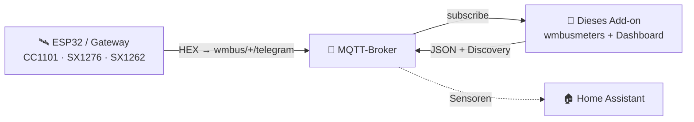
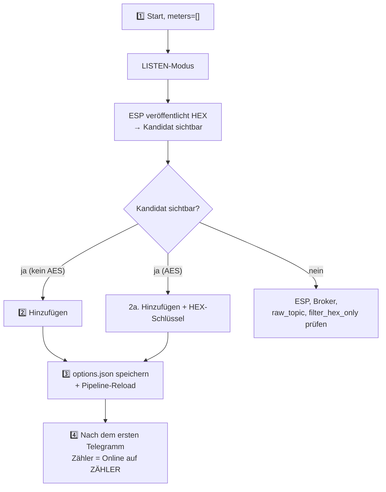

> 🌐 [EN](README.en.md) | [PL](README.pl.md) | [**DE**](README.de.md) | [CS](README.cs.md) | [SK](README.sk.md)

# wMBus MQTT Bridge — Benutzerhandbuch (DE)

> Ein benutzerorientierter Leitfaden: Installation, Zähler hinzufügen, Dashboard
> lesen, Fehlerbehebung. **Wie es intern funktioniert** (Architektur, Runtime-
> Dateien, Soft-Reload, ESP-Diagnosevertrag) steht in
> [`ARCHITECTURE.md`](ARCHITECTURE.md).

---

## Inhaltsverzeichnis

1. [Was es tut](#1-was-es-tut)
2. [Voraussetzungen](#2-voraussetzungen)
3. [Schnellstart — Home Assistant](#3-schnellstart--home-assistant)
4. [Schnellstart — Docker standalone](#4-schnellstart--docker-standalone)
5. [Die WebUI — was du siehst](#5-die-webui--was-du-siehst)
6. [Typischer Ablauf: von leer zu einem laufenden Zähler](#6-typischer-ablauf-von-leer-zu-einem-laufenden-zähler)
7. [Nach Wert filtern — wenn zu viele fremde Zähler zu hören sind](#7-nach-wert-filtern--wenn-zu-viele-fremde-zähler-zu-hören-sind)
8. [Konfigurationsoptionen](#8-konfigurationsoptionen)
9. [Sprache der Oberfläche](#9-sprache-der-oberfläche)
10. [Fehlerbehebung](#10-fehlerbehebung)
11. [Wie es unter der Haube funktioniert](#11-wie-es-unter-der-haube-funktioniert)
12. [Lizenz und Upstream](#12-lizenz-und-upstream)

---

## 1. Was es tut

> **In einem Satz:** Es dekodiert Wireless-M-Bus-Telegramme (Wasser-, Wärme- und
> Stromzähler) **ohne lokalen USB-Dongle** — die rohen HEX-Frames liefert ein
> beliebiger externer Empfänger (ESP32, Gateway) über MQTT.

- **Du** platzierst den Funkempfänger dort, wo Empfang ist (z. B. ein ESP32 mit Antenne).
- **Der Empfänger** veröffentlicht rohe HEX-Frames per MQTT (`wmbus/<device>/telegram`).
- **Dieses Add-on** verbindet sich mit dem Broker, speist `wmbusmeters`, dekodiert
  die Telegramme und veröffentlicht das Ergebnis zurück nach MQTT + **Home Assistant Discovery**.

Ergebnis: **Deine Zähler erscheinen als Sensoren in HA, ganz ohne Funkhardware auf der HA-Seite.**



> 🤝 Üblicherweise mit der Firmware **[esphome-wmbus-bridge-rawonly](https://github.com/Kustonium/esphome-wmbus-bridge-rawonly)**
> verwendet (ESP32 + CC1101/SX1276/SX1262, veröffentlicht RAW HEX). Beide Projekte
> sind unabhängig — das Add-on nimmt Hex von jeder Quelle an, die auf `raw_topic` veröffentlicht.

> 🌉 **Als Ganzes bilden der ESP (RF-Empfänger) und dieses Add-on (Decoder)
> ein verteiltes _wM-Bus → Home-Assistant-Gateway_** — das Funkmodul steht dort,
> wo Empfang ist, das Dekodieren (Entschlüsselung und der Treibersatz des
> gepinnten `wmbusmeters`-Builds) auf HA läuft. Anders als monolithische wM-Bus-Gateways (Funk + Decoder in
> einer Box) braucht es keinen lokalen USB-Dongle und skaliert durch das
> Hinzufügen günstiger ESP-Knoten.
>
> **Jede Hälfte läuft auch eigenständig und ist austauschbar:** der ESP speist ein beliebiges MQTT-Backend (Node-RED, ein eigenes Skript, ein eigener Decoder), und das Add-on dekodiert Hex aus beliebiger Quelle auf `raw_topic` (dieser ESP, rtl-wmbus, ein anderes Gateway, das Replay-Tool) — sie kooperieren, aber keine hängt von der anderen ab.

---

## 2. Voraussetzungen

- Ein **MQTT-Broker** (Mosquitto, EMQX…), erreichbar von HA / vom Host.
- Ein **Empfänger**, der HEX-Frames auf `wmbus/<device>/telegram` veröffentlicht.
- Home Assistant (Add-on-Modus) **oder** Docker + compose (standalone).

> ⚠️ Betreibe nicht parallel das offizielle `wmbusmeters`-Add-on — dieses Projekt
> hat seine eigene Instanz und sie würden sich doppeln.

> 🧱 **Verantwortungsgrenze.** Dieses Projekt liefert zwei MQTT-Clients — die ESP-Firmware (Funk → MQTT) und dieses Add-on (MQTT → Dekodierung → HA); sein Geltungsbereich endet am MQTT-Topic. **Der Broker selbst — Authentifizierung, ACLs, TLS, Netzwerk-Exposition und ein etwaiges Broker-zu-Broker-Bridging für entfernte/verteilte Setups (Standort A → Internet → Standort B) — liegt in der Verantwortung des Betreibers.** Empfohlen: Broker im LAN halten; für Fernzugriff Tunnel/VPN oder Broker-Bridging mit TLS nutzen; Port 1883 und die WebUI (8099) nicht direkt ins Internet stellen. Hinweis: bei AES-verschlüsselten Zählern bleibt die Nutzlast vom Zähler Ende-zu-Ende verschlüsselt, unabhängig vom Broker-Transport.

> ⚠️ **Neu hier? Lies das, bevor du etwas exponierst.** Leite den Broker-Port (1883) oder Home Assistant **nicht** über deinen Heimrouter ins Internet weiter — ein exponierter Broker kann von jedem gelesen und missbraucht werden. Für Zugriff von außen nutze eine fertige, sichere Option: **Home Assistant Cloud (Nabu Casa)** oder die Add-ons **Tailscale** / **Cloudflare Tunnel**. Unsicher? Lass alles im Heimnetz — das Add-on braucht keinen Internetzugang.

---

## 3. Schnellstart — Home Assistant

1. **Repository hinzufügen:** Settings → Add-ons → Add-on Store → ⋮ → Repositories:
   ```
   https://github.com/Kustonium/homeassistant-wmbus-mqtt-bridge
   ```
2. **Installiere** „wMBus MQTT Bridge", klicke **Start** (mit dem Default
   `meters: []` geht das Add-on in den **LISTEN-Modus** und hört nur zu).
3. **Öffne die WebUI** (Info → OPEN WEB UI).
4. Gehe zu **EMPFANG / SUCHE**, finde deinen Zähler unter den erkannten Kandidaten
   und klicke **Hinzufügen** (Modal: ID, Treiber, Name, optionaler AES-Schlüssel
   und die Auswahl der zu veröffentlichenden Felder — siehe unten).
   Nach dem Speichern lädt sich die Pipeline selbst neu (kein Container-Neustart).

Vollständige Anleitung in [§6](#6-typischer-ablauf-von-leer-zu-einem-laufenden-zähler).

---

## 4. Schnellstart — Docker standalone

Für alles außerhalb von HA (DietPi, Ubuntu, Raspberry Pi OS, NAS…).

```bash
git clone https://github.com/Kustonium/homeassistant-wmbus-mqtt-bridge.git
mkdir -p /home/wmbus
cp -a homeassistant-wmbus-mqtt-bridge/docker/examples/* /home/wmbus/
cd /home/wmbus
docker compose pull
docker compose up -d
docker compose logs -f wmbus
```

Das `wmbus`-Image ist multi-arch (amd64 + aarch64) — `pull` lädt automatisch
die passende Variante für deinen Host, kein lokales Build-Toolchain nötig.

Konfiguration in `./config/options.json` (Feldreferenz in [§8](#8-konfigurationsoptionen)):

```json
{
  "raw_topic": "wmbus/+/telegram",
  "discovery_enabled": true,
  "state_prefix": "wmbusmeters",
  "mqtt_mode": "external",
  "external_mqtt_host": "192.168.1.10",
  "external_mqtt_port": 1883,
  "external_mqtt_username": "user",
  "external_mqtt_password": "pass",
  "meters": []
}
```

Nach dem Bearbeiten: `docker compose restart wmbus`. WebUI: Port `8099` in
`docker-compose.yml` freigeben und `http://<host-ip>:8099/` öffnen.

> 💡 In Docker funktioniert der globale **Neustart**-Button, wenn für den
> Container eine Neustart-Richtlinie gesetzt ist (die Beispiel-Compose-Datei
> nutzt `restart: unless-stopped`). Ohne diese Richtlinie stoppt der Button den
> Container; starte ihn mit `docker start <container>` erneut.

---

## 5. Die WebUI — was du siehst

Verfügbar in **5 Sprachen** (EN/PL/DE/CS/SK) — Umschalter oben rechts.

| Tab | Zweck |
|---|---|
| **PANEL** | Dashboard: die Pipeline ESP→MQTT→wmbusmeters→HA (klickbare Kacheln) + Statistik. |
| **ZÄHLER** | Deine konfigurierten Zähler: Wert, letztes Telegramm, **EMPFANG**. |
| **EMPFANG / SUCHE** | Erkannte Kandidaten + konfigurierte „on air"; hier Zähler hinzufügen/entfernen und angezeigte Werte filtern. |
| **LOGS / ESP-LOGS** | Runtime-Ereignisse und ESP-Empfänger-Diagnose. |
| **EINSTELLUNGEN / ÜBER** | Aktive Konfiguration, Info. |

### Die Spalte EMPFANG (was die Badges bedeuten)

Fahre mit der Maus über das **ⓘ** neben der EMPFANG-Überschrift für eine Legende. Kurz:

- **Status + Balken** — ob der Zähler ankommt: *online* / *überfällig* / **still**.
  Die Schwelle ist **adaptiv** zum eigenen Rhythmus des Zählers (sein Durchschnitts-
  intervall). Längere Stille ist **neutral** (grau), kein roter Alarm — ein Zähler
  kann nachts / bei Abwesenheit / bei schwacher Batterie still sein, wir schlagen
  also keinen Fehlalarm.
- **📡 ESP** — der Zähler ist auf einem der ESPs markiert (highlight).
- **📶 Name N% · Anzahl** — Empfang % und Telegramm-Anzahl **pro ESP** (aus der
  optionalen Diagnose). Bei mehreren ESPs siehst du, welcher Empfänger den Zähler
  hört und wie gut. Farbe: grün ≥90 · gelb ≥50 · rot <50.

> Rohwert % und Anzahl sind **kein** Maß für die Empfindlichkeit der Platine
> (kumulativer Zähler seit Boot, unterschiedliche Uptimes). Echte Empfindlichkeit
> ist **Abdeckung** — welche Zähler eine Platine überhaupt hört.

### Zähler hinzufügen / entfernen (EMPFANG)

- Kandidaten ohne AES werden automatisch dekodiert — die Spalte **Wert** zeigt eine
  Live-Vorschau ohne Konfiguration.
- **Hinzufügen** speichert den Zähler und lädt die Pipeline neu.
- **Vergleichen** im Modal **Hinzufügen** oder **Driver…** dekodiert das letzte
  Telegramm mit zwei Treibern, ohne Änderungen zu speichern. Wähle einen Treiber
  im Feld **Treiber**, gib bei verschlüsselten Zählern den AES-Schlüssel ein und
  klicke **Vergleichen**. Links steht der gespeicherte Treiber oder die
  Auto-Erkennung von `wmbusmeters`, rechts der ausgewählte Treiber. Grüne Zeilen
  sind zusätzliche Felder, gelbe Zeilen andere Werte; mehr Felder bedeuten **nicht**
  automatisch richtig — prüfe die Werte am Zählerdisplay.
- **Melden…** verwendet einen gespeicherten 32-stelligen AES-Schlüssel für
  dieselbe Zähler-ID, falls vorhanden. Dadurch kann `wmbusmeters --analyze`
  entschlüsselte Details anzeigen. Der Schlüssel selbst wird nie aufgenommen,
  Zählerstände können aber enthalten sein — prüfe den Bericht vor dem
  öffentlichen Posten.
- **Ausgewählte entfernen** — Checkboxen markieren und mehrere auf einmal entfernen
  (Button über der Tabelle).

---

## 6. Typischer Ablauf: von leer zu einem laufenden Zähler



1. **Start** mit `meters: []` → LISTEN-Modus, Log zeigt `No meters configured -> LISTEN MODE`.
2. **Hinzufügen** eines Kandidaten (ohne AES — sofort; AES — den 32-Zeichen-HEX-Schlüssel eingeben).
   Dasselbe Modal listet jedes Feld, das der Treiber melden kann, jeweils mit der
   Beschreibung aus wmbusmeters und einer Checkbox. Hake ab, was keine Entität
   werden soll, oder trage Muster wie `consumption_at_history_*` unter **Felder
   überspringen** ein. Lässt du es leer, wird wie bisher alles veröffentlicht.
   Später änderst du das über **Driver…** am vorhandenen Zähler — beachte: ein
   abgewähltes Feld verliert seine Entität samt aufgezeichnetem Verlauf.
3. Das Speichern landet in `options.json` und die DECODE-Pipeline lädt **ohne
   vollständigen Container-Neustart** neu.
4. Nach dem **nächsten Telegramm** dieses Zählers erscheint er als **Online** auf
   ZÄHLER. HA Discovery erstellt Entitäten für die von `wmbusmeters` gelieferten
   numerischen Felder, zum Beispiel `total_m3`. Die endgültige HA-`entity_id`
   vergibt Home Assistant; die Bridge legt sie nicht fest.

Bis das erste Telegramm eintrifft, zeigt das Dashboard ein Panel **„wartet auf das
erste Telegramm"**. Ein voller Add-on-Neustart ist nur ein Notfall-Fallback.

**Nicht unterstützter Zähler?** Wenn ein Kandidat nie dekodiert wird (unbekannter
Treiber / „unknown format signature"), nutzen Sie den Button **Meldung…** in
seiner Zeile: das Add-on erstellt einen fertigen Issue-Block für das
wmbusmeters-Upstream-Projekt (Roh-Telegramm + `wmbusmeters --analyze`-Ausgabe).
Das Telegramm enthält die Seriennummer des Zählers; der AES-Schlüssel wird nie
beigefügt. Wird ein gespeicherter Schlüssel für die Analyse verwendet, kann die
entschlüsselte Ausgabe Zählerstände enthalten.

Derselbe Button **Meldung…** steht in jeder Zeile von ZÄHLER, sodass sich ein
bereits hinzugefügter Zähler — einer, der zwar dekodiert, aber ein Feld falsch
oder weniger Felder als sein Display meldet — melden lässt, ohne ihn vorher zu
entfernen. Das ist zugleich der Weg, den Rohframe eines konfigurierten Zählers
zu sehen: die Meldung beginnt mit dem Telegramm selbst. Der Frame stammt aus
dem Ringpuffer der zuletzt empfangenen Telegramme und steht nach einem Neustart
zur Verfügung, sobald der Zähler wieder sendet.

---

## 7. Nach Wert filtern — wenn zu viele fremde Zähler zu hören sind

Der aktuelle WebUI-Ablauf ist die Leiste **Nach Wert filtern** unter EMPFANG / SUCHE:

1. Warte, bis konfigurierte Zähler oder Kandidaten einen numerischen Wert in der
   Spalte **Wert** anzeigen.
2. Gib den Stand vom physischen Display und eine Toleranz ein (Standard `0.05`).
3. Der Browser lässt Zeilen innerhalb der Toleranz sichtbar und blendet Zeilen
   mit abweichendem oder fehlendem Wert aus.

Der Filter vergleicht nur bereits in der WebUI angezeigte Werte. Er startet keine
weiteren Decoder, probiert keine anderen Treiber und ändert keine Konfiguration.
Für zwei Treiber auf demselben Frame dient separat **Vergleichen**.

Das ältere `search_mode`-Backend bleibt für fortgeschrittene Nutzung über die
versteckte Route `#search` erhalten. LISTEN speichert dabei nur als unverschlüsselte
Wasserzähler gemeldete Kandidaten mit ihrem einen vorgeschlagenen Treiber. Erst
ein weiterer Neustart lädt sie als temporäre Zähler und prüft numerische Felder,
deren Name `m3` oder `total_volume` enthält. Es werden **nicht** alle Treiber
probiert. Temporäre SEARCH-Zähler sind von HA Discovery ausgeschlossen.

---

## 8. Konfigurationsoptionen

Aus [`config.yaml`](../config.yaml).

### MQTT — Eingang / Ausgang

| Feld | Typ | Default | Beschreibung |
|---|---|---|---|
| `raw_topic` | str | `wmbus/+/telegram` | Topic mit den rohen HEX-Frames. `+` = Wildcard (ESP-Name in der Diagnose) |
| `filter_hex_only` | bool | `true` | Nachrichten ignorieren, die nicht wie HEX aussehen |
| `mqtt_mode` | enum | `auto` | `auto` (Reihenfolge: `external_mqtt_host`, falls gesetzt → HA-Broker aus dem Supervisor-Dienst → Probe bekannter Broker-Add-ons `core-mosquitto`/`a0d7b954-emqx`, mit `external_mqtt_username/password`, falls angegeben) / `ha` (HA erzwingen) / `external` (immer extern) |
| `external_mqtt_host/port/username/password` | str/int | `""` / `1883` / `""` / `""` | Externer Broker (bei `external`) |

### Discovery und Ausgabe

| Feld | Typ | Default | Beschreibung |
|---|---|---|---|
| `discovery_enabled` | bool | `true` | HA Discovery veröffentlichen |
| `discovery_prefix` | str | `homeassistant` | Discovery-Präfix |
| `discovery_retain` | bool | `true` | Discovery als retained |
| `state_prefix` | str | `wmbusmeters` | Präfix des Wert-Topics |
| `state_retain` | bool | `false` | Retained State |
| `verify_ha_entities` | bool | `false` | Im HA-Add-on-Modus den bereits deklarierten Lesezugriff auf die HA Core API zur Prüfung einer Canary-Entität verwenden. Docker hat kein Supervisor-Token; dort ist die Prüfung nicht verfügbar. |

Jede per Discovery angelegte Entität trägt ein **Availability-Template**: fehlt
ein Feld im letzten Telegramm des Zählers (manche Zähler senden abwechselnd
kurze und vollständige Rahmen), zeigt die Entität `unavailable` statt eines
veralteten oder falschen Werts — und erholt sich automatisch mit dem nächsten
Telegramm, das das Feld enthält. Unabhängig davon markiert ein automatisch
abgestimmtes `expire_after` (ca. 2× das beobachtete Sendeintervall des Zählers,
mindestens 1 h) Entitäten als `unavailable`, wenn der Zähler verstummt.

Über die numerischen Mess-Sensoren hinaus erhält jeder Zähler, der ein Feld
`status` meldet, zwei **Diagnose**-Entitäten (im Abschnitt *Diagnose* des
Geräts): einen `sensor` mit dem rohen Statustext und einen `binary_sensor`
(`device_class: problem`), der *an* ist, sobald der Status etwas anderes als
`OK` ist. Der Text wird unverändert von `wmbusmeters` übernommen; sein genauer
Inhalt hängt vom ausgewählten Upstream-Treiber ab.

Darüber hinaus veröffentlicht die Bridge eine Discovery-Konfiguration für
**jedes** Feld des Treibers und teilt sie danach auf, was sie messen:

- ein Feld, das Home Assistant klassifizieren kann (`device_class` wird
  geraten) oder das eine Verbrauchseinheit trägt — m³, GJ, MJ, kWh, Wh, l, hca,
  kVARh, kVAh, also auch die Größen, für die HA keine Klasse hat: Volumen am
  Wärmezähler, Wärmeenergie in GJ/MJ, Einheiten des Heizkostenverteilers sowie
  Blind- und Scheinenergie — wird ein normaler Mess-Sensor, aktiviert;
- alles andere wird eine **Diagnose**-Entität, **deaktiviert** veröffentlicht
  (`enabled_by_default: false`): Zahlen ohne Klasse (Alter des Eintrags,
  Fehlerzähler), Textfelder (`current_status`, `meter_datetime`, …) sowie
  Felder, die der Treiber aktuell als `null` meldet (`fraud_date`, solange es
  keinen Betrugsfall gab). Home Assistant registriert eine solche Entität und
  zeigt sie auf der Geräteseite ausgeschaltet an; du aktivierst die, die du
  brauchst.

Keine Entität erhält nur die Identität des Zählers (`id`, `name`, `meter`,
`media`, `timestamp`, `rssi`, `lqi`) — sie steckt bereits im Gerätenamen und in
den Entitätsattributen.

Jede Entität trägt zusätzlich das Attribut `Description` — den Text, den der
Treiberautor für dieses Feld geschrieben hat, aus `wmbusmeters --listfields`. Er
steht neben den dekodierten Telegrammfeldern in den Attributen, es geht also
nichts verloren, was vorher da war.

Home Assistant wertet `enabled_by_default` nur beim erstmaligen Anlegen einer
Entität aus, ein Update deaktiviert also nie etwas Bestehendes.
`entity_category` wird dagegen bei jeder Konfigurationsaktualisierung
angewendet, sodass numerische Felder ohne Klasse aus einer älteren Version in
den Abschnitt *Diagnose* wandern.

Dieselbe Regel gilt umgekehrt: eine deaktiviert angelegte Entität bleibt
deaktiviert, bis du sie auf der Geräteseite aktivierst — auch wenn eine neuere
Add-on-Version sie inzwischen als normalen Sensor veröffentlichen würde. Das
Löschen des Geräts hilft nicht, denn Home Assistant stellt entfernte Entitäten
samt Aktivierungszustand wieder her, sobald derselbe Zähler erneut erkannt wird;
dieser Eintrag bleibt 30 Tage erhalten. Einmal von Hand aktivieren genügt.

### RSSI je Empfangsplatine (optional, auf dem ESP aktiviert)

Der Signalpegel ist kein Bestandteil des Telegramms. Das RAW-Topic überträgt
reines Hexadezimal, `wmbusmeters` sieht also nie einen RSSI und kann keinen
melden — die Empfangsplatine muss ihn separat veröffentlichen. Diese
Veröffentlichung ist **standardmäßig aus** und keine Add-on-Option: Sie
aktivieren sie im YAML der Firmware, im Abschnitt `wmbus_radio`:

```yaml
wmbus_radio:
  publish_rssi: true
```

Die Platine veröffentlicht dann für jeden dekodierten Zähler:

```text
wmbus/<platine>/rssi/<zähler_id>    payload: -52
```

Die Bridge speichert diesen Wert je Zähler **und** je Platine und hängt ihn als
`rssi_<platine>_dbm` an das dekodierte Telegramm an. Jede Platine erhält damit
für denselben Zähler ihre eigene Signalstärke-Entität:

```json
{
  "rssi_lilygo_dbm": -52,
  "rssi_xiaoseed_dbm": -50
}
```

Das ist Absicht. Zwei Platinen können denselben Zähler hören, und ein einzelner
zusammengefasster Wert würde einfach zwischen ihnen springen — eine Zahl, die
wie ein schwankendes Signal aussieht statt wie zwei Empfänger. Deshalb gibt es
kein gemeinsames `rssi_dbm`.

Gespeichert wird nur ein plausibler Messwert: -125 bis -1 dBm. Die
„keine Daten"-Sentinels der Firmware werden verworfen statt als Messwert
veröffentlicht, und ein zwischengespeicherter Wert, der älter als fünf Minuten
ist, wird nicht an ein frisches Telegramm gehängt — hört eine Platine auf zu
senden, wird ihre Entität also nicht verfügbar, statt auf der letzten Zahl
einzufrieren.

Bleibt die Option aus, kommt nichts an, es wird kein Feld ergänzt und keine
Entität angelegt.

### Älterer SEARCH-Modus

| Feld | Typ | Default | Beschreibung |
|---|---|---|---|
| `search_mode` | bool | `false` | Aktiviert das versteckte ältere SEARCH-Backend aus [§7](#7-nach-wert-filtern--wenn-zu-viele-fremde-zähler-zu-hören-sind) |
| `search_expected_value_m3` | float | `0` | Erwarteter m³-Stand |
| `search_tolerance_m3` | float | `0.05` | Vergleichstoleranz — im Block nicht erhöhen |
| `search_delta_mode` / `search_min_delta_m3` | bool/float | `false` / `0.001` | (Experimentell) Delta-Vergleich |
| `search_topic` | str | `wmbus/search/candidates` | Topic der SEARCH-Ergebnisse ohne Retain |

### Debug

| Feld | Typ | Default | Beschreibung |
|---|---|---|---|
| `loglevel` | enum | `normal` | `normal` / `verbose` / `debug` |
| `debug_every_n` | int | `0` | Zusätzliche Diagnose alle N Telegramme |

> 💡 Alle obigen Optionen sind auch direkt in der WebUI unter **Einstellungen → Konfiguration** editierbar (mit einer Erklärung je Option); Kernoptionen wirken nach einem Add-on-Neustart.

### Zähler — `meters[]`

| Feld | Typ | Pflicht | Beschreibung |
|---|---|---|---|
| `id` | str | ja | Dein Zählerlabel für MQTT-Discovery-Namen und die generierte Konfiguration |
| `meter_id` | str | ja | Die Seriennummer des Zählers (HEX, aus LISTEN) |
| `type` | str | ja | **Der wmbusmeters-Treibername** (z. B. `hydrodigit`, `amiplus`, `izarv2`) **oder `auto`/`other`**. Ein freier String — wmbusmeters validiert den Treiber beim Dekodieren (bewusst kein Enum, damit neue Treiber nie abgelehnt werden). |
| `type_other` | str? | bei `type=other` | Eigener Treibername |
| `key` | str? | bei verschlüsselt | 32-Zeichen-AES-Schlüssel (HEX) |
| `exclude_fields` | str? | nein | Glob-Muster für Felder, die **keine** Home-Assistant-Entität bekommen sollen — z. B. `consumption_at_history_*, history_*_date`. Durch Kommas oder Leerzeichen getrennt; leer veröffentlicht alle Felder. |
| `calculated_fields` | str? | nein | Zusätzliche Felder, die **wmbusmeters** aus dem Telegramm berechnet, durch Semikolon getrennt, je `name=formel` — z. B. `difftemp_c=flow_temperature_c - return_temperature_c`. Gerechnet wird im Decoder; das Ergebnis ist ein normales Feld und wird zur Entität wie jedes andere. |
| `static_fields` | str? | nein | Feste Werte für diesen Zähler, durch Semikolon getrennt, je `name=wert` — z. B. `location=kueche; apartment=12`. Der Decoder schreibt sie **als Text** ins Telegramm (`apartment=12` kommt als `"12"` an), sie erscheinen also in den Entitätsattributen und als Diagnose-Entitäten: ein Etikett, keine Messung. |

Zwei Dinge sind vorher gut zu wissen. Die Arithmetik **achtet auf Einheiten**:
`total_m3 / 2 counter` funktioniert, `total_m3 * 2` nicht — eine nackte Zahl hat
keine Einheit, und der Decoder weist die Formel ab. Felder gleicher Einheit zu
addieren braucht nichts Besonderes, z. B.
`difftemp_c=max_external_temperature_c - min_external_temperature_last_month_c`.
Eine Formel, die der Decoder nicht versteht, kostet nur dieses eine Feld: er meldet
es im Log, das Feld fehlt schlicht, und der Rest des Zählers wird normal dekodiert.

Der Name eines berechneten Feldes ist nicht frei wählbar: er muss auf eine
Einheit enden, und diese rechnet das Ergebnis um. Aus derselben Formel liefert
`difftemp_c` °C und `difftemp_f` °F — an einem echten Telegramm gemessen kamen
11 °C als `11`, `51.8` und `284.15` unter den Namen `_c`, `_f` und `_k` zurück.
Ein Name ohne Einheit oder mit einer unbekannten (`meinfeld`, `kopie_xyz`) wird
abgelehnt: der Decoder meldet *"Could not extract a valid unit from calculated
field name"*, das Feld entsteht nicht, und der Zähler dekodiert weiter. Für
konstante Felder gilt das nicht — dort ist jeder Name zulässig, da nichts
umgerechnet wird.

Die Treiberliste der WebUI wird aus dem festgelegten `wmbusmeters`-Build und
dessen XMQ-Quellen erzeugt. Nutze diesen Katalog statt einer manuellen Liste.

Die Feldtabelle im Treiberpanel des Zählers stammt aus
`wmbusmeters --listfields` — dem vollständigen Katalog des Treibers, nicht der
Liste dessen, was dieser Pfad veröffentlicht. Zehn Felder, die jeder Treiber
gemeinsam hat, werden deshalb ausgegraut angezeigt und lassen sich nicht
ankreuzen. `id`, `name`, `meter`, `media` und `timestamp` sind die Identität des
Zählers: Sie bleiben im Gerätenamen und in den Entitätsattributen, statt eigene
Entitäten zu werden. `timestamp_ut`, `timestamp_lt`, `timestamp_utc`, `device`
und `rssi_dbm` erreichen hier nie das JSON des Decoders — die drei Zeitstempel
existieren nur für die Ausgabeformate CSV/`fields`, und die letzten beiden füllt
ein empfangendes Funkgerät, das der Decoder nicht hat, wenn ihm Telegramme als
Hex übergeben werden.

---

### Diagnose-Tab

Eine Tabelle je Platine: Frames, Zähler, fehlende Ereignisse, Neustarts der
letzten 24 Stunden und Zeit seit dem letzten Frame, dazu ein Status je Platine.
Darunter je eine Karte mit Details und einer Klartext-Notiz zu jeder Warnung.

Zwei Dinge, für die das gebaut ist. **Sequenzlücken** belegen, dass ein Ereignis
zwischen ESP und Add-on verloren ging - nicht aber, ob Funk, MQTT, Netzwerk oder
Abonnent schuld war. Und **stille Neustarts**: ein Neustart setzt die Zähler
zurück und löscht damit seinen eigenen Beleg. Liegen die Neustarts etwa 15
Minuten auseinander, benennt der Tab die wahrscheinliche Ursache - ESPHomes
Standard `api.reboot_timeout`, der die Platine neu startet, sobald kein
Native-API-Client verbunden ist. Ein reiner MQTT-Empfänger hat nie einen.

Die Seite braucht Firmware, die das `rx`-Metadaten-Topic sendet; ältere Platinen
erscheinen schlicht nicht.

Stempelt die Firmware die Frames zusätzlich mit ihrer Empfangszeit, zeigt die
Karte eine **ESP-Uhr**-Zeile: ob die Uhr der Platine gesetzt ist und wie weit
ihre Empfangszeit von der des Add-ons abweicht.

### Export der ESP-Empfangsnachweise (`esp_rx_api_enabled`, standardmäßig aus)

Firmware, die strukturierte Empfangsmetadaten auf `wmbus/<Platine>/rx`
veröffentlicht, erlaubt dem Add-on, **tatsächliche Empfänge pro Zähler und pro
Platine** zu zählen, statt sich auf Prozentwerte zu verlassen, die jede Platine
über sich selbst berechnet hat. Diese Prozentwerte waren zwischen Platinen nicht
vergleichbar: Wer nur jede zweite Sendung hört, errechnet auch ein doppelt so
langes Mittelintervall und zeigt trotzdem 100 %.

Die Option **`esp_rx_api_enabled` ist standardmäßig aus** und ändert nichts an der
Erfassung oder an der normalen Oberfläche. Eingeschaltet bewirkt sie zweierlei:

- `GET /api/esp-rx` über die authentifizierte Ingress-WebUI — Empfangsübersicht,
  Sequenzkontinuität je Platine und begrenzte Historie, mit `limit` (1–10000),
  `since` und `until` (UTC-Epoche, `until` exklusiv);
- eine Schaltfläche **Download RX history** auf der Seite Empfangen / Suche, die
  dieselben freigegebenen Daten mit dem vollständigen Puffer (bis 100.000
  Ereignisse) unter einem UTC-Zeitstempel-Dateinamen speichert.

Der Export liefert **nie** RAW-Telegramme, AES-Schlüssel oder MQTT-Zugangsdaten und
ist nur lesend: Herunterladen kürzt die Historie nicht, setzt keine Zähler zurück
und startet nichts neu. Ist die Option aus, antwortet der Endpunkt mit HTTP 404.

Sequenzlücken belegen, dass irgendwo zwischen ESP und Abonnent ein Ereignis
verloren ging. Sie sagen für sich genommen **nicht**, ob Funk, MQTT, Netzwerk oder
Abonnent die Ursache war.

### Qundis-Walk-by-Block (`qds_walkby_enabled`, standardmäßig aus)

Qundis-Zähler packen ihre gesamte Walk-by-Nutzlast in einen einzigen
Herstellerdatensatz (`0DFF5F`, 53 Bytes) in CI=0x78-Telegrammen. Seit der
Generation 2026 ist dieser Datensatz **innerhalb des Datensatzes** verschlüsselt,
nicht auf der wM-Bus-Ebene: Solche Telegramme haben keinen TPL-Header, wM-Bus
meldet sie also zu Recht als unverschlüsselt, und nichts kennzeichnet sie als
schlüsselpflichtig.

Ohne diese Option gehen zwei Dinge schief; die Option behebt beide:

- **Zufällige Werte mit `status: OK`.** Der Dekoder erkennt einen
  Walk-by-Datensatz an einem einzigen Byte, das zufälliger verschlüsselter Inhalt
  in einem von 256 Telegrammen trifft — also etwa alle acht Stunden pro Zähler.
  Dann liest er die verschlüsselten Bytes als Zahl. Bei einem Zähler mit 1,387 m³
  ergibt das `15430.611` und verfälscht unbemerkt die Langzeitstatistik von Home
  Assistant. Mit eingeschalteter Option wird ein nicht überprüfbarer Datensatz
  mit geändertem Schlüssel an den Dekoder gegeben, sodass kein Treiber darauf
  passt: Der Messwert entfällt, die Zähleruhr wird weiterhin aktualisiert.
- **Gar keine Werte, ohne Erklärung.** Ist der AES-Schlüssel des Zählers
  konfiguriert, entschlüsselt das Add-on den Block selbst und übergibt dem
  Dekoder einen lesbaren Datensatz. Ist er es nicht, sagt das Log genau das —
  zusammen mit Version, Typ und CI des Zählers sowie den gefundenen Datensätzen.

**Gemeint ist der gewöhnliche AES-Schlüssel des Zählers** — derselbe, den seine
regulären Telegramme (CI=0x7A) bereits verwenden. Es gibt kein separates
Walk-by-Geheimnis: Wenn sich die regulären Telegramme dieses Zählers
entschlüsseln lassen, ist es genau dieser Schlüssel. Ein falscher Schlüssel wird
als solcher gemeldet und liefert niemals einen Ersatzwert.

Bei ausgeschalteter Option ist die Dekodierung Byte für Byte wie zuvor; eine
Installation ohne Qundis-Zähler ist also nicht betroffen. Siehe
`docs/ARCHITECTURE.md` §3.5.

### Drahtgebundener M-Bus (serieller Bus, standardmäßig aus)

Wärme- und Wasserzähler laufen oft über Kabel statt Funk: ein M-Bus-Master-Konverter
sitzt an einem Zweidrahtbus und meldet sich am Rechner als serielle Schnittstelle
(USB, RS-232 oder RS-485). Das Add-on kann einen solchen Bus selbst abfragen.

Alles Nachgelagerte bleibt wie beim Funk — dieselben Treiber, Einheiten, Discovery,
berechnete und konstante Felder. Nur der Transport unterscheidet sich: Zähler werden
abgefragt statt mitgehört und adressiert statt erkannt.

Nach der ersten gültigen Antwort erscheint ein kabelgebundener Zähler auch unter
**PANEL** und **ZÄHLER**. Die Quellspalte zeigt `M-Bus · <Bus-Alias>` statt ESP-,
Funkband- und Empfangskennzeichen, und das Dashboard ergänzt den tatsächlichen
kabelgebundenen Pfad `Zähler → serieller Master → abfragendes wmbusmeters → MQTT + HA`.
Dieser Pfad gilt erst nach einem vom Runtime akzeptierten Telegramm als aktiv, nicht
schon durch das Einschalten der Engine.

**Zwei Schalter, beide standardmäßig aus.** `mbus_tab_visible` zeigt nur den Tab,
`mbus_enabled` startet die Engine. Sind beide aus, ändert sich für Sie nichts.

| Option | Bedeutung |
|---|---|
| `mbus_device` | serielle Schnittstelle; bevorzugt ein `/dev/serial/by-id/…`-Pfad |
| `mbus_bus_alias` | Busname in der Zählerkonfiguration (`MAIN`) |
| `mbus_baudrate` | 300–9600, meist 2400 |
| `mbus_poll_interval` | Standardintervall für jeden Zähler ohne eigenes |
| `mbus_donotprobe_all` | eingeschaltet lassen — siehe Warnung unten |
| `mbus_device_serial` | wird beim Auswählen eines Ports automatisch gefüllt; erkennt, dass ein `/dev`-Knoten inzwischen zu anderer Hardware gehört, statt ihn stillschweigend abzufragen |
| `mbus_loglevel` | `normal`, `verbose`, `debug` — nur für die Bus-Instanz, unabhängig vom Haupt-Loglevel |
| `mbus_logtelegrams` | protokolliert jeden mit dem Bus ausgetauschten Frame; nützlich, wenn ein Zähler schweigt, sonst geschwätzig |
| `mbus_ignoreduplicates` | verwirft wiederholte identische Telegramme vor dem Dekodieren |
| `mbus_meters[]` | `id`, `address` (`p1`..`p250` oder 8 Hex), `type`, `key`, `poll_interval` |

**Das Add-on scannt bewusst niemals Ports.** Sondieren heißt Senden, und auf einem
typischen Home-Assistant-Rechner ist eine der seriellen Schnittstellen ein
Zigbee-Koordinator. Der Decoder kann einen korrekten Konverter ohnehin nicht
bestätigen — er öffnet das Gerät und meldet Erfolg — deshalb wählen Sie den Port.

Den ausgewählten Bus können Sie anschließend ausdrücklich prüfen: **Prüfen, ob der
Bus lebt** sendet genau einen Test-Broadcast, **Primäradressen scannen** durchläuft nur
den gewählten Bereich (`p1`–`p250`, höchstens 32 je Anfrage) und zeigt je Zeile sowohl
die Adressbestätigung als auch die Diagnose der Datenantwort; **Einmal abfragen**
fragt eine konfigurierte Primäradresse ab. Während die reguläre Abfrage läuft, werden
alle drei Aktionen abgewiesen, weil M-Bus nur einen Master hat. **„Einmal abfragen“
dient nur zur Diagnose:** Die Rohantwort wird angezeigt, aber nicht dekodiert, an
MQTT/Home Assistant veröffentlicht oder zur Pipeline hinzugefügt. Für den normalen
Betrieb speichern Sie einen Zähler, aktivieren die Engine, klicken auf **Anwenden**
und starten das Add-on neu. Die Ausgabe dieser regulären Engine bleibt in der
schreibgeschützten **Bus-Konsole** sichtbar; beliebige Bytes lassen sich dort nicht
senden.

Das Feld **Treiber** in der Zählertabelle schlägt alle im aktuellen Image
enthaltenen Treiber vor und akzeptiert weiterhin eigene Namen. `auto` kann einen
Zähler erkennen, wählt aber nicht für jede kabelgebundene Antwort garantiert einen
nützlichen Treiber; liefert die automatische Dekodierung keinen Wert, verwenden Sie
den in der Zählerdokumentation genannten Treiber.
**Treiber erkennen** führt eine Diagnoseabfrage aus und übergibt den empfangenen
Rahmen an den Analysator des mitgelieferten `wmbusmeters`. Ein Vorschlag füllt das
Feld, wird aber nie automatisch gespeichert: Prüfen Sie ihn und klicken Sie auf
**Zähler speichern**. Kann der Analysator keinen verlässlichen Vorschlag machen,
meldet die Oberfläche dies ausdrücklich, statt zu raten.
Pipeline leitet die angezeigte Einheit aus dem tatsächlichen Namen des dekodierten
Feldes ab (zum Beispiel `_c` → `°C`, `_rh` → `RH%`), auch bei Treibern ohne
kumulativen Zählerstand, die den allgemeinen numerischen Fallback verwenden.

**Unter Docker** binden Sie den Konverter explizit ein:
`devices: ["/dev/serial/by-id/usb-…:/dev/ttyUSB0"]`. Niemals `/dev:/dev`, niemals
`privileged`.

**Die Registerkarte sagt, warum nichts ankommt.** Am Bus sehen eine falsche Adresse,
ein toter Zähler, ein Konverter, der die Leitung nicht speist, und ein Zähler mit
einem anderen Protokoll von außen gleich aus: Es entstehen keine Entitäten. Die
Bus-Status-Karte benennt den Fall — pro Zähler, samt dem Zeitpunkt der jeweils
letzten Antwort:

- *Keine Antwort* — der Port ist offen, der adressierte Zähler schweigt. Adresse,
  Verkabelung oder ein Konverter, der den Bus nicht speist.
- *Beschädigte Telegramme* — Prüfsummenfehler, meist zwei Zähler auf derselben
  Primäradresse. Ein Zähler, der mit zwei verschiedenen IDs antwortet, wird eigens
  markiert: Der Decoder meldet keinen Konflikt, er gibt einfach beides aus, und Sie
  bekämen sonst aus einem Eintrag ein zweites Gerät in Home Assistant.
- *Das ist kein M-Bus-Verkehr* — es fließen Bytes, aber keines hat die Form eines
  M-Bus-Telegramms. Typische Stromzähler des Versorgers mit optischer Schnittstelle
  oder RS-485 sprechen DLMS/COSEM (IEC 62056), andere Modbus RTU/TCP. Dieses Add-on
  dekodiert keines dieser Protokolle. Ein echter EN-13757-M-Bus-Stromzähler kann
  dennoch funktionieren, wenn wmbusmeters einen passenden Treiber besitzt. Ein
  RS-485-Anschluss allein bedeutet nicht M-Bus.
- *An diesem Port hängt ein anderes Gerät* — der Port zeigt jetzt auf andere Hardware
  als die ausgewählte, deshalb wird die Abfrage verweigert, statt in den
  Zigbee-Koordinator zu funken.

**Nicht an einem echten Bus verifiziert.** Das Protokoll wurde gegen einen Simulator
getestet, nicht gegen echte Zähler — der Autor besitzt keine drahtgebundene
M-Bus-Hardware. Funktioniert etwas nicht, melden Sie ein Issue; nur so lässt es sich
beheben.

Die Ansicht **ÜBER DAS PROJEKT** dokumentiert beide tatsächlichen Datenpfade und
zeigt den Hinweis zur KI-Unterstützung. Die Repository-Fassung steht in
[NOTICE.md](../NOTICE.md).

### Tauron-/KPL-Stromzähler (Polen)

Diese Zähler setzen ein nicht standardkonformes Präfix an die Stelle, an der der
wM-Bus-Standard die Bytes zur Bestätigung einer erfolgreichen Entschlüsselung erwartet.
Das Upstream-`wmbusmeters` liest das als falschen Schlüssel und verwirft das ganze
Telegramm mit *"did you use the correct decryption key?"*, obwohl der Schlüssel stimmt.
Dieses Add-on enthält dafür eine lokale Korrektur, die ausschließlich für Zähler mit dem
Herstellerkürzel `KPL` greift.

Konfiguriere einen solchen Zähler mit dem Treiber **`amiplus`** — die automatische
Erkennung findet ihn nicht, da kein Upstream-Treiber diesen Hersteller beansprucht.

**Hier nicht verifiziert.** Auf dieser Seite besitzt niemand einen solchen Zähler; die
Korrektur beruht auf einer Nutzermeldung. Wenn du einen hast, öffne bitte ein Issue mit
einem Rohtelegramm.

## 9. Sprache der Oberfläche

5 Sprachen (en/pl/de/cs/sk). Auswahl: `?lang=de` in der URL → Cookie `wmbus_lang`
→ `Accept-Language`-Header → Default `en`. Umschalter oben rechts.

---

## 10. Fehlerbehebung

### „Telegramme erreichen den Broker, aber keine Entitäten in HA"

Starten Sie den **Discovery Doctor** (Ansicht EINSTELLUNGEN): eine
Ein-Klick-Checkliste zeigt den aktuellen MQTT-Status der Bridge, die Discovery-
Einstellungen und die Anzahl retained Sensor-Configs je konfiguriertem Zähler,
einschließlich eines Beispiel-Payloads. Eine empfangene HA-Birth-Meldung ist ein
positiver Nachweis für Broker und Präfix; ihr Fehlen ist nicht beweiskräftig,
weil sie nicht immer retained ist. Die optionale Canary-Prüfung über die HA Core
API liefert den stärkeren Nachweis. Der Dialog enthält auch **Re-Discovery
erzwingen**.

### „Ich möchte neu anfangen — alle Zähler entfernen"

In der Ansicht EINSTELLUNGEN entfernt **Add-on zurücksetzen** ALLE
konfigurierten Zähler, löscht ihre Home-Assistant-Entitäten (es werden leere
retained Discovery-Configs veröffentlicht, sodass die Entitäten verschwinden)
und setzt den Laufzeitzustand zurück (Kandidaten, Ignorierliste, Statistiken).
Das Add-on kehrt in den Zustand nach der Installation zurück. Die Aktion ist
unumkehrbar und fragt vorher nach Bestätigung.

### „Ich möchte Optionen direkt in der WebUI ändern"

Das Formular **Konfiguration** wird für skalare Optionen aus dem Add-on-Schema
erzeugt; Zähler werden separat unter EMPFANG verwaltet. Im HA-Add-on-Modus
speichert es über die Supervisor API, in Standalone-Docker direkt nach
`/config/options.json`. Das MQTT-Passwort ist nur schreibbar; leer lassen behält
den aktuellen Wert. Kernoptionen wirken erst nach einem vollständigen Add-on-
oder Container-Neustart.

### „Mein Zähler verschlüsselt seine Telegramme — was nun?"

Wenn LISTEN Verschlüsselung ausdrücklich meldet, zeigt der Kandidat das Badge
**AES req.**. Ohne den individuellen 128-Bit-AES-Schlüssel (32 Hex-Zeichen)
kann seine Payload nicht dekodiert werden. Woher der
Schlüssel kommt: **Hausverwaltung / Genossenschaft**, der **Versorger**, der
den Zähler abrechnet, oder der **Installateur**. Sie können den Zähler ohne
Schlüssel hinzufügen und ihn später über den **Treiber…**-Button nachtragen.
Wenn `wmbusmeters` eine erkannte Warnung zu einem fehlenden oder ungültigen
Schlüssel ausgibt, speichert die Bridge sie und zeigt den entsprechenden roten
Status. Nach der Korrektur lädt die Pipeline neu und wartet auf das nächste
Telegramm.

### „Ich sehe keine Telegramme" (RAW count = 0)
1. Veröffentlicht der Empfänger auf `wmbus/<irgendetwas>/telegram`? Test: `mosquitto_sub -h <broker> -t 'wmbus/#' -v`.
2. Prüfe die tatsächlichen Startzeilen: `MQTT: <host>:<port> topic=<raw_topic>` und `MQTT broker ready`.
3. Bei `filter_hex_only: true` werden Nicht-HEX-Payloads und Payloads mit ungerader Länge vor dem RAW-Zähler still verworfen. Sendet der ESP base64/JSON, ändere das Senderformat oder deaktiviere den Filter bewusst.
4. Ist der Broker erreichbar? Verbindungsfehler prüfen (`mqtt_mode`).

### „Ich habe einen Zähler hinzugefügt, er erscheint aber nicht unter ZÄHLER"
Er erscheint erst **nach dem nächsten Telegramm** für diese ID (einige Sekunden bis
wenige Minuten). Wenn nicht — `meter_id`, Treiber, AES-Schlüssel und Logs prüfen.

### „Ein Treiber fehlt im Zählerformular"
Das aktuelle Schema speichert `type` als freien String und verwendet kein festes
Treiber-Enum. Der WebUI-Katalog wird aus den eingebauten und XMQ-Treibern des
festgelegten `wmbusmeters`-Builds erzeugt; der Image-Build schlägt fehl, wenn der
eingebaute Treiber `izar` fehlt. Prüfe die aktiven Optionen und wähle den Treiber
erneut aus diesem Katalog.

### „Der Status zeigt «still», nicht rotes «offline»"
Das ist beabsichtigt (Honest-Witness): ein Zähler ist passiv, längere Stille ist
also mehrdeutig (Nacht/Abwesenheit/Batterie) — wir zeigen einen neutralen Zustand,
keinen Fehlalarm. Die Schwelle ergibt sich aus dem **Rhythmus** jedes Zählers, nicht
aus festen 15/60 Min.

### „Der Wert wächst nur, er ist nicht momentan"
Der angezeigte Hauptwert ist der **Zählerstand** (`total_m3`,
`total_energy_consumption_kwh`). Enthält das Decoder-JSON `total_m3`, aber kein
Momentan-Durchfluss-Feld, erzeugt die Bridge keines. Berechne aktuellen/
periodischen Verbrauch in HA mit einem **Utility-Meter**-Helfer (täglich/
monatlich, übersteht Neustarts) oder **Derivative** (m³/h). `total_m3` wird als
`device_class: water` + `state_class: total_increasing` veröffentlicht und fließt so
auch in die HA-Wasser-/Energie-Statistik.

### „Mein Zähler ist verschlüsselt — woher den AES-Schlüssel?"
Vom Zähleranbieter (Hausverwaltung / Wasser-/Wärmeversorger), einem Aufkleber oder
der Zählerdokumentation. Ohne Schlüssel lassen sich verschlüsselte Telegramme nicht dekodieren.

### „Zähler hinzufügen hat nichts getan" (Docker)
Das `./config/`-Verzeichnis muss **schreibbar** sein (nicht `:ro`). Nach dem
Hinzufügen sollte das Log das Schreiben in `options.json` bestätigen. Notfalls
`docker restart <container>`.

---

## 11. Wie es unter der Haube funktioniert

**Warum wird auf dem Server dekodiert und nicht auf dem ESP?** Projekte, die
den Decoder in die ESP-Firmware einbetten, stoßen immer wieder auf dieselben
Problemklassen: Jedes neue Zählermodell erfordert ein Firmware-Update, jedes
ESPHome-/Toolchain-Release kann den Build des eingebetteten Decoders brechen,
und am Ende bleibt die gesamte Geräteflotte auf einer alten ESPHome-Version
gepinnt, nur damit eine Komponente weiter kompiliert. Hier trägt der ESP gar
keinen Decoder, daher:

- einen Zähler hinzufügen oder ändern = eine WebUI-Änderung — **nie ein Reflash**;
- ESPHome-Updates können das Dekodieren nicht brechen — auf dem Chip gibt es
  keinen Decoder, der brechen könnte;
- AES-Schlüssel bleiben auf dem Server — der ESP sieht nie Schlüsselmaterial;
- die Firmware ist für alle identisch und wächst nicht mit der Zahl der Zähler.

Der ehrliche Preis: Es braucht einen dauerhaft laufenden Host und einen
MQTT-Broker — was eine Home-Assistant-Installation ohnehin schon hat. Die
vollständige Begründung samt Tabelle der Fehlerklassen steht in
[`ARCHITECTURE.md`](ARCHITECTURE.md#why-decode-centrally).

Die Integrationsgrenze zu `wmbusmeters`, der Telegrammfluss, das Prozessmodell,
Runtime-Dateien, Soft-Reload, der ESP-Vertrag und der Dashboard-Status stehen in
**[`ARCHITECTURE.md`](ARCHITECTURE.md)**. Build, CI, Decoder-Upgrades und die
Grenze zwischen den Dev- und Stable-Repositories stehen in
**[`DEVELOPMENT.md`](DEVELOPMENT.md)**.

---

## 12. Lizenz und Upstream

**GNU GPL-3.0.** Dieses Projekt enthält und modifiziert Code aus
`wmbusmeters-ha-addon` (GPL-3.0); das Ganze — inkl. `webui.py`, `i18n.py`, dem neu
geschriebenen `bridge.sh` — wird unter GPL-3.0 verteilt.

- **wmbusmeters** — https://github.com/wmbusmeters/wmbusmeters (Fredrik Öhrström, GPL-3.0)
- **wmbusmeters-ha-addon** — https://github.com/wmbusmeters/wmbusmeters-ha-addon (GPL-3.0)

Ein von **Kustonium** entwickelter Fork: MQTT-Eingang statt lokalem Dongle, eine
WebUI in 5 Sprachen, LISTEN/ADD, Wertfilterung und Treibervergleich.

---

Fragen / Fehler → [GitHub Issues](https://github.com/Kustonium/homeassistant-wmbus-mqtt-bridge/issues).
