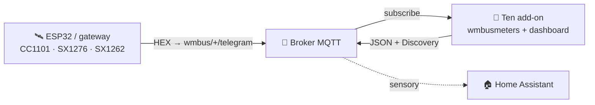
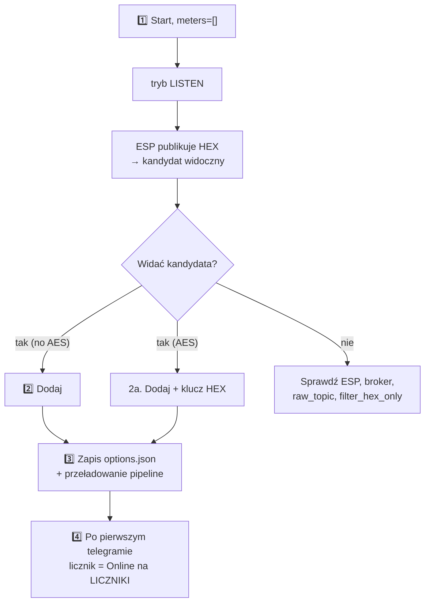

> 🌐 [EN](README.en.md) | [**PL**](README.pl.md) | [DE](README.de.md) | [CS](README.cs.md) | [SK](README.sk.md)

# wMBus MQTT Bridge — dokumentacja użytkownika (PL)

> Przewodnik dla użytkownika: instalacja, dodawanie liczników, czytanie panelu,
> rozwiązywanie problemów. **Jak to działa w środku** (architektura, pliki
> runtime, soft-reload, kontrakt diagnostyki ESP) opisuje
> [`ARCHITECTURE.md`](ARCHITECTURE.md).

---

## Spis treści

1. [Co to robi](#1-co-to-robi)
2. [Wymagania](#2-wymagania)
3. [Szybki start — Home Assistant](#3-szybki-start--home-assistant)
4. [Szybki start — Docker standalone](#4-szybki-start--docker-standalone)
5. [WebUI — co widzisz](#5-webui--co-widzisz)
6. [Typowy workflow: od pustki do działającego licznika](#6-typowy-workflow-od-pustki-do-działającego-licznika)
7. [Filtr wartości — gdy słychać za dużo cudzych liczników](#7-filtr-wartości--gdy-słychać-za-dużo-cudzych-liczników)
8. [Opcje konfiguracji](#8-opcje-konfiguracji)
9. [Język interfejsu](#9-język-interfejsu)
10. [Rozwiązywanie problemów](#10-rozwiązywanie-problemów)
11. [Jak to działa głębiej](#11-jak-to-działa-głębiej)
12. [Licencja i projekty bazowe](#12-licencja-i-projekty-bazowe)

---

## 1. Co to robi

> **W jednym zdaniu:** dekoduje telegramy Wireless M-Bus (wodomierze, liczniki
> ciepła, prądu) **bez lokalnego dongla USB** — surowe ramki HEX dostarcza Ci
> dowolny zewnętrzny odbiornik (ESP32, gateway) przez MQTT.

- **Ty** masz odbiornik radiowy tam, gdzie jest zasięg (np. ESP32 z anteną).
- **Odbiornik** publikuje surowe ramki HEX do MQTT (`wmbus/<device>/telegram`).
- **Ten add-on** podpina się do brokera, dokarmia `wmbusmeters`, dekoduje i
  publikuje wynik z powrotem do MQTT + **Home Assistant Discovery**.

Efekt: **Twoje liczniki pojawiają się jako sensory w HA, bez żadnego sprzętu
radiowego po stronie HA.**



> 🤝 Typowo używany z firmware **[esphome-wmbus-bridge-rawonly](https://github.com/Kustonium/esphome-wmbus-bridge-rawonly)**
> (ESP32 + CC1101/SX1276/SX1262, publikuje RAW HEX). Oba projekty są niezależne —
> add-on przyjmuje hex z dowolnego źródła publikującego na `raw_topic`.

> 🌉 **Całościowo ESP (odbiornik radiowy) i ten add-on (dekoder) tworzą
> rozproszony _gateway wM-Bus → Home Assistant_** — radio stoi tam, gdzie jest
> zasięg, a dekodowanie (deszyfracja i zestaw driverów z przypiętego buildu
> `wmbusmeters`) działa na HA. W odróżnieniu od monolitycznych bramek wM-Bus (radio + dekoder w jednym
> pudełku) nie wymaga lokalnego dongla USB i skaluje się przez dostawianie
> tanich węzłów ESP.
>
> **Każdą połowę można też używać samodzielnie i są wymienne:** ESP karmi dowolny backend MQTT (Node-RED, własny skrypt, własny dekoder), a add-on dekoduje hex z dowolnego źródła na `raw_topic` (ten ESP, rtl-wmbus, inny gateway, narzędzie replay) — współpracują, ale żadna nie zależy od drugiej.

---

## 2. Wymagania

- **Broker MQTT** (Mosquitto, EMQX…) osiągalny z HA / z hosta.
- **Odbiornik** publikujący ramki HEX na `wmbus/<device>/telegram`.
- Home Assistant (tryb add-onu) **albo** Docker + compose (standalone).

> ⚠️ Nie instaluj równolegle oficjalnego add-onu `wmbusmeters` — ten projekt ma
> własną instancję i będą się dublować.

> 🧱 **Granica odpowiedzialności.** Projekt dostarcza dwóch klientów MQTT — firmware ESP (radio → MQTT) i ten add-on (MQTT → dekodowanie → HA); jego zakres kończy się na temacie MQTT. **Sam broker — uwierzytelnianie, ACL, TLS, ekspozycja sieciowa oraz ewentualny mostek broker-broker dla instalacji zdalnych/rozproszonych (lokalizacja A → internet → lokalizacja B) — jest odpowiedzialnością operatora.** Zalecane: trzymaj broker w LAN; do dostępu zdalnego użyj tunelu/VPN albo mostka brokera z TLS; nie wystawiaj portu 1883 ani WebUI (8099) wprost do internetu. Uwaga: dla liczników z AES payload pozostaje zaszyfrowany przez licznik end-to-end, niezależnie od transportu brokera.

> ⚠️ **Początkujący? Przeczytaj, zanim cokolwiek wystawisz.** **Nie** przekierowuj na domowym routerze portu brokera (1883) ani Home Assistanta do internetu — wystawiony broker może odczytać i wykorzystać ktokolwiek. Do dostępu z zewnątrz użyj gotowego, bezpiecznego rozwiązania: **Home Assistant Cloud (Nabu Casa)** albo dodatków **Tailscale** / **Cloudflare Tunnel**. Nie masz pewności? Zostaw wszystko w sieci domowej — add-on do działania nie potrzebuje internetu.

---

## 3. Szybki start — Home Assistant

1. **Dodaj repozytorium:** Settings → Add-ons → Add-on Store → ⋮ → Repositories:
   ```
   https://github.com/Kustonium/homeassistant-wmbus-mqtt-bridge
   ```
2. **Zainstaluj** „wMBus MQTT Bridge", kliknij **Start** (domyślnie `meters: []`
   → add-on wchodzi w **tryb LISTEN** i tylko nasłuchuje).
3. **Otwórz WebUI** (Info → OPEN WEB UI).
4. Wejdź w **ODBIERANE / SZUKAJ**, znajdź swój licznik wśród wykrytych
   kandydatów i kliknij **Dodaj** (modal: ID, sterownik, nazwa, opcjonalny klucz
   AES oraz wybór publikowanych pól — patrz niżej). Po zapisie pipeline
   przeładowuje się sam (bez restartu kontenera).

Pełny przebieg w [§6](#6-typowy-workflow-od-pustki-do-działającego-licznika).

---

## 4. Szybki start — Docker standalone

Dla wszystkich poza HA (DietPi, Ubuntu, Raspberry Pi OS, NAS…).

```bash
git clone https://github.com/Kustonium/homeassistant-wmbus-mqtt-bridge.git
mkdir -p /home/wmbus
cp -a homeassistant-wmbus-mqtt-bridge/docker/examples/* /home/wmbus/
cd /home/wmbus
docker compose pull
docker compose up -d
docker compose logs -f wmbus
```

Obraz `wmbus` jest wieloarchitekturowy (amd64 + aarch64) — `pull` sam ściąga
wariant pasujący do hosta, bez lokalnej kompilacji.

Konfiguracja w `./config/options.json` (referencja pól w [§8](#8-opcje-konfiguracji)):

```json
{
  "raw_topic": "wmbus/+/telegram",
  "discovery_enabled": true,
  "state_prefix": "wmbusmeters",
  "mqtt_mode": "external",
  "external_mqtt_host": "192.168.1.10",
  "external_mqtt_port": 1883,
  "external_mqtt_username": "user",
  "external_mqtt_password": "pass",
  "meters": []
}
```

Po edycji: `docker compose restart wmbus`. WebUI: wystaw port `8099` w
`docker-compose.yml` i otwórz `http://<host-ip>:8099/`.

> 💡 W Dockerze globalny przycisk **Restart** działa, jeśli kontener ma ustawioną
> politykę restartu (przykładowy plik Compose używa `restart: unless-stopped`).
> Bez niej przycisk zatrzyma kontener; uruchom go ponownie poleceniem
> `docker start <container>`.

---

## 5. WebUI — co widzisz

Dostępny w **5 językach** (EN/PL/DE/CS/SK) — przełącznik w prawym górnym rogu.

| Zakładka | Po co |
|---|---|
| **PANEL** | Dashboard: pipeline ESP→MQTT→wmbusmeters→HA (klikalne kafelki) + statystyki. |
| **LICZNIKI** | Twoje skonfigurowane liczniki: wartość, ostatni telegram, **ODBIÓR**. |
| **ODBIERANE / SZUKAJ** | Wykryci kandydaci + skonfigurowane w eterze; tu dodajesz/usuwasz liczniki i filtrujesz pokazane wartości. |
| **LOGI / LOGI ESP** | Zdarzenia runtime i diagnostyka odbiorników ESP. |
| **USTAWIENIA / O PROJEKCIE** | Aktywna konfiguracja, info. |

### Kolumna ODBIÓR (co oznaczają znaczki)

Najedź na **ⓘ** przy nagłówku ODBIÓR — masz legendę. W skrócie:

- **status + słupki** — czy licznik dochodzi: *online* / *spóźniony* / **cisza**.
  Próg jest **adaptacyjny** do rytmu danego licznika (jego średniego interwału).
  Długa cisza to stan **neutralny** (szary), nie czerwony alarm — licznik bywa
  cichy nocą/po wyjeździe/przy słabej baterii, więc nie krzyczymy alarmem.
- **📡 ESP** — licznik jest zaznaczony (highlight) na którymś ESP.
- **📶 nazwa N% · liczba** — % odbioru i liczba telegramów **na danym ESP**
  (z opcjonalnej diagnostyki). Przy kilku ESP widać, który odbiornik łapie licznik
  i jak dobrze. Kolor: zielony ≥90 · bursztyn ≥50 · czerwony <50.

> Surowy % i liczba telegramów **nie są** miarą czułości płytek (licznik
> kumulatywny od startu, różne uptime). Realna czułość to **pokrycie** — które
> liczniki dana płytka w ogóle słyszy.

### Dodawanie / usuwanie liczników (ODBIERANE)

- Kandydaci bez AES dekodują się automatycznie — w kolumnie **Wartość** widać
  podgląd na żywo bez konfigurowania.
- **Dodaj** zapisuje licznik do konfiguracji i przeładowuje pipeline.
- **Porównaj** w modalu **Dodaj** lub **Driver…** dekoduje ostatni telegram dwoma
  driverami bez zapisywania zmian. Wybierz driver w polu **Sterownik**, wpisz
  klucz AES jeśli licznik jest szyfrowany i kliknij **Porównaj**. Lewa kolumna to
  driver zapisany albo auto-detekcja `wmbusmeters`, prawa kolumna to driver
  wybrany przez Ciebie. Zielone wiersze oznaczają dodatkowe pola, żółte — inną
  wartość; więcej pól **nie** znaczy automatycznie poprawnie, więc porównaj
  wartości z wyświetlaczem licznika.
- **Zgłoszenie…** używa zapisanego 32-znakowego klucza AES dla tego samego ID,
  jeśli taki klucz istnieje, dzięki czemu `wmbusmeters --analyze` może pokazać
  dane po deszyfracji. Sam klucz nigdy nie trafia do raportu, ale mogą znaleźć
  się w nim odczyty licznika — sprawdź raport przed publicznym wklejeniem.
- **Usuń zaznaczone** — zaznacz checkboxy i usuń kilka naraz (przycisk nad tabelą).

---

## 6. Typowy workflow: od pustki do działającego licznika



1. **Start** z `meters: []` → tryb LISTEN, w logach `No meters configured -> LISTEN MODE`.
2. **Dodaj** kandydata (bez AES — od razu; z AES — wpisz 32-znakowy klucz HEX).
   W tym samym modalu masz listę wszystkich pól, jakie driver potrafi zwrócić —
   każde z opisem z wmbusmeters i checkboxem. Odznacz to, czego nie chcesz jako
   encji, albo wpisz wzorce w polu **Pola do pominięcia**, np.
   `consumption_at_history_*`. Zostaw puste i publikowane jest wszystko, jak
   dotąd. Później zmienisz to przez **Driver…** przy dodanym liczniku — pamiętaj,
   że odznaczenie pola usuwa jego encję razem z zapisaną historią.
3. Zapis trafia do `options.json`, pipeline DECODE przeładowuje się **bez pełnego
   restartu kontenera**.
4. Po **następnym telegramie** tego licznika pojawia się on jako **Online** na
   LICZNIKI, a HA Discovery tworzy encje dla liczbowych pól zwróconych przez
   `wmbusmeters`, np. `total_m3`. Końcowy `entity_id` nadaje Home Assistant;
   bridge nie ustala go na sztywno.

Zanim przyjdzie pierwszy telegram, dashboard pokazuje sekcję **„czeka na pierwszy
telegram"**. Pełny restart dodatku jest tylko awaryjnym fallbackiem.

**Niewspierany licznik?** Jeśli kandydat nigdy się nie dekoduje (nieznany driver
/ „unknown format signature"), użyj przycisku **Zgłoszenie…** w jego wierszu:
add-on buduje gotowy do wklejenia blok zgłoszenia do projektu wmbusmeters
(surowy telegram + wynik `wmbusmeters --analyze`). Telegram zawiera numer
seryjny licznika. Klucz AES nigdy nie jest dołączany; jeśli zapisany klucz
został użyty do analizy, zdekodowany wynik może zawierać odczyty licznika.

Ten sam przycisk **Zgłoszenie…** jest w każdym wierszu widoku LICZNIKI, więc już
dodany licznik — taki, który dekoduje się, ale podaje pole błędnie albo mniej
pól, niż pokazuje jego wyświetlacz — zgłosisz bez usuwania go z konfiguracji.
To jest też sposób na podejrzenie surowej ramki skonfigurowanego licznika:
zgłoszenie zaczyna się właśnie od telegramu. Ramka pochodzi z bufora ostatnio
odebranych telegramów, więc po restarcie jest dostępna, gdy tylko licznik znów
nada.

---

## 7. Filtr wartości — gdy słychać za dużo cudzych liczników

Aktualny workflow w WebUI to pasek **Filtruj po wartości** w ODBIERANE / SZUKAJ:

1. Poczekaj, aż skonfigurowane liczniki lub kandydaci pokażą liczbę w kolumnie
   **Wartość**.
2. Wpisz odczyt z fizycznego wyświetlacza i tolerancję (domyślnie `0.05`).
3. Przeglądarka pozostawi wiersze mieszczące się w tolerancji i ukryje wiersze
   z inną albo brakującą wartością.

Filtr porównuje wyłącznie wartości już pokazane w WebUI. Nie uruchamia kolejnych
dekoderów, nie próbuje innych driverów i nie zmienia konfiguracji. Do zestawienia
dwóch driverów dla tej samej ramki służy osobno przycisk **Porównaj**.

Starszy backend `search_mode` nadal istnieje dla zastosowań zaawansowanych pod
ukrytą trasą `#search`. Po włączeniu LISTEN zapisuje tylko kandydatów zgłoszonych
jako nieszyfrowane wodomierze wraz z jednym sugerowanym driverem. Dopiero kolejny
restart ładuje zapisanych kandydatów jako tymczasowe liczniki i sprawdza liczbowe
pola, których nazwa zawiera `m3` albo `total_volume`. Mechanizm **nie** próbuje
wszystkich driverów. Tymczasowe liczniki SEARCH są wyłączone z HA Discovery.

---

## 8. Opcje konfiguracji

Z [`config.yaml`](../config.yaml).

### MQTT — wejście / wyjście

| Pole | Typ | Domyślnie | Opis |
|---|---|---|---|
| `raw_topic` | str | `wmbus/+/telegram` | Topic z surowymi HEX-ami. `+` = wildcard (nazwa ESP w diagnostyce) |
| `filter_hex_only` | bool | `true` | Ignoruj wiadomości niewyglądające jak HEX |
| `mqtt_mode` | enum | `auto` | `auto` (kolejność: `external_mqtt_host` jeśli wpisany → broker HA z usługi Supervisora → sonda znanych brokerów-add-onów `core-mosquitto`/`a0d7b954-emqx`, z danymi `external_mqtt_username/password` jeśli podane) / `ha` (wymuś HA) / `external` (zawsze zewnętrzny) |
| `external_mqtt_host/port/username/password` | str/int | `""` / `1883` / `""` / `""` | Broker zewnętrzny (gdy `external`) |

### Discovery i wyjście

| Pole | Typ | Domyślnie | Opis |
|---|---|---|---|
| `discovery_enabled` | bool | `true` | Publikuje HA Discovery |
| `discovery_prefix` | str | `homeassistant` | Prefix Discovery |
| `discovery_retain` | bool | `true` | Discovery jako retained |
| `state_prefix` | str | `wmbusmeters` | Prefix tematu wartości |
| `state_retain` | bool | `false` | Retained dla stanu |
| `verify_ha_entities` | bool | `false` | W trybie add-onu HA używa zadeklarowanego dla dodatku dostępu read-only do HA Core API, aby sprawdzić encję kontrolną. Docker nie ma tokenu Supervisora, więc ta weryfikacja jest tam niedostępna. |

Każda encja z Discovery ma **availability template**: gdy w ostatnim telegramie
licznika brakuje danego pola (niektóre liczniki wysyłają naprzemiennie ramki
krótkie i pełne), encja pokazuje `unavailable` zamiast przestarzałej lub
fałszywej wartości — i wraca automatycznie przy następnym telegramie
zawierającym to pole. Niezależnie od tego auto-strojony `expire_after`
(ok. 2× zaobserwowany interwał nadawania licznika, minimum 1 h) oznacza encje
jako `unavailable`, gdy licznik zamilknie.

Poza liczbowymi sensorami pomiarowymi każdy licznik raportujący pole `status`
dostaje też dwie encje **diagnostyczne** (w sekcji *Diagnostyka* urządzenia):
`sensor` z surowym tekstem statusu oraz `binary_sensor` (`device_class:
problem`), który włącza się, gdy status jest inny niż `OK`. Tekst jest
przekazywany 1:1 z `wmbusmeters`, więc jego dokładna treść zależy od wybranego
drivera upstream.

Poza tym most publikuje konfigurację Discovery dla **każdego** pola zwróconego
przez driver i dzieli je według tego, co mierzą:

- pole, które Home Assistant potrafi sklasyfikować (zgadujemy `device_class`)
  albo które ma jednostkę zużycia — m³, GJ, MJ, kWh, Wh, l, hca, kVARh, kVAh,
  czyli także wielkości, dla których HA nie ma klasy: objętość na liczniku
  ciepła, energia cieplna w GJ/MJ, jednostki podzielnika kosztów oraz energia
  bierna i pozorna — zostaje zwykłym sensorem pomiarowym, włączonym;
- cała reszta zostaje encją **diagnostyczną** publikowaną jako **wyłączona**
  (`enabled_by_default: false`): liczby bez klasy (wiek odczytu, liczniki
  błędów), pola tekstowe (`current_status`, `meter_datetime`, …) oraz pola,
  które driver zwraca w danej chwili jako `null` (`fraud_date`, zanim wystąpi
  oszustwo). Home Assistant rejestruje taką encję i pokazuje ją na stronie
  urządzenia jako wyłączoną; włączasz te, które są Ci potrzebne.

Encji nie dostaje wyłącznie tożsamość licznika (`id`, `name`, `meter`, `media`,
`timestamp`, `rssi`, `lqi`) — jest już w nazwie urządzenia i w atrybutach encji.

Każda encja niesie też atrybut `Description` — opis pola napisany przez autora
drivera, pobrany z `wmbusmeters --listfields`. Stoi obok pól zdekodowanego
telegramu w atrybutach encji, więc nic z tego, co było wcześniej, nie ginie.

Home Assistant czyta `enabled_by_default` tylko przy pierwszym dodaniu encji,
więc aktualizacja nigdy nie wyłącza tego, co już masz. `entity_category` jest
natomiast stosowana przy każdej aktualizacji konfiguracji, więc pola liczbowe
bez klasy założone przez starszą wersję przenoszą się do sekcji *Diagnostyka*.

Ta sama zasada działa w drugą stronę: encja utworzona jako wyłączona pozostanie
wyłączona, dopóki nie włączysz jej na stronie urządzenia — nawet jeśli nowsza
wersja dodatku publikowałaby ją już jako zwykły sensor. Skasowanie urządzenia
nic tu nie da, bo Home Assistant przywraca usunięte encje razem ze stanem
włączenia, gdy tylko ten sam licznik zostanie ponownie wykryty; trzyma ten wpis
przez 30 dni. Włącz ją raz ręcznie, a zostanie włączona.

### RSSI per płytka odbiorcza (opcja włączana po stronie ESP)

Poziom sygnału nie jest częścią telegramu. Temat RAW niesie czysty HEX, więc
`wmbusmeters` nigdy nie widzi RSSI i nie ma czego zgłosić — płytka odbiorcza
musi opublikować tę wartość osobno. Publikacja jest **domyślnie wyłączona** i
nie jest opcją dodatku: włączasz ją w YAML-u firmware'u, w sekcji
`wmbus_radio`:

```yaml
wmbus_radio:
  publish_rssi: true
```

Płytka publikuje wtedy dla każdego zdekodowanego licznika:

```text
wmbus/<płytka>/rssi/<id_licznika>    payload: -52
```

Most trzyma tę wartość osobno dla każdej pary licznik **i** płytka, a następnie
dołącza ją do zdekodowanego telegramu jako `rssi_<płytka>_dbm`. Każda płytka
dostaje więc własną encję siły sygnału dla tego samego licznika:

```json
{
  "rssi_lilygo_dbm": -52,
  "rssi_xiaoseed_dbm": -50
}
```

Tak ma być. Ten sam licznik może być słyszany przez dwie płytki, a jedna
scalona wartość po prostu skakałaby między nimi — liczba wyglądałaby na
wahający się sygnał, a nie na dwa odbiorniki. Dlatego nie ma wspólnego pola
`rssi_dbm`.

Most zapisuje wyłącznie wiarygodny pomiar: od -125 do -1 dBm. Firmware'owe
wartości „brak danych" są odrzucane, a nie publikowane jako odczyt; wartość
starsza niż pięć minut nie zostaje doklejona do świeżego telegramu — jeśli
któraś płytka przestanie publikować, jej encja staje się niedostępna, zamiast
zamarznąć na ostatniej liczbie.

Przy wyłączonej opcji nic nie przychodzi, żadne pole nie jest dodawane i żadna
encja nie powstaje.

### Starszy tryb SEARCH

| Pole | Typ | Domyślnie | Opis |
|---|---|---|---|
| `search_mode` | bool | `false` | Włącza ukryty starszy backend SEARCH opisany w [§7](#7-filtr-wartości--gdy-słychać-za-dużo-cudzych-liczników) |
| `search_expected_value_m3` | float | `0` | Oczekiwane wskazanie m³ |
| `search_tolerance_m3` | float | `0.05` | Tolerancja — w bloku nie zwiększaj |
| `search_delta_mode` / `search_min_delta_m3` | bool/float | `false` / `0.001` | (Eksperymentalne) porównanie delty |
| `search_topic` | str | `wmbus/search/candidates` | Topic wyników SEARCH publikowany bez retain |

### Debug

| Pole | Typ | Domyślnie | Opis |
|---|---|---|---|
| `loglevel` | enum | `normal` | `normal` / `verbose` / `debug` |
| `debug_every_n` | int | `0` | Co N-ty telegram dodatkowa diagnostyka |

### Liczniki — `meters[]`

| Pole | Typ | Wymagane | Opis |
|---|---|---|---|
| `id` | str | tak | Twoja etykieta licznika, używana w nazwach MQTT Discovery i generowanej konfiguracji |
| `meter_id` | str | tak | Numer seryjny licznika (HEX, z LISTEN) |
| `type` | str | tak | **Nazwa sterownika wmbusmeters** (np. `hydrodigit`, `amiplus`, `izarv2`) **lub `auto`/`other`**. Dowolny string — wmbusmeters waliduje sterownik przy dekodowaniu (świadomie nie enum, żeby nowe sterowniki nie były odrzucane). |
| `type_other` | str? | gdy `type=other` | Niestandardowa nazwa sterownika |
| `key` | str? | gdy szyfrowany | 32-znakowy klucz AES (HEX) |
| `exclude_fields` | str? | nie | Wzorce (globy) pól, które mają **nie** dostać encji w Home Assistant — np. `consumption_at_history_*, history_*_date`. Oddzielane przecinkami lub spacjami; puste publikuje wszystkie pola. |
| `calculated_fields` | str? | nie | Dodatkowe pola liczone przez **wmbusmeters** z telegramu, rozdzielone średnikami, każde jako `nazwa=formuła` — np. `difftemp_c=flow_temperature_c - return_temperature_c`. Liczy dekoder; wynik jest zwykłym polem i dostaje encję jak każde inne. |
| `static_fields` | str? | nie | Stałe wartości doczepione do licznika, rozdzielone średnikami, każda jako `nazwa=wartość` — np. `location=kuchnia; apartment=12`. Dekoder wstawia je do telegramu **jako tekst** (`apartment=12` przyjdzie jako `"12"`), więc widać je w atrybutach encji i jako encje diagnostyczne: to etykieta, nie pomiar. |

Przed napisaniem formuły warto wiedzieć dwie rzeczy. Arytmetyka **pilnuje
jednostek**: `total_m3 / 2 counter` zadziała, a `total_m3 * 2` nie — goła liczba nie
ma jednostki i dekoder odrzuca taką formułę. Dodawanie pól o tej samej jednostce nie
wymaga niczego dodatkowego, np.
`difftemp_c=max_external_temperature_c - min_external_temperature_last_month_c`.
Formuła, której dekoder nie rozumie, kosztuje wyłącznie to jedno pole: napisze o tym
w logu, pole po prostu nie powstanie, a reszta licznika dekoduje się normalnie.

Nazwa pola liczonego nie jest dowolna: musi kończyć się jednostką, i to ona
przelicza wynik. Z tej samej formuły `difftemp_c` da °C, a `difftemp_f` da °F —
zmierzone na żywym telegramie: 11 °C wróciło jako `11`, `51.8` i `284.15` dla
nazw `_c`, `_f` i `_k`. Nazwa bez jednostki albo z nieznaną (`mojepole`,
`kopia_xyz`) jest odrzucana: dekoder pisze *„Could not extract a valid unit from
calculated field name"*, pole nie powstaje, a licznik dekoduje się dalej. Pól
stałych ta zasada nie dotyczy — tam każda nazwa jest dobra, bo nic nie jest
przeliczane.

Lista driverów w WebUI jest generowana z przypiętego buildu `wmbusmeters` i jego
źródeł XMQ. Korzystaj z tego katalogu zamiast ręcznej listy w dokumentacji.

Tabela pól w panelu drivera licznika pochodzi z `wmbusmeters --listfields` — to
pełny katalog drivera, a nie lista tego, co publikuje ta ścieżka. Dziesięć pól
wspólnych dla wszystkich driverów jest więc pokazanych jako wyszarzone i nie da
się ich zaznaczyć. `id`, `name`, `meter`, `media` i `timestamp` to tożsamość
licznika: zostają w nazwie urządzenia i w atrybutach encji, zamiast dostawać
własne encje. `timestamp_ut`, `timestamp_lt`, `timestamp_utc`, `device` i
`rssi_dbm` nigdy nie trafiają tutaj do JSON-a dekodera — trzy znaczniki czasu
istnieją wyłącznie dla formatów CSV/`fields`, a dwa ostatnie wypełnia radiowe
urządzenie odbiorcze, którego dekoder nie ma, gdy telegramy podaje mu się jako
HEX.

---

### Zakładka Diagnostyka

Tabela per płytka: ramki, liczniki, zgubione zdarzenia, restarty w ostatniej
dobie i czas od ostatniej ramki, plus jeden stan na płytkę. Pod nią karta każdej
płytki ze szczegółami i wyjaśnieniem każdego ostrzeżenia zwykłym językiem.

Dwie rzeczy, pod które to powstało. **Luki w sekwencji**, które dowodzą, że
zdarzenie zginęło między ESP a dodatkiem — choć nie mówią, czy zawiniło radio,
MQTT, sieć czy subskrybent. Oraz **ciche restarty**: restart zeruje liczniki
płytki, więc bez osobnego zapisu kasuje własny ślad. Gdy restarty są oddalone
o mniej więcej 15 minut, zakładka mówi to wprost i nazywa prawdopodobną
przyczynę — domyślne `api.reboot_timeout` w ESPHome, które restartuje płytkę
zawsze, gdy nie jest podłączony żaden klient Native API. Odbiornik pracujący
tylko na MQTT nigdy takiego nie ma.

Strona wymaga firmware'u publikującego temat metadanych `rx`; płytki na starszym
firmwarze po prostu się nie pojawią.

Gdy firmware stempluje też ramki czasem odbioru, karta zyskuje wiersz **Zegar
ESP**: czy zegar płytki jest ustawiony i jak bardzo jej pojęcie o czasie odbioru
rozjeżdża się z czasem dodatku.

Gdy firmware publikuje też retained snapshot `<diag>/config`, karta zyskuje
sekcję **Konfiguracja** z każdym efektywnym ustawieniem i markerem — `default`,
`CHANGED` albo `set` — więc czytelnik widzi, z czym płytka realnie wystartowała,
bez pytania o YAML. Starszy firmware po prostu pomija tę sekcję; z pustego
tematu nie ma czego renderować.

### Eksport dowodów odbioru z ESP (`esp_rx_api_enabled`, domyślnie wyłączony)

Firmware publikujący strukturalne metadane odbioru na `wmbus/<płytka>/rx` pozwala
dodatkowi liczyć **rzeczywiste odbiory per licznik i per płytka**, zamiast opierać
się na procentach, które każda płytka wyliczała sama o sobie. Te procenty nie były
porównywalne między płytkami: płytka słysząca co drugą transmisję wyliczała dwa
razy dłuższy średni interwał i też pokazywała 100%.

Opcja **`esp_rx_api_enabled` jest domyślnie wyłączona** i nie zmienia niczego
w zbieraniu danych ani w zwykłym GUI. Włączenie robi dwie rzeczy:

- udostępnia `GET /api/esp-rx` przez uwierzytelniony Ingress WebUI — podsumowanie
  odbioru, ciągłość sekwencji per płytka i ograniczoną historię, z parametrami
  `limit` (1–10000), `since` i `until` (epoka UTC, `until` wyłącznie);
- dodaje przycisk **Download RX history** na stronie Odebrane / Szukaj, który
  zapisuje te same dane z pełnym zachowanym buforem (do 100 000 zdarzeń) pod nazwą
  pliku ze znacznikiem UTC.

Eksport **nigdy** nie zwraca surowych telegramów, kluczy AES ani poświadczeń MQTT
i jest tylko do odczytu: pobranie nie skraca historii, nie zeruje liczników i nic
nie restartuje. Przy wyłączonej opcji endpoint odpowiada HTTP 404.

Luki w sekwencji dowodzą, że jakieś zdarzenie zginęło gdzieś między ESP
a subskrybentem. Same z siebie **nie** mówią, czy przyczyną było radio, MQTT, sieć
czy subskrybent.

### Blok walk-by Qundis (`qds_walkby_enabled`, domyślnie wyłączony)

Liczniki Qundis pakują całą zawartość walk-by w jeden rekord producenta
(`0DFF5F`, 53 bajty) w ramkach CI=0x78. Od generacji 2026 ten rekord jest
szyfrowany **wewnątrz rekordu**, a nie na warstwie wM-Bus: takie ramki nie mają
nagłówka TPL, więc wM-Bus słusznie widzi je jako nieszyfrowane i nic nie oznacza
ich jako wymagających klucza.

Bez tej opcji dzieją się dwie złe rzeczy — opcja usuwa obie:

- **Losowe wartości ze `status: OK`.** Dekoder rozpoznaje rekord walk-by po
  jednym bajcie, a losowa zaszyfrowana treść trafia w niego raz na 256
  telegramów — czyli mniej więcej co osiem godzin na licznik. Wtedy czyta
  zaszyfrowane bajty jako liczbę. Na liczniku pokazującym 1,387 m³ daje to
  `15430.611`, co po cichu zatruwa statystyki długoterminowe Home Assistanta.
  Przy włączonej opcji rekord, którego nie da się zweryfikować, trafia do
  dekodera ze zmienionym kluczem, którego żaden sterownik nie łapie: odczyt
  przepada, zegar licznika nadal się aktualizuje.
- **Brak jakichkolwiek wartości, bez wyjaśnienia.** Jeśli klucz AES licznika
  jest skonfigurowany, dodatek sam odszyfrowuje blok i podaje dekoderowi
  czytelny rekord. Jeśli nie jest — log mówi to wprost, razem z wersją i typem
  licznika, polem CI oraz listą znalezionych rekordów.

**Chodzi o zwykły klucz AES licznika** — ten sam, którego używają jego zwykłe
ramki (CI=0x7A). Nie ma osobnego sekretu do walk-by; jeśli zwykłe ramki tego
licznika się odszyfrowują, to jest właśnie ten klucz. Zły klucz jest zgłaszany
jako zły i nigdy nie daje wartości zastępczej.

Przy wyłączonej opcji dekodowanie jest co do bajtu takie jak wcześniej, więc
instalacja bez liczników Qundis nic nie odczuwa. Patrz `docs/ARCHITECTURE.md`
§3.5.

### M-Bus przewodowy (magistrala szeregowa, domyślnie wyłączony)

Liczniki ciepła i wody często idą kablem, nie radiem: konwerter M-Bus master siedzi
na dwużyłowej magistrali i pokazuje się w systemie jako port szeregowy (USB, RS-232
albo RS-485). Dodatek potrafi taką magistralę odpytywać sam.

Wszystko dalej jest takie samo jak przy radiu — te same drivery, jednostki,
Discovery, pola liczone i stałe. Różni się tylko transport: liczniki się odpytuje
zamiast nasłuchiwać, i adresuje zamiast wykrywać.

Po pierwszej prawidłowej odpowiedzi licznik przewodowy pojawia się również w
**Panelu** i **Licznikach**. Kolumna źródła pokazuje `M-Bus · <alias magistrali>`
zamiast odznak ESP, pasma radiowego i jakości odbioru, a Panel dodaje rzeczywisty
potok przewodowy `licznik → master szeregowy → odpytujący wmbusmeters → MQTT + HA`.
Potok jest oznaczony jako aktywny dopiero po przyjęciu telegramu przez runtime, a
nie po samym włączeniu silnika.

**Dwa przełączniki, oba domyślnie wyłączone.** `mbus_tab_visible` tylko pokazuje
zakładkę, `mbus_enabled` uruchamia silnik. Przy obu wyłączonych nic się dla Ciebie
nie zmienia.

| Opcja | Znaczenie |
|---|---|
| `mbus_device` | port szeregowy; najlepiej ścieżka `/dev/serial/by-id/…` |
| `mbus_bus_alias` | nazwa magistrali w konfiguracji liczników (`MAIN`) |
| `mbus_baudrate` | 300–9600, zwykle 2400 |
| `mbus_poll_interval` | domyślny interwał wpisywany każdemu licznikowi bez własnego |
| `mbus_donotprobe_all` | zostaw włączone — patrz ostrzeżenie niżej |
| `mbus_device_serial` | wypełniane automatycznie przy wyborze portu; pozwala wykryć, że węzeł `/dev` należy już do innego sprzętu, zamiast po cichu go odpytywać |
| `mbus_loglevel` | `normal`, `verbose`, `debug` — dotyczy tylko instancji magistrali, niezależnie od głównego poziomu logu |
| `mbus_logtelegrams` | loguje każdą ramkę wymienioną z magistralą; przydatne, gdy licznik milczy, poza tym hałaśliwe |
| `mbus_ignoreduplicates` | odrzuca powtórzone identyczne telegramy przed dekodowaniem |
| `mbus_meters[]` | `id`, `address` (`p1`..`p250` albo 8 hex), `type`, `key`, `poll_interval` |

**Dodatek nigdy nie skanuje portów, i to jest świadome.** Sondowanie oznacza
nadawanie, a na typowej maszynie z Home Assistant jeden z portów szeregowych to
koordynator Zigbee. Dekoder i tak nie potwierdzi właściwego konwertera — otwiera
urządzenie i melduje sukces — więc port zawsze wskazujesz Ty.

Wybraną magistralę możesz potem sprawdzić jawnie: **Sprawdź, czy magistrala żyje**
wysyła jeden broadcast testowy, **Skan adresów pierwotnych** przechodzi tylko podany
zakres (`p1`–`p250`, najwyżej 32 adresy na żądanie) i w każdym wierszu pokazuje
zarówno potwierdzenie adresu, jak i diagnozę odpowiedzi z danymi, a **Odpytaj raz** pyta jeden
skonfigurowany adres pierwotny. Wszystkie trzy akcje są odrzucane podczas zwykłego
odpytywania, bo M-Bus ma jednego mastera. **„Odpytaj raz” służy tylko do
diagnostyki:** pokazuje surową odpowiedź, ale jej nie dekoduje, nie publikuje do
MQTT/Home Assistant i nie dodaje licznika do Pipeline. Do normalnej pracy zapisz
licznik, włącz silnik, kliknij **Zastosuj** i zrestartuj dodatek. Wyjście dekodera
z tego regularnego silnika widać w **Konsoli magistrali**, która jest tylko do
odczytu i nie przyjmuje dowolnych bajtów do wysłania.

Pole **Driver** w tabeli liczników podpowiada wszystkie drivery dostarczone w
bieżącym obrazie, ale nadal przyjmuje własną nazwę. `auto` może rozpoznać licznik,
lecz nie gwarantuje dobrania użytecznego drivera dla każdej odpowiedzi przewodowej;
gdy automatyczne dekodowanie nie daje wartości, wybierz driver z dokumentacji
licznika.
**Wykryj driver** wykonuje jedno odpytanie diagnostyczne i przekazuje otrzymaną
ramkę do analizatora we wbudowanym `wmbusmeters`. Sugestia wypełnia pole, ale
nigdy nie zapisuje się automatycznie: sprawdź ją i kliknij **Zapisz liczniki**.
Jeżeli analizator nie ma wiarygodnej sugestii, interfejs mówi o tym wprost zamiast
zgadywać.
Pipeline wyprowadza jednostkę z rzeczywistej nazwy zdekodowanego pola (na przykład
`_c` → `°C`, `_rh` → `RH%`), także dla driverów bez sumarycznego odczytu, które
korzystają z ogólnego numerycznego fallbacku.

**W Dockerze** zmapuj konwerter jawnie:
`devices: ["/dev/serial/by-id/usb-…:/dev/ttyUSB0"]`. Nigdy `/dev:/dev`, nigdy
`privileged`.

**Zakładka mówi, dlaczego nic nie przychodzi.** Na magistrali zły adres, martwy
licznik, konwerter niezasilający linii i licznik mówiący innym protokołem wyglądają
z zewnątrz tak samo: nie pojawiają się encje. Karta stanu magistrali nazywa, który
to przypadek — per licznik, razem z chwilą ostatniej odpowiedzi każdego z nich:

- *Brak odpowiedzi* — port jest otwarty, licznik pod tym adresem milczy. Adres,
  okablowanie albo konwerter, który nie zasila magistrali.
- *Uszkodzone ramki* — błędy sumy kontrolnej, najczęściej dwa liczniki na jednym
  adresie pierwotnym. Licznik odpowiadający dwoma różnymi id jest osobno oznaczany:
  dekoder nie zgłasza konfliktu, po prostu wypuszcza obie odpowiedzi, a Ty inaczej
  dostaniesz w Home Assistancie drugie urządzenie z jednego wpisu.
- *To nie jest ruch M-Bus* — bajty płyną, ale żaden nie ma kształtu ramki M-Bus.
  Typowe liczniki energii elektrycznej operatora (OSD) z portem optycznym albo
  RS-485 używają DLMS/COSEM (IEC 62056), inne Modbus RTU/TCP. Ten dodatek nie
  dekoduje żadnego z tych protokołów. Nie wyklucza to prawdziwego licznika energii
  z interfejsem M-Bus zgodnym z EN 13757, jeśli wmbusmeters ma dla niego driver.
  Samo złącze RS-485 nie oznacza M-Bus.
- *Na tym porcie jest inne urządzenie* — port wskazuje teraz inny sprzęt niż
  wybrany, więc odpytywanie jest odmawiane, zamiast trafić w czyjś koordynator
  Zigbee.

**Niesprawdzone na prawdziwej magistrali.** Protokół był testowany na symulatorze,
nie na prawdziwych licznikach — autor nie ma sprzętu M-Bus po kablu. Jeśli coś nie
działa, zgłoś issue; to jedyna droga, żeby to naprawić.

Widok **O projekcie** dokumentuje oba rzeczywiste potoki danych i wyświetla notę o
wsparciu AI. Kopia repozytorium znajduje się w [NOTICE.md](../NOTICE.md).

### Liczniki energii Tauron / KPL (Polska)

Te liczniki wstawiają niestandardowy prefiks w miejscu, w którym standard wM-Bus trzyma
bajty potwierdzające udane odszyfrowanie. Upstreamowy `wmbusmeters` czyta to jako zły
klucz i odrzuca cały telegram, pisząc *„did you use the correct decryption key?"* mimo że
klucz jest prawidłowy. Ten dodatek niesie lokalną poprawkę, stosowaną wyłącznie do
liczników z flagą producenta `KPL`.

Taki licznik skonfiguruj z driverem **`amiplus`** — automatyczne rozpoznanie go nie
znajdzie, bo żaden driver upstreamu nie zgłasza tego producenta.

**Niesprawdzone u nas.** Nikt po tej stronie nie ma takiego licznika; poprawka opiera się
na zgłoszeniu użytkownika. Jeśli masz taki licznik, zgłoś issue z surowym telegramem.

## 9. Język interfejsu

5 języków (en/pl/de/cs/sk). Wybór: `?lang=pl` w URL → cookie `wmbus_lang` →
nagłówek `Accept-Language` → domyślnie `en`. Przełącznik w prawym górnym rogu.

---

## 10. Rozwiązywanie problemów

### „Telegramy docierają do brokera, ale w HA nie ma encji"

Uruchom **Discovery Doctor** (widok USTAWIENIA): checklista jednym kliknięciem
pokazuje bieżący stan MQTT bridge'a, ustawienia Discovery oraz liczbę retained
configów sensorów dla każdego skonfigurowanego licznika, razem z przykładowym
payloadem. Odebrany komunikat birth HA potwierdza właściwy broker i prefiks;
jego brak niczego nie rozstrzyga, bo ten komunikat nie zawsze jest retained.
Mocniejszym sprawdzeniem jest opcjonalna encja kontrolna przez HA Core API.
Okno ma również przycisk **Wymuś ponowne discovery**.

### „Chcę zacząć od zera — usuń wszystkie liczniki"

W widoku USTAWIENIA przycisk **Wyzeruj add-on** usuwa WSZYSTKIE skonfigurowane
liczniki, kasuje ich encje w Home Assistant (publikuje puste retained configi
discovery, więc encje znikają) i czyści stan runtime (kandydaci, lista
ignorowanych, statystyki). Add-on wraca do stanu jak po instalacji. Operacja
jest nieodwracalna i wymaga potwierdzenia.

### „Chcę zmieniać opcje bez wychodzenia z WebUI"

Widok USTAWIENIA ma edytowalny formularz **Konfiguracja** dla opcji skalarnych
ze schematu add-onu, z opisem „po co są" przy każdej. Liczniki są zarządzane
osobno w ODBIERANE / SZUKAJ. Zapis trafia przez Supervisor API w trybie add-onu
HA, a w samodzielnym Dockerze
bezpośrednio do `/config/options.json`. Hasło MQTT jest tylko do zapisu (zostaw
puste, by zachować obecną wartość). Opcje rdzenne wchodzą w życie po pełnym
restarcie add-onu lub kontenera.

### „Mój licznik szyfruje telegramy — co dalej?"

Gdy LISTEN jawnie zgłosi szyfrowanie, kandydat ma odznakę **AES req.**. Bez
indywidualnego 128-bitowego klucza AES (32 znaki hex) jego payloadu nie da się
zdekodować. Skąd wziąć klucz: **zarządca
budynku / spółdzielnia**, **dostawca medium**, który rozlicza licznik, albo
**instalator licznika**. Licznik możesz dodać bez klucza i uzupełnić go później
przyciskiem **Driver…**. Gdy `wmbusmeters` wypisze rozpoznane ostrzeżenie o
brakującym lub błędnym kluczu, bridge zapisuje je i pokazuje odpowiedni czerwony
status przy liczniku. Po poprawieniu klucza pipeline się przeładowuje i czeka na
następny telegram.

### „Nie widzę żadnych telegramów" (RAW count = 0)
1. Odbiornik publikuje na `wmbus/<cokolwiek>/telegram`? Test: `mosquitto_sub -h <broker> -t 'wmbus/#' -v`.
2. Sprawdź rzeczywiste linie startowe: `MQTT: <host>:<port> topic=<raw_topic>` oraz `MQTT broker ready`.
3. Przy `filter_hex_only: true` payloady niebędące HEX-em albo mające nieparzystą długość są po cichu odrzucane przed licznikiem RAW. Jeśli ESP wysyła base64/JSON, zmień format nadawcy albo świadomie wyłącz filtr.
4. Broker osiągalny? Sprawdź błędy połączenia (`mqtt_mode`).

### „Dodałem licznik, ale nie pojawia się w LICZNIKI"
Pojawi się dopiero **po kolejnym telegramie** tego ID (od kilkudziesięciu s do
kilkunastu min). Jeśli dalej nie ma — sprawdź `meter_id`, sterownik, klucz AES i
logi.

### „Brakuje drivera w formularzu licznika"
Aktualny schemat zapisuje `type` jako dowolny string; nie ma stałego enum z
dozwolonymi driverami. Katalog WebUI powstaje z driverów wbudowanych i XMQ z
przypiętego buildu `wmbusmeters`, a build obrazu kończy się błędem, jeśli brakuje
wbudowanego drivera `izar`. Sprawdź aktywne opcje i wybierz driver ponownie z
tego katalogu.

### „Status pokazuje «cisza», nie czerwone «offline»"
Tak ma być (honest-witness): licznik jest pasywny, więc długa cisza jest
niejednoznaczna (noc/wyjazd/bateria) — pokazujemy neutralny stan, nie fałszywy
alarm. Próg liczy się z **rytmu danego licznika**, nie ze sztywnych 15/60 min.

### „Wartość tylko rośnie, nie jest chwilowa"
Jako wartość główną pokazujemy **stan licznika** (`total_m3`,
`total_energy_consumption_kwh`). Jeśli JSON dekodera zawiera `total_m3`, ale nie
zawiera pola chwilowego przepływu, bridge go nie tworzy. Aktualne/okresowe
zużycie policz w HA pomocnikiem **Utility Meter** (dobowy/
miesięczny, przeżywa restarty) lub **Derivative** (m³/h). `total_m3` jest
publikowane jako `device_class: water` + `state_class: total_increasing`, więc
wchodzi do statystyk wody/Energii HA.

### „Mam licznik szyfrowany, skąd klucz AES?"
Od dostawcy liczników (administrator budynku / dostawca wody/ciepła), z naklejki
lub dokumentacji. Bez klucza nie zdekodujesz szyfrowanych telegramów.

### „Dodaj licznik nic nie zrobił" (Docker)
Katalog `./config/` musi być **zapisywalny** (nie `:ro`). W logach po dodaniu
powinno być potwierdzenie zapisu do `options.json`. W razie czego `docker
restart <container>`.

---

## 11. Jak to działa głębiej

**Dlaczego dekodowanie na serwerze, a nie na ESP?** Projekty, które wbudowują
dekoder w firmware ESP, wpadają wciąż w te same klasy problemów: każdy nowy
model licznika wymaga aktualizacji firmware, każde wydanie ESPHome/toolchaina
może zepsuć kompilację wbudowanego dekodera, a cała flota urządzeń kończy
przypięta do starej wersji ESPHome tylko po to, żeby jeden komponent dalej się
kompilował. Tutaj ESP w ogóle nie wozi dekodera, więc:

- dodanie lub zmiana licznika to edycja w WebUI — **nigdy reflash**;
- aktualizacje ESPHome nie mogą zepsuć dekodowania — na chipie nie ma dekodera,
  który mógłby się zepsuć;
- klucze AES zostają na serwerze — ESP nigdy nie widzi materiału kryptograficznego;
- firmware jest identyczny dla każdego i nie rośnie wraz z liczbą liczników.

Uczciwy koszt: potrzebny jest stale działający host i broker MQTT — czyli to,
co instalacja Home Assistant i tak już ma. Pełne uzasadnienie, z tabelą klas
awarii, znajdziesz w
[`ARCHITECTURE.md`](ARCHITECTURE.md#why-decode-centrally).

Granica integracji z `wmbusmeters`, przepływ telegramu, model procesów, pliki
runtime, soft-reload, kontrakt ESP i dane panelu są opisane w
**[`ARCHITECTURE.md`](ARCHITECTURE.md)**. Budowanie, CI, aktualizacje dekodera i
granicę między repozytoriami dev i stable opisuje
**[`DEVELOPMENT.md`](DEVELOPMENT.md)**.

---

## 12. Licencja i projekty bazowe

**GNU GPL-3.0.** Projekt zawiera i modyfikuje kod z `wmbusmeters-ha-addon`
(GPL-3.0); cały — w tym `webui.py`, `i18n.py`, przepisany `bridge.sh` — jest pod
GPL-3.0.

- **wmbusmeters** — https://github.com/wmbusmeters/wmbusmeters (Fredrik Öhrström, GPL-3.0)
- **wmbusmeters-ha-addon** — https://github.com/wmbusmeters/wmbusmeters-ha-addon (GPL-3.0)

Fork rozwijany przez **Kustonium**: wejście MQTT zamiast lokalnego dongla, WebUI
w 5 językach, LISTEN/ADD, filtrowanie wartości i porównywanie driverów.

---

Pytania / błędy → [GitHub Issues](https://github.com/Kustonium/homeassistant-wmbus-mqtt-bridge/issues).
