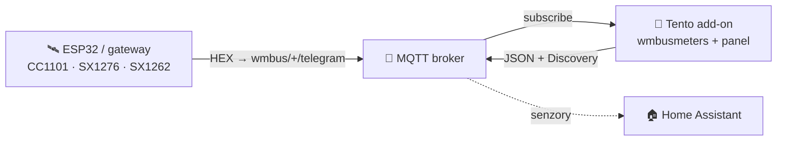
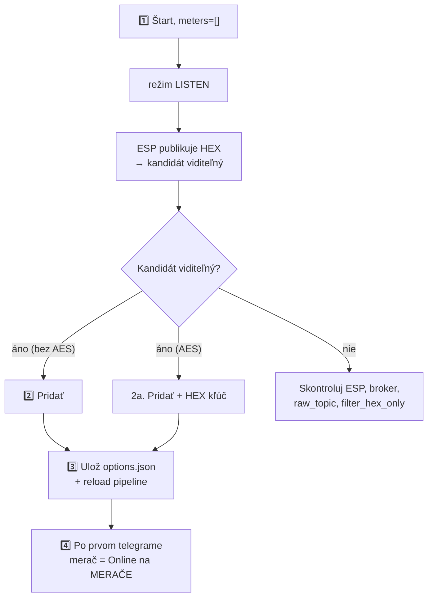

> 🌐 [EN](README.en.md) | [PL](README.pl.md) | [DE](README.de.md) | [CS](README.cs.md) | [**SK**](README.sk.md)

# wMBus MQTT Bridge — používateľská príručka (SK)

> Príručka pre používateľa: inštalácia, pridávanie meračov, čítanie panelu,
> riešenie problémov. **Ako to funguje vnútri** (architektúra, runtime súbory,
> soft-reload, kontrakt ESP diagnostiky) je v [`ARCHITECTURE.md`](ARCHITECTURE.md).

---

## Obsah

1. [Čo to robí](#1-čo-to-robí)
2. [Požiadavky](#2-požiadavky)
3. [Rýchly štart — Home Assistant](#3-rýchly-štart--home-assistant)
4. [Rýchly štart — Docker standalone](#4-rýchly-štart--docker-standalone)
5. [WebUI — čo vidíš](#5-webui--čo-vidíš)
6. [Typický postup: od prázdna k funkčnému meraču](#6-typický-postup-od-prázdna-k-funkčnému-meraču)
7. [Filtrovanie podľa hodnoty — keď je počuť priveľa cudzích meračov](#7-filtrovanie-podľa-hodnoty--keď-je-počuť-priveľa-cudzích-meračov)
8. [Možnosti konfigurácie](#8-možnosti-konfigurácie)
9. [Jazyk rozhrania](#9-jazyk-rozhrania)
10. [Riešenie problémov](#10-riešenie-problémov)
11. [Ako to funguje pod kapotou](#11-ako-to-funguje-pod-kapotou)
12. [Licencia a upstream](#12-licencia-a-upstream)

---

## 1. Čo to robí

> **Jednou vetou:** dekóduje telegramy Wireless M-Bus (vodomery, merače tepla,
> elektromery) **bez lokálneho USB donglu** — surové HEX rámce dodáva ľubovoľný
> externý prijímač (ESP32, gateway) cez MQTT.

- **Ty** umiestniš rádiový prijímač tam, kde je signál (napr. ESP32 s anténou).
- **Prijímač** publikuje surové HEX rámce na MQTT (`wmbus/<device>/telegram`).
- **Tento add-on** sa pripojí k brokeru, kŕmi `wmbusmeters`, dekóduje telegramy a
  publikuje výsledok späť na MQTT + **Home Assistant Discovery**.

Výsledok: **tvoje merače sa objavia ako senzory v HA, bez akéhokoľvek rádiového hardvéru na strane HA.**



> 🤝 Typicky sa používa s firmvérom **[esphome-wmbus-bridge-rawonly](https://github.com/Kustonium/esphome-wmbus-bridge-rawonly)**
> (ESP32 + CC1101/SX1276/SX1262, publikuje RAW HEX). Oba projekty sú nezávislé —
> add-on prijíma hex z ľubovoľného zdroja publikujúceho na `raw_topic`.

> 🌉 **Ako celok tvoria ESP (RF prijímač) a tento add-on (dekodér)
> distribuovaný _wM-Bus → Home Assistant gateway_** — rádio je tam, kde je
> signál, a dekódovanie (dešifrovanie a sada ovládačov z pripnutého zostavenia
> `wmbusmeters`) beží na HA.
> Na rozdiel od monolitických wM-Bus gateway (rádio + dekodér v jednej krabičke)
> nepotrebuje lokálny USB dongle a škáluje pridávaním lacných ESP uzlov.
>
> **Každá polovica funguje aj samostatne a sú zameniteľné:** ESP kŕmi ľubovoľný MQTT backend (Node-RED, vlastný skript, vlastný dekodér) a add-on dekóduje hex z ľubovoľného zdroja na `raw_topic` (tento ESP, rtl-wmbus, iný gateway, replay nástroj) — spolupracujú, ale ani jedna nezávisí od druhej.

---

## 2. Požiadavky

- **MQTT broker** (Mosquitto, EMQX…) dosiahnuteľný z HA / z hostiteľa.
- **Prijímač** publikujúci HEX rámce na `wmbus/<device>/telegram`.
- Home Assistant (režim add-onu) **alebo** Docker + compose (standalone).

> ⚠️ Neprevádzkuj paralelne oficiálny add-on `wmbusmeters` — tento projekt má vlastnú
> inštanciu a navzájom by sa zdvojovali.

> 🧱 **Hranica zodpovednosti.** Projekt poskytuje dvoch MQTT klientov — firmware ESP (rádio → MQTT) a tento add-on (MQTT → dekódovanie → HA); jeho rozsah končí pri MQTT téme. **Samotný broker — autentifikácia, ACL, TLS, sieťová expozícia a prípadný bridging broker-broker pre vzdialené/distribuované inštalácie (lokalita A → internet → lokalita B) — je zodpovednosťou prevádzkovateľa.** Odporúčané: broker drž v LAN; pre vzdialený prístup použi tunel/VPN alebo bridging brokera s TLS; nevystavuj port 1883 ani WebUI (8099) priamo do internetu. Pozn.: pri meračoch s AES ostáva payload šifrovaný meračom end-to-end, nezávisle od transportu brokera.

> ⚠️ **Začiatočník? Prečítaj si to, než niečo vystavíš.** **Nepresmerovávaj** na domácom routeri port brokera (1883) ani Home Assistant do internetu — vystavený broker môže čítať a zneužiť ktokoľvek. Pre prístup zvonku použi hotové bezpečné riešenie: **Home Assistant Cloud (Nabu Casa)** alebo add-ony **Tailscale** / **Cloudflare Tunnel**. Nie si si istý? Nechaj všetko v domácej sieti — add-on na svoju funkciu internet nepotrebuje.

---

## 3. Rýchly štart — Home Assistant

1. **Pridaj repozitár:** Settings → Add-ons → Add-on Store → ⋮ → Repositories:
   ```
   https://github.com/Kustonium/homeassistant-wmbus-mqtt-bridge
   ```
2. **Nainštaluj** „wMBus MQTT Bridge", klikni **Start** (s predvoleným `meters: []`
   add-on prejde do **režimu LISTEN** a iba počúva).
3. **Otvor WebUI** (Info → OPEN WEB UI).
4. Choď na **PRÍJEM / HĽADANIE**, nájdi svoj merač medzi detegovanými kandidátmi a
   klikni **Pridať** (modal: ID, ovládač, názov, voliteľný AES kľúč a výber
   publikovaných polí — pozri nižšie). Po uložení sa
   pipeline sama prenačíta (bez reštartu kontajnera).

Celý postup v [§6](#6-typický-postup-od-prázdna-k-funkčnému-meraču).

---

## 4. Rýchly štart — Docker standalone

Pre všetko mimo HA (DietPi, Ubuntu, Raspberry Pi OS, NAS…).

```bash
git clone https://github.com/Kustonium/homeassistant-wmbus-mqtt-bridge.git
mkdir -p /home/wmbus
cp -a homeassistant-wmbus-mqtt-bridge/docker/examples/* /home/wmbus/
cd /home/wmbus
docker compose pull
docker compose up -d
docker compose logs -f wmbus
```

Image `wmbus` je multi-arch (amd64 + aarch64) — `pull` sám stiahne variantu
zodpovedajúcu tvojmu hostu, bez lokálnej kompilácie.

Konfigurácia v `./config/options.json` (referencia polí v [§8](#8-možnosti-konfigurácie)):

```json
{
  "raw_topic": "wmbus/+/telegram",
  "discovery_enabled": true,
  "state_prefix": "wmbusmeters",
  "mqtt_mode": "external",
  "external_mqtt_host": "192.168.1.10",
  "external_mqtt_port": 1883,
  "external_mqtt_username": "user",
  "external_mqtt_password": "pass",
  "meters": []
}
```

Po úprave: `docker compose restart wmbus`. WebUI: vystav port `8099` v
`docker-compose.yml` a otvor `http://<host-ip>:8099/`.

> 💡 V Dockeri globálne tlačidlo **Reštart** funguje, ak má kontajner nastavenú
> politiku reštartu (ukážkový súbor Compose používa
> `restart: unless-stopped`). Bez nej tlačidlo kontajner zastaví; znova ho
> spustite pomocou `docker start <container>`.

---

## 5. WebUI — čo vidíš

Dostupné v **5 jazykoch** (EN/PL/DE/CS/SK) — prepínač vpravo hore.

| Záložka | Na čo |
|---|---|
| **PANEL** | Dashboard: pipeline ESP→MQTT→wmbusmeters→HA (klikateľné dlaždice) + štatistiky. |
| **MERAČE** | Tvoje nakonfigurované merače: hodnota, posledný telegram, **PRÍJEM**. |
| **PRÍJEM / HĽADANIE** | Detegovaní kandidáti + nakonfigurované „v éteri"; tu pridáš/odoberieš merače a filtruješ zobrazené hodnoty. |
| **LOGY / ESP LOGY** | Runtime udalosti a diagnostika ESP prijímačov. |
| **NASTAVENIA / O PROJEKTE** | Aktívna konfigurácia, info. |

### Stĺpec PRÍJEM (čo znamenajú odznaky)

Nájdi kurzorom na **ⓘ** pri hlavičke PRÍJEM — máš legendu. Stručne:

- **stav + stĺpce** — či merač dochádza: *online* / *oneskorený* / **ticho**. Prah je
  **adaptívny** podľa rytmu daného merača (jeho priemerného intervalu). Dlhšie ticho je
  **neutrálne** (sivé), nie červený alarm — merač môže byť v noci / pri neprítomnosti /
  pri slabej batérii tichý, takže nehlásime planý poplach.
- **📡 ESP** — merač je označený (highlight) na niektorom z ESP.
- **📶 názov N% · počet** — % príjmu a počet telegramov **na danom ESP** (z voliteľnej
  diagnostiky). Pri viacerých ESP vidíš, ktorý prijímač merač počuje a ako dobre. Farba:
  zelená ≥90 · jantárová ≥50 · červená <50.

> Surové % a počet **nie sú** mierou citlivosti dosky (kumulatívny počet od bootu,
> rôzne uptime). Skutočná citlivosť je **pokrytie** — ktoré merače doska vôbec počuje.

### Pridávanie / odoberanie meračov (PRÍJEM)

- Kandidáti bez AES sa dekódujú automaticky — stĺpec **Hodnota** ukazuje živý náhľad
  bez konfigurácie.
- **Pridať** uloží merač a prenačíta pipeline.
- **Porovnať** v modale **Pridať** alebo **Driver…** dekóduje posledný telegram dvoma
  drivermi bez uloženia zmien. Vyber driver v poli **Driver**, pri šifrovanom
  merači zadaj AES kľúč a klikni na **Porovnať**. Ľavý stĺpec je uložený driver
  alebo auto-detekcia `wmbusmeters`, pravý stĺpec je tebou vybraný driver. Zelené
  riadky sú ďalšie polia, žlté riadky iné hodnoty; viac polí **neznamená**
  automaticky správne — over hodnoty na displeji merača.
- **Hlásenie…** môže pri rovnakom ID použiť uložený 32-znakový AES kľúč, aby
  `wmbusmeters --analyze` ukázal užitočný výstup. Samotný kľúč sa do hlásenia
  nikdy neprikladá, ale dešifrovaná analýza môže obsahovať odpočty merača.
- **Odstrániť vybrané** — zaškrtni checkboxy a odober viac naraz (tlačidlo nad tabuľkou).

---

## 6. Typický postup: od prázdna k funkčnému meraču



1. **Štart** s `meters: []` → režim LISTEN, log ukáže `No meters configured -> LISTEN MODE`.
2. **Pridaj** kandidáta (bez AES — hneď; AES — zadaj 32-znakový HEX kľúč).
   V tom istom modáli je zoznam všetkých polí, ktoré ovládač vie vrátiť — každé s
   popisom z wmbusmeters a zaškrtávacím políčkom. Odškrtni, čo nechceš ako
   entitu, alebo zadaj vzory ako `consumption_at_history_*` do poľa **Polia na
   vynechanie**. Ak necháš prázdne, publikuje sa všetko ako doteraz. Neskôr to
   zmeníš cez **Driver…** pri pridanom merači — pozor, odškrtnuté pole príde o
   entitu aj o zaznamenanú históriu.
3. Uloženie ide do `options.json` a DECODE pipeline sa prenačíta **bez plného reštartu
   kontajnera**.
4. Po **ďalšom telegrame** tohto merača (od desiatok sekúnd po pár minút, podľa merača)
   sa objaví ako **Online** na MERAČE a HA Discovery odošle konfigurácie senzorov.
   Konečné `entity_id` prideľuje Home Assistant.

Kým príde prvý telegram, dashboard ukazuje panel **„čaká na prvý telegram"**. Plný
reštart add-onu je len núdzová záloha.

**Premenovanie merača.** Otvor **Driver…** pri nakonfigurovanom merači a uprav pole
**Názov**. Názov je to, čo Home Assistant zobrazuje ako názov zariadenia.
Premenovanie je z hľadiska histórie bezpečné: `unique_id` každej entity vzniká z ID
merača, nie z názvu, takže entity aj ich zaznamenané dáta zostanú. Home Assistant
pri premenovaní neprepočítava existujúce `entity_id` — entita vytvorená ako
`sensor.kuchyna_total_m3` si toto ID ponechá aj po premenovaní zariadenia na
*Kúpeľňa*, mení sa len zobrazovaný názov. Dva merače nemôžu mať rovnaký názov:
dekodér zapisuje jeden súbor na názov, preto je uloženie odmietnuté, namiesto toho
aby druhý merač ticho prepísal prvý.

**Nepodporovaný merač?** Ak sa kandidát nikdy nedekóduje (neznámy driver /
„unknown format signature"), použite tlačidlo **Hlásenie…** v jeho riadku:
add-on zostaví hotový blok hlásenia pre upstream projekt wmbusmeters (surový
telegram + výstup `wmbusmeters --analyze`). Telegram obsahuje sériové číslo
merača. Uložený AES kľúč môže byť použitý na analýzu rovnakého ID, ale samotný
kľúč sa nikdy neprikladá. Dešifrovaný výstup môže obsahovať odpočty merača.

To isté tlačidlo **Hlásenie…** je v každom riadku pohľadu MERAČE, takže už
pridaný merač — taký, ktorý sa dekóduje, ale hlási pole nesprávne alebo menej
polí, než ukazuje jeho displej — nahlásite bez toho, aby ste ho museli odobrať.
Je to zároveň spôsob, ako si pozrieť surový rámec nakonfigurovaného merača:
hlásenie začína práve telegramom. Rámec pochádza z kruhového buffera naposledy
prijatých telegramov, takže po reštarte je k dispozícii hneď, ako merač znova
vyšle.

---

## 7. Filtrovanie podľa hodnoty — keď je počuť priveľa cudzích meračov

Aktuálny postup vo WebUI používa panel **Filtrovať podľa hodnoty** v zobrazení
PRÍJEM / HĽADANIE:

1. Odpíš aktuálnu číselnú hodnotu z fyzického displeja merača.
2. Zadaj ju do filtra; predvolená tolerancia je `0.05`.
3. WebUI skryje riadky, ktorých už zobrazené číselné hodnoty sú mimo tolerancie.

Filter pracuje iba na hodnotách, ktoré už WebUI prijalo pre nakonfigurované
merače a kandidátov. Nespúšťa ďalšie dekódovanie, neskúša všetky ovládače a
nemení konfiguráciu.

Starší backend SEARCH ostáva dostupný pre pokročilú konfiguráciu, ale jeho
záložka je v navigácii skrytá. Po zapnutí `search_mode` režim LISTEN ukladá iba
výslovne nešifrované vodné kandidáty a jeden ovládač navrhnutý LISTEN. Až ďalší
reštart načíta tieto dočasné merače; porovnávajú sa číselné polia, ktorých názov
obsahuje `m3` alebo `total_volume`. Dočasné merače SEARCH sú vynechané z HA Discovery.

---

## 8. Možnosti konfigurácie

Z [`config.yaml`](../config.yaml).

### MQTT — vstup / výstup

| Pole | Typ | Predvolené | Popis |
|---|---|---|---|
| `raw_topic` | str | `wmbus/+/telegram` | Topic so surovými HEX rámcami. `+` = wildcard (názov ESP v diagnostike) |
| `filter_hex_only` | bool | `true` | Ignoruj správy, ktoré nevyzerajú ako HEX |
| `mqtt_mode` | enum | `auto` | `auto` (poradie: `external_mqtt_host`, ak je vyplnený → HA broker zo služby Supervisora → sonda známych broker add-onov `core-mosquitto`/`a0d7b954-emqx`, s údajmi `external_mqtt_username/password`, ak sú zadané) / `ha` (vynútiť HA) / `external` (vždy externý) |
| `external_mqtt_host/port/username/password` | str/int | `""` / `1883` / `""` / `""` | Externý broker (pri `external`) |

### Discovery a výstup

| Pole | Typ | Predvolené | Popis |
|---|---|---|---|
| `discovery_enabled` | bool | `true` | Publikuj HA Discovery |
| `discovery_prefix` | str | `homeassistant` | Prefix Discovery |
| `discovery_retain` | bool | `true` | Discovery ako retained |
| `state_prefix` | str | `wmbusmeters` | Prefix topicu s hodnotami |
| `state_retain` | bool | `false` | Retained stav |
| `verify_ha_entities` | bool | `false` | V režime HA add-onu použije deklarovaný read-only prístup add-onu k HA Core API na overenie testovacej entity. Docker nemá token Supervisora, takže tam overenie nie je dostupné. |

Každá entita z Discovery má **availability template**: ak v poslednom telegrame
merača chýba dané pole (niektoré merače striedajú krátke a plné rámce), entita
zobrazí `unavailable` namiesto zastaranej alebo falošnej hodnoty — a
automaticky sa obnoví s ďalším telegramom, ktorý pole obsahuje. Nezávisle od
toho automaticky ladené `expire_after` (cca 2× pozorovaný interval vysielania
merača, minimálne 1 h) označí entity ako `unavailable`, keď merač stíchne.

Okrem číselných meracích senzorov každý merač, ktorý hlási pole `status`,
dostane aj dve **diagnostické** entity (v sekcii *Diagnostika* zariadenia):
`sensor` so surovým textom stavu a `binary_sensor` (`device_class: problem`),
ktorý sa zapne vždy, keď je stav iný než `OK`. Text sa preberá doslovne z
wmbusmeters, takže jeho presný obsah závisí od vybraného ovládača upstreamu.

Okrem toho most publikuje konfiguráciu Discovery pre **každé** pole, ktoré
ovládač vracia, a rozdeľuje ich podľa toho, čo merajú:

- pole, ktoré Home Assistant vie zaradiť (odhadneme `device_class`), alebo
  ktoré nesie jednotku spotreby — m³, GJ, MJ, kWh, Wh, l, hca, kVARh, kVAh,
  teda aj veličiny, pre ktoré HA triedu nemá: objem na merači tepla, tepelná
  energia v GJ/MJ, jednotky pomerového rozdeľovača vykurovacích nákladov a
  jalová i zdanlivá energia — sa stane bežným meracím senzorom, zapnutým;
- všetko ostatné sa stane **diagnostickou** entitou publikovanou ako **vypnutá**
  (`enabled_by_default: false`): čísla bez triedy (vek záznamu, počítadlá chýb),
  textové polia (`current_status`, `meter_datetime`, …) a polia, ktoré ovládač
  práve hlási ako `null` (`fraud_date`, kým k podvodu nedošlo). Home Assistant
  takúto entitu zaregistruje a na stránke zariadenia ju zobrazí ako vypnutú;
  zapneš tie, ktoré potrebuješ.

Entitu nedostane iba identita merača (`id`, `name`, `meter`, `media`,
`timestamp`, `rssi`, `lqi`) — je už v názve zariadenia a v atribútoch entít.

Každá entita navyše nesie atribút `Description` — popis poľa od autora ovládača,
získaný z `wmbusmeters --listfields`. Stojí vedľa dekódovaných polí telegramu v
atribútoch entity, takže nič z toho, čo tam bolo predtým, nezmizne.

Home Assistant číta `enabled_by_default` len pri prvom pridaní entity, takže
aktualizácia nikdy nevypne to, čo už máš. `entity_category` sa naopak uplatní
pri každej aktualizácii konfigurácie, takže číselné polia bez triedy založené
staršou verziou sa presunú do sekcie *Diagnostika*.

To isté platí aj naopak: entita vytvorená ako vypnutá zostane vypnutá, kým ju na
stránke zariadenia nezapneš — aj keď by ju novšia verzia doplnku už publikovala
ako bežný senzor. Zmazanie zariadenia nepomôže, pretože Home Assistant
odstránené entity vrátane stavu zapnutia obnoví, len čo je ten istý merač znovu
detekovaný; tento záznam si drží 30 dní. Stačí ju raz zapnúť ručne.

### RSSI podľa prijímacej dosky (voliteľné, zapína sa na ESP)

Úroveň signálu nie je súčasťou telegramu. RAW téma nesie čistý hexadecimálny
zápis, takže `wmbusmeters` žiadne RSSI nevidí a nemá čo hlásiť — musí ho zvlášť
publikovať prijímacia doska. Táto publikácia je **predvolene vypnutá** a nie je
voľbou doplnku: zapína sa v YAML firmvéru, v sekcii `wmbus_radio`:

```yaml
wmbus_radio:
  publish_rssi: true
```

Doska potom pre každý dekódovaný merač publikuje:

```text
wmbus/<doska>/rssi/<id_merača>    payload: -52
```

Most si hodnotu ukladá zvlášť pre každý merač **a** každú dosku a pripája ju k
dekódovanému telegramu ako `rssi_<doska>_dbm`. Každá doska tak má pre ten istý
merač vlastnú entitu sily signálu:

```json
{
  "rssi_lilygo_dbm": -52,
  "rssi_xiaoseed_dbm": -50
}
```

Je to zámer. Ten istý merač môžu počuť dve dosky a jediná zlúčená hodnota by
medzi nimi len preskakovala — číslo by vyzeralo ako kolísajúci signál, nie ako
dva prijímače. Preto spoločné pole `rssi_dbm` neexistuje.

Most ukladá iba vierohodné meranie: -125 až -1 dBm. Sentinely firmvéru
označujúce „žiadne dáta" sa zahadzujú namiesto toho, aby sa publikovali ako
odčítanie, a hodnota staršia než päť minút sa k čerstvému telegramu nepripojí —
keď niektorá doska prestane publikovať, jej entita sa stane nedostupnou namiesto
toho, aby zamrzla na poslednom čísle.

Ak voľbu necháte vypnutú, nič nepríde, nepridá sa žiadne pole a nevznikne žiadna
entita.

### Starší režim SEARCH

| Pole | Typ | Predvolené | Popis |
|---|---|---|---|
| `search_mode` | bool | `false` | Zapína skrytý starší backend SEARCH opísaný v [§7](#7-filtrovanie-podľa-hodnoty--keď-je-počuť-priveľa-cudzích-meračov) |
| `search_expected_value_m3` | float | `0` | Očakávaný stav m³ |
| `search_tolerance_m3` | float | `0.05` | Tolerancia porovnania — v dome nezvyšuj |
| `search_delta_mode` / `search_min_delta_m3` | bool/float | `false` / `0.001` | (Experimentálne) porovnanie delty |
| `search_topic` | str | `wmbus/search/candidates` | Topic výsledkov SEARCH publikovaný bez retain |

### Debug

| Pole | Typ | Predvolené | Popis |
|---|---|---|---|
| `loglevel` | enum | `normal` | `normal` / `verbose` / `debug` |
| `debug_every_n` | int | `0` | Extra diagnostika každý N-tý telegram |

> 💡 Všetky vyššie uvedené možnosti sa dajú upraviť aj priamo vo WebUI v **Nastavenia → Konfigurácia** (s popisom pri každej); kľúčové možnosti sa prejavia po reštarte doplnku.

### Merače — `meters[]`

| Pole | Typ | Povinné | Popis |
|---|---|---|---|
| `id` | str | áno | Tvoj štítok merača, použitý v názvoch MQTT Discovery a generovanej konfigurácii |
| `meter_id` | str | áno | Sériové číslo merača (HEX, z LISTEN) |
| `type` | str | áno | **Názov ovládača wmbusmeters** (napr. `hydrodigit`, `amiplus`, `izarv2`) **alebo `auto`/`other`**. Voľný reťazec — wmbusmeters overí ovládač pri dekódovaní (zámerne nie enum, aby nové ovládače neboli odmietané). |
| `type_other` | str? | pri `type=other` | Vlastný názov ovládača |
| `key` | str? | pri šifrovaní | 32-znakový AES kľúč (HEX) |
| `exclude_fields` | str? | nie | Vzory (globy) polí, ktoré **nemajú** dostať entitu v Home Assistante — napr. `consumption_at_history_*, history_*_date`. Oddelené čiarkami alebo medzerami; prázdne publikuje všetky polia. |
| `calculated_fields` | str? | nie | Ďalšie polia, ktoré **wmbusmeters** počíta z telegramu, oddelené bodkočiarkami, každé ako `názov=vzorec` — napr. `difftemp_c=flow_temperature_c - return_temperature_c`. Počíta dekodér; výsledok je bežné pole a stane sa entitou ako každé iné. |
| `static_fields` | str? | nie | Pevné hodnoty pripojené k meraču, oddelené bodkočiarkami, každá ako `názov=hodnota` — napr. `location=kuchyna; apartment=12`. Dekodér ich vkladá do telegramu **ako text** (`apartment=12` príde ako `"12"`), takže ich vidno v atribútoch entít a ako diagnostické entity: štítok, nie meranie. |

Pred písaním vzorca sa hodí vedieť dve veci. Aritmetika **stráži jednotky**:
`total_m3 / 2 counter` funguje, `total_m3 * 2` nie — holé číslo nemá jednotku a
dekodér taký vzorec odmietne. Sčítanie polí s rovnakou jednotkou nepotrebuje nič
navyše, napr.
`difftemp_c=max_external_temperature_c - min_external_temperature_last_month_c`.
Vzorec, ktorému dekodér nerozumie, stojí len to jedno pole: napíše to do logu, pole
jednoducho nevznikne a zvyšok merača sa dekóduje normálne.

Názov počítaného poľa nie je ľubovoľný: musí končiť jednotkou a tá prepočíta
výsledok. Z toho istého vzorca dá `difftemp_c` °C a `difftemp_f` °F — zmerané na
skutočnom telegrame: 11 °C sa vrátilo ako `11`, `51.8` a `284.15` pre názvy
`_c`, `_f` a `_k`. Názov bez jednotky alebo s neznámou (`mojepole`, `kopia_xyz`)
je odmietnutý: dekodér napíše *"Could not extract a valid unit from calculated
field name"*, pole nevznikne a merač dekóduje ďalej. Konštantných polí sa to
netýka — tam je prípustný akýkoľvek názov, pretože sa nič neprevádza.

Zoznam ovládačov vo WebUI sa generuje z pripnutého zostavenia `wmbusmeters` a
jeho XMQ zdrojov. Používajte tento katalóg namiesto ručne udržiavaného zoznamu
v návode.

Tabuľka polí v paneli ovládača merača pochádza z `wmbusmeters --listfields` — je
to úplný katalóg ovládača, nie zoznam toho, čo táto cesta publikuje. Desať polí
spoločných všetkým ovládačom sa preto zobrazuje stlmene a nedá sa zaškrtnúť.
`id`, `name`, `meter`, `media` a `timestamp` sú identita merača: zostávajú v
názve zariadenia a v atribútoch entít, namiesto toho, aby dostali vlastné
entity. `timestamp_ut`, `timestamp_lt`, `timestamp_utc`, `device` a `rssi_dbm` sa
sem do JSON dekodéra nikdy nedostanú — tri časové pečiatky existujú len pre
výstupné formáty CSV/`fields` a posledné dve vypĺňa prijímacie rádiové
zariadenie, ktoré dekodér nemá, keď mu telegramy podávate ako HEX.

---

### Záložka Diagnostika

Tabuľka podľa dosiek: rámce, merače, chýbajúce udalosti, reštarty za posledných
24 hodín a čas od posledného rámca, plus jeden stav na dosku. Pod ňou karta
každej dosky s detailmi a zrozumiteľným vysvetlením každého varovania.

Dve veci, kvôli ktorým vznikla. **Medzery v sekvencii** dokazujú, že sa udalosť
stratila medzi ESP a doplnkom - nehovoria však, či zlyhalo rádio, MQTT, sieť
alebo odberateľ. A **tiché reštarty**: reštart vynuluje počítadlá dosky, takže
bez osobitného záznamu maže vlastnú stopu. Keď sú reštarty zhruba 15 minút od
seba, záložka to povie a pomenuje pravdepodobnú príčinu - predvolený
`api.reboot_timeout` v ESPHome, ktorý dosku reštartuje vždy, keď nie je
pripojený klient Native API. Prijímač len na MQTT žiadneho nemá.

Stránka potrebuje firmvér publikujúci tému metadát `rx`; staršie dosky sa
jednoducho neobjavia.

Ak firmvér navyše pečiatkuje rámce časom príjmu, karta získa riadok **Hodiny
ESP**: či sú hodiny dosky nastavené a ako veľmi sa ich čas príjmu líši od času
doplnku.

Ak firmvér navyše publikuje retained snapshot `<diag>/config`, karta získa
sekciu **Konfigurácia** s každým účinným nastavením a značkou - `default`,
`CHANGED` alebo `set` - takže čitateľ vidí, s čím doska skutočne nabehla, bez
žiadania o YAML. Staršie firmvéry sekciu jednoducho nemajú.

### Export dôkazov o príjme z ESP (`esp_rx_api_enabled`, predvolene vypnuté)

Firmvér publikujúci štruktúrované metadáta príjmu na `wmbus/<doska>/rx` umožňuje
doplnku počítať **skutočné príjmy na merač a na dosku** namiesto spoliehania sa na
percentá, ktoré si každá doska počítala sama o sebe. Tie percentá neboli medzi
doskami porovnateľné: doska počujúca každé druhé vysielanie si odvodila dvakrát
dlhší priemerný interval a aj tak ukazovala 100 %.

Voľba **`esp_rx_api_enabled` je predvolene vypnutá** a nemení nič na zbere dát ani
na bežnom rozhraní. Zapnutie urobí dve veci:

- sprístupní `GET /api/esp-rx` cez overené Ingress WebUI — prehľad príjmu,
  spojitosť sekvencie podľa dosiek a ohraničenú históriu, s `limit` (1–10000),
  `since` a `until` (UTC epocha, `until` nezahrnuté);
- pridá tlačidlo **Download RX history** na stránke Prijaté / Hľadať, ktoré uloží
  tie isté povolené dáta s celým uchovaným bufferom (až 100 000 udalostí) pod
  názvom súboru s UTC značkou.

Export **nikdy** nevracia RAW telegramy, AES kľúče ani prihlasovacie údaje MQTT
a je len na čítanie: stiahnutie neskracuje históriu, nenuluje počítadlá a nič
nereštartuje. Pri vypnutej voľbe endpoint odpovedá HTTP 404.

Medzery v sekvencii dokazujú, že sa niekde medzi ESP a odberateľom stratila
udalosť. Samy osebe **nehovoria**, či bola príčinou rádiová časť, MQTT, sieť alebo
odberateľ.

### Blok walk-by Qundis (`qds_walkby_enabled`, predvolene vypnuté)

Meradlá Qundis vkladajú celý obsah walk-by do jediného záznamu výrobcu
(`0DFF5F`, 53 bajtov) v telegramoch CI=0x78. Od generácie 2026 je tento záznam
šifrovaný **vnútri záznamu**, nie na vrstve wM-Bus: takéto telegramy nemajú
hlavičku TPL, wM-Bus ich teda správne hlási ako nešifrované a nič ich neoznačí
ako vyžadujúce kľúč.

Bez tejto voľby nastávajú dva problémy a voľba rieši oba:

- **Náhodné hodnoty so `status: OK`.** Dekodér rozpozná záznam walk-by podľa
  jediného bajtu, ktorý náhodný šifrovaný obsah trafí raz za 256 telegramov —
  teda približne každých osem hodín na meradlo. Potom číta šifrované bajty ako
  číslo. Pri meradle s 1,387 m³ z toho vznikne `15430.611`, čo nenápadne
  znehodnotí dlhodobé štatistiky Home Assistanta. So zapnutou voľbou sa
  neoveriteľný záznam odovzdá dekodéru so zmeneným kľúčom, na ktorý nesedí žiadny
  ovládač: odčet prepadne, hodiny meradla sa naďalej aktualizujú.
- **Žiadne hodnoty a žiadne vysvetlenie.** Ak je AES kľúč meradla nastavený,
  doplnok blok sám dešifruje a odovzdá dekodéru čitateľný záznam. Ak nie je, log
  to povie priamo — spolu s verziou a typom meradla, poľom CI a nájdenými
  záznamami.

**Ide o bežný AES kľúč meradla** — ten istý, ktorý používajú jeho bežné telegramy
(CI=0x7A). Žiadne osobitné tajomstvo pre walk-by neexistuje; ak sa bežné
telegramy toho meradla dešifrujú, je to práve tento kľúč. Nesprávny kľúč je
nahlásený ako nesprávny a nikdy nevedie k náhradnej hodnote.

S vypnutou voľbou je dekódovanie bajt po bajte rovnaké ako predtým, inštalácia
bez meradiel Qundis teda nie je dotknutá. Pozri `docs/ARCHITECTURE.md` §3.5.

### Drôtový M-Bus (sériová zbernica, predvolene vypnuté)

Merače tepla a vody často vedú káblom, nie rádiom: prevodník M-Bus master sedí na
dvojdrôtovej zbernici a v systéme sa hlási ako sériový port (USB, RS-232 alebo
RS-485). Doplnok vie takúto zbernicu sám dopytovať.

Všetko nadväzujúce zostáva rovnaké ako pri rádiu — tie isté ovládače, jednotky,
Discovery, počítané aj konštantné polia. Líši sa len transport: merače sa dopytujú
namiesto počúvania a adresujú namiesto objavovania.

Po prvej platnej odpovedi sa káblový merač zobrazí aj v **PANELI** a
**MERAČOCH**. Stĺpec zdroja ukazuje `M-Bus · <alias zbernice>` namiesto odznakov
ESP, rádiového pásma a príjmu a Panel doplní skutočnú káblovú cestu
`merač → sériový master → dopytujúci wmbusmeters → MQTT + HA`. Cesta sa označí
ako aktívna až po prijatí telegramu runtime, nie iba zapnutím enginu.

**Dva prepínače, oba predvolene vypnuté.** `mbus_tab_visible` iba zobrazí záložku,
`mbus_enabled` spustí engine. Pri oboch vypnutých sa pre vás nič nemení.

| Voľba | Význam |
|---|---|
| `mbus_device` | sériový port; najlepšie cesta `/dev/serial/by-id/…` |
| `mbus_bus_alias` | názov zbernice v konfigurácii meračov (`MAIN`) |
| `mbus_baudrate` | 300–9600, zvyčajne 2400 |
| `mbus_poll_interval` | predvolený interval zapísaný každému meraču bez vlastného |
| `mbus_donotprobe_all` | nechajte zapnuté — pozri varovanie nižšie |
| `mbus_device_serial` | vyplní sa automaticky pri výbere portu; umožní zistiť, že uzol `/dev` už patrí inému hardvéru, namiesto tichého dopytovania |
| `mbus_loglevel` | `normal`, `verbose`, `debug` — len pre inštanciu zbernice, nezávisle od hlavnej úrovne logu |
| `mbus_logtelegrams` | loguje každý rámec vymenený so zbernicou; užitočné, keď merač mlčí, inak ukecané |
| `mbus_ignoreduplicates` | zahadzuje opakované identické telegramy pred dekódovaním |
| `mbus_meters[]` | `id`, `address` (`p1`..`p250` alebo 8 hex), `type`, `key`, `poll_interval` |

**Doplnok zámerne nikdy neskenuje porty.** Sondovanie znamená vysielanie a na typickom
stroji s Home Assistant je jeden zo sériových portov koordinátor Zigbee. Dekodér
správny prevodník aj tak nepotvrdí — otvorí zariadenie a ohlási úspech — port preto
vyberáte vy.

Vybranú zbernicu potom môžete výslovne overiť: **Overiť, či zbernica žije** odošle
jeden testovací broadcast, **Sken primárnych adries** prejde iba zadaný rozsah
(`p1`–`p250`, najviac 32 adries na požiadavku) a v každom riadku zobrazí potvrdenie
adresy aj diagnostiku dátovej odpovede; **Dopytovať raz** osloví jednu
nakonfigurovanú primárnu adresu. Počas bežného dopytovania sú všetky tri akcie
odmietnuté, pretože M-Bus má jediný master. **„Dopytovať raz“ slúži iba na
diagnostiku:** zobrazí surovú odpoveď, ale nedekóduje ju, nepublikuje do MQTT/Home
Assistant ani nepridá merač do Pipeline. Pre bežnú prevádzku merač uložte, zapnite
engine, kliknite na **Použiť** a reštartujte doplnok. Výstup tohto bežného enginu
zostáva viditeľný v **Konzole zbernice**, ktorá je iba na čítanie a neumožňuje
posielať ľubovoľné bajty.

Pole **Ovládač** v tabuľke meračov ponúka všetky ovládače dodané v aktuálnom obraze
a naďalej prijíma vlastný názov. `auto` môže merač rozpoznať, ale nezaručuje výber
použiteľného ovládača pre každú káblovú odpoveď; ak automatické dekódovanie nevráti
hodnotu, vyberte ovládač uvedený v dokumentácii merača.
**Zistiť ovládač** vykoná jedno diagnostické dopytovanie a odovzdá prijatý rámec
analyzátoru v pribalenom `wmbusmeters`. Návrh vyplní pole, ale nikdy sa automaticky
neuloží: skontrolujte ho a kliknite na **Uložiť merače**. Ak analyzátor nemá
spoľahlivý návrh, rozhranie to oznámi namiesto hádania.
Pipeline odvodzuje zobrazenú jednotku zo skutočného názvu dekódovaného poľa
(napríklad `_c` → `°C`, `_rh` → `RH%`), aj pri ovládačoch bez kumulatívneho odpočtu,
ktoré používajú všeobecný číselný fallback.

**V Dockeri** namapujte prevodník výslovne:
`devices: ["/dev/serial/by-id/usb-…:/dev/ttyUSB0"]`. Nikdy `/dev:/dev`, nikdy
`privileged`.

**Záložka povie, prečo nič nechodí.** Na zbernici vyzerajú zlá adresa, mŕtvy merač,
prevodník, ktorý nenapája linku, a merač hovoriaci iným protokolom zvonku rovnako:
nevzniknú žiadne entity. Karta stavu zbernice pomenuje, o ktorý prípad ide — po
meračoch, spolu s okamihom poslednej odpovede každého z nich:

- *Bez odpovede* — port je otvorený, merač na tejto adrese mlčí. Adresa, kabeláž
  alebo prevodník, ktorý zbernicu nenapája.
- *Poškodené rámce* — chyby kontrolného súčtu, najčastejšie dva merače na jednej
  primárnej adrese. Merač odpovedajúci dvoma rôznymi id je zvlášť označený: dekodér
  žiadny konflikt nehlási, jednoducho vydá obe odpovede, a vy by ste inak z jedného
  záznamu dostali v Home Assistantovi druhé zariadenie.
- *Toto nie je prevádzka M-Bus* — bajty tečú, ale žiadny nemá tvar rámca M-Bus.
  Bežné elektromery distribútora s optickým portom alebo RS-485 používajú
  DLMS/COSEM (IEC 62056), iné Modbus RTU/TCP. Tento doplnok nedekóduje žiadny
  z týchto protokolov. Skutočný elektromer M-Bus podľa EN 13757 však môže fungovať,
  ak preň wmbusmeters obsahuje ovládač. Samotný konektor RS-485 neznamená M-Bus.
- *Na tomto porte je iné zariadenie* — port teraz ukazuje na iný hardvér než vybraný,
  takže je dopytovanie odmietnuté namiesto toho, aby mierilo do cudzieho Zigbee
  koordinátora.

**Neoverené na skutočnej zbernici.** Protokol bol testovaný voči simulátoru, nie voči
skutočným meračom — autor nemá drôtový M-Bus hardvér. Ak niečo nefunguje, založte
issue; inak sa to nedá opraviť.

Zobrazenie **O PROJEKTE** dokumentuje obe skutočné dátové cesty a zobrazuje
oznámenie o podpore AI. Kópia v repozitári je v [NOTICE.md](../NOTICE.md).

### Elektromery Tauron / KPL (Poľsko)

Tieto merače vkladajú neštandardný prefix tam, kde štandard wM-Bus očakáva bajty
potvrdzujúce úspešné dešifrovanie. Upstreamový `wmbusmeters` to číta ako zlý kľúč a celý
telegram zahodí s hláškou *"did you use the correct decryption key?"*, hoci kľúč je
správny. Tento doplnok nesie lokálnu opravu, ktorá sa použije len pri meračoch s výrobcom
`KPL`.

Takýto merač nastavte s ovládačom **`amiplus`** — automatická detekcia ho nenájde, pretože
žiadny upstreamový ovládač si tohto výrobcu nenárokuje.

**U nás neoverené.** Nikto na tejto strane taký merač nemá; oprava stojí na hlásení
používateľa. Ak ho máte, založte prosím issue so surovým telegramom.

## 9. Jazyk rozhrania

5 jazykov (en/pl/de/cs/sk). Výber: `?lang=sk` v URL → cookie `wmbus_lang` →
hlavička `Accept-Language` → predvolene `en`. Prepínač vpravo hore.

---

## 10. Riešenie problémov

### „Telegramy dorazia na broker, ale v HA nie sú entity"

Spusti **Discovery Doctor** (pohľad NASTAVENIA): checklist jedným kliknutím
ukáže aktuálny stav MQTT bridge, či je Discovery zapnuté a retained, a koľko
retained konfigurácií senzorov existuje pre každý nakonfigurovaný merač,
vrátane ukážky payloadu. Prijatá birth správa HA potvrdzuje, že HA používa daný
broker a prefix; jej neprítomnosť nič nedokazuje, pretože správa často nie je
retained. Voliteľné overenie testovacej entity cez HA Core API je silnejšia
kontrola. Dialóg obsahuje aj tlačidlo **Vynútiť re-discovery**.

### „Chcem začať odznova — odstrániť všetky merače"

V zobrazení NASTAVENIA tlačidlo **Resetovať doplnok** odstráni VŠETKY
nakonfigurované merače, vymaže ich entity v Home Assistante (publikuje prázdne
retained discovery configy, takže entity zmiznú) a vyčistí behový stav
(kandidáti, zoznam ignorovaných, štatistiky). Doplnok sa vráti do stavu po
inštalácii. Akcia je nezvratná a najprv vyžaduje potvrdenie.

### „Chcem zmeniť možnosti bez opustenia WebUI"

V zobrazení NASTAVENIA je upraviteľný formulár **Konfigurácia** pre skalárne
možnosti zo schémy add-onu, s popisom každej z nich. Merače sa spravujú osobitne
v PRÍJEM / HĽADANIE. Uloženie v režime HA add-onu zapisuje možnosti cez
Supervisor API, v samostatnom Dockeri priamo do
`/config/options.json`. MQTT heslo je iba na zápis (prázdne pole zachová
súčasnú hodnotu). Základné možnosti sa prejavia po úplnom reštarte
add-onu/kontajnera.

### „Môj merač šifruje telegramy — čo teraz?"

Keď LISTEN výslovne ohlási šifrovanie, kandidát má odznak **AES req.**. Bez
individuálneho 128-bitového AES kľúča (32 hex znakov) jeho payload nemožno
dekódovať. Kde kľúč získať: **správca budovy / družstvo**,
**dodávateľ média**, ktorý merač fakturuje, alebo **inštalatér merača**. Merač
môžeš pridať bez kľúča a doplniť ho neskôr tlačidlom **Driver…**. Keď
`wmbusmeters` vypíše rozpoznané varovanie o chýbajúcom alebo neplatnom kľúči,
bridge ho zaznamená a na riadku merača ukáže zodpovedajúci červený stav. Po
oprave kľúča sa pipeline prenačíta a čaká na ďalší telegram.

### „Nevidím žiadne telegramy" (RAW count = 0)
1. Publikuje prijímač na `wmbus/<čokoľvek>/telegram`? Test: `mosquitto_sub -h <broker> -t 'wmbus/#' -v`.
2. Skontroluj skutočné štartovacie riadky: `MQTT: <host>:<port> topic=<raw_topic>` a `MQTT broker ready`.
3. Pri `filter_hex_only: true` sa ne-HEX alebo nepárne payloady ticho zahodia ešte pred RAW počítadlom. Ak ESP posiela base64/JSON, zmeň formát odosielateľa alebo filter vedome vypni.
4. Je broker dosiahnuteľný? Skontroluj chyby pripojenia (`mqtt_mode`).

### „Pridal som merač, ale neobjavuje sa v MERAČE"
Objaví sa až **po ďalšom telegrame** pre toto ID (desiatky sekúnd až pár minút).
Ak nie — skontroluj `meter_id`, ovládač, AES kľúč a logy.

### „Vo formulári merača chýba ovládač"
Aktuálna schéma ukladá `type` ako voľný reťazec; nemá pevný enum povolených
ovládačov. Katalóg WebUI sa generuje zo vstavaných a XMQ ovládačov pripnutého
zostavenia `wmbusmeters` a zostavenie obrazu zlyhá, ak chýba vstavaný ovládač
`izar`. Skontroluj aktívne možnosti a vyber ovládač z tohto katalógu znova.

### „Stav ukazuje «ticho», nie červené «offline»"
Tak je to zámerne (honest-witness): merač je pasívny, dlhšie ticho je teda
nejednoznačné (noc/neprítomnosť/batéria) — ukazujeme neutrálny stav, nie planý poplach.
Prah vychádza z **rytmu** každého merača, nie z pevných 15/60 min.

### „Hodnota len rastie, nie je okamžitá"
Hlavná zobrazená hodnota je **stav merača** (`total_m3`,
`total_energy_consumption_kwh`). Ak JSON dekodéra obsahuje `total_m3`, ale nie
pole okamžitého prietoku, bridge žiadne nevytvára. Aktuálnu/periodickú spotrebu
spočítaj v HA pomocníkom **Utility Meter** (denný/mesačný, prežije reštarty)
alebo **Derivative** (m³/h). `total_m3` je publikované ako `device_class: water` +
`state_class: total_increasing`, takže ide aj do štatistík vody/Energie HA.

### „Mám šifrovaný merač — kde vziať AES kľúč?"
Od dodávateľa meračov (správca budovy / dodávateľ vody/tepla), z nálepky alebo
dokumentácie merača. Bez kľúča šifrované telegramy nedekóduješ.

### „Pridať merač nič neurobilo" (Docker)
Adresár `./config/` musí byť **zapisovateľný** (nie `:ro`). Po pridaní by mal log
potvrdiť zápis do `options.json`. V núdzi `docker restart <container>`.

---

## 11. Ako to funguje pod kapotou

**Prečo sa dekóduje na serveri, a nie na ESP?** Projekty, ktoré vstavajú
dekodér do firmvéru ESP, narážajú stále na tie isté triedy problémov: každý
nový model merača znamená aktualizáciu firmvéru, každé vydanie
ESPHome/toolchainu môže rozbiť build vstavaného dekodéra a celá flotila
zariadení nakoniec ostane pripnutá na starej verzii ESPHome len preto, aby sa
jedna komponenta ďalej kompilovala. Tu ESP žiadny dekodér nenesie, takže:

- pridanie alebo zmena merača je úprava vo WebUI — **nikdy reflash**;
- aktualizácie ESPHome nemôžu rozbiť dekódovanie — na čipe nie je dekodér,
  ktorý by sa mohol rozbiť;
- AES kľúče ostávajú na serveri — ESP nikdy nevidí kľúčový materiál;
- firmvér je pre všetkých rovnaký a nerastie s počtom meračov.

Poctivá cena: potrebujete stále bežiaci hostiteľ a MQTT broker — čo inštalácia
Home Assistant už aj tak má. Úplné zdôvodnenie vrátane tabuľky tried zlyhaní je v
[`ARCHITECTURE.md`](ARCHITECTURE.md#why-decode-centrally).

Hranica integrácie s `wmbusmeters`, tok telegramu, model procesov, runtime
súbory, soft-reload, kontrakt ESP a stav dashboardu sú v
**[`ARCHITECTURE.md`](ARCHITECTURE.md)**. Build, CI, aktualizácie dekodéra a hranica
medzi repozitármi dev a stable sú v **[`DEVELOPMENT.md`](DEVELOPMENT.md)**.

---

## 12. Licencia a upstream

**GNU GPL-3.0.** Tento projekt obsahuje a upravuje kód z `wmbusmeters-ha-addon`
(GPL-3.0); celok — vrátane `webui.py`, `i18n.py`, prepísaného `bridge.sh` — je
distribuovaný pod GPL-3.0.

- **wmbusmeters** — https://github.com/wmbusmeters/wmbusmeters (Fredrik Öhrström, GPL-3.0)
- **wmbusmeters-ha-addon** — https://github.com/wmbusmeters/wmbusmeters-ha-addon (GPL-3.0)

Fork vyvíjaný **Kustonium**: MQTT vstup namiesto lokálneho donglu, WebUI v 5 jazykoch,
LISTEN/ADD, filtrovanie hodnôt a porovnanie ovládačov.

---

Otázky / chyby → [GitHub Issues](https://github.com/Kustonium/homeassistant-wmbus-mqtt-bridge/issues).
